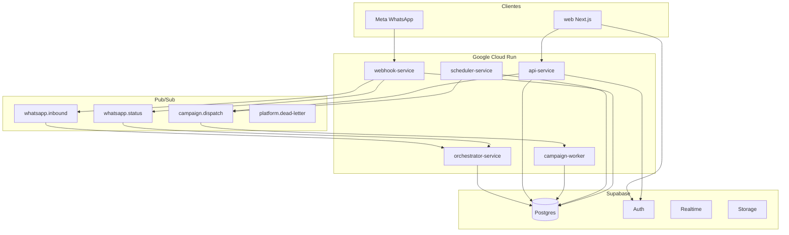
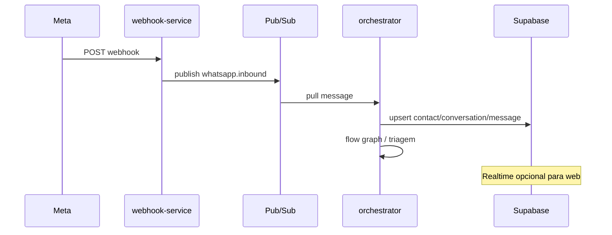

# DESIGN — Aethera / Flux Farma Atendimento

Documento de referência de **arquitetura, produto e design de sistema** do monorepo `plataforma_atendimento`. Complementa o [README.md](README.md) (setup) e os runbooks em [`docs/`](docs/).

**Produção:** [https://www.aetheraai.online](https://www.aetheraai.online)  
**Marca na UI:** Aethera (operado pela Flux Farma no workspace padrão).

---

## 1. Visão do produto

Plataforma de **atendimento omnicanal** voltada a operações de farmácias, entregadores e líderes de campo, com:

- **Inbox** para atendentes (WhatsApp, e-mail, webchat, Instagram quando habilitado).
- **Cadastros** (entregadores, farmácias, líderes) e **contatos** vinculados a conversas.
- **Automações** (fluxos de conversa, triagem por perfil, MCP/tools).
- **Campanhas** de disparo em massa com worker dedicado.
- **Financeiro** (parcelas, adiantamentos, descontos).
- **Portal do líder** (diárias, faltas, farmácias, pré-cadastro, desligamento).
- **Copiloto** de IA para briefing e sugestões no atendimento.
- **Multi-workspace** com papéis por tenant e `platform_owner` para governança da plataforma.

Princípio operacional: o atendente permanece na **inbox** o máximo possível; cadastros e telas auxiliares abrem em **nova aba** quando configurado no front.

---

## 2. Arquitetura de sistema

### 2.1 Diagrama lógico



### 2.2 Serviços e responsabilidades

| Serviço | Porta local | Responsabilidade |
|---------|-------------|------------------|
| [`apps/web`](apps/web) | 3000 | UI Next.js 16 (App Router), inbox, settings, cadastros, relatórios |
| [`apps/api-service`](apps/api-service) | 3001 | API REST autenticada: CRUD, auth, financeiro, copilot, provisionamento |
| [`apps/webhook-service`](apps/webhook-service) | 3002 | Webhook Meta → validação → Pub/Sub |
| [`apps/orchestrator-service`](apps/orchestrator-service) | 3003 | Consumo inbound/status, fluxos, triagem, SLA de conversa |
| [`apps/scheduler-service`](apps/scheduler-service) | 3004 | Crons: SLA tickets/tarefas, parcelas, automações |
| [`apps/campaign-worker`](apps/campaign-worker) | 3005 | Execução de campanhas (anti-ban, filas) |

Contratos Pub/Sub: [`docs/INTERSERVICE_CONTRACTS.md`](docs/INTERSERVICE_CONTRACTS.md).

### 2.3 Pacotes compartilhados

| Pacote | Uso |
|--------|-----|
| [`packages/logger`](packages/logger) | Logs estruturados nos workers/API |
| [`packages/channel-runtime`](packages/channel-runtime) | Runtime de canais (tipos, envio) |
| [`packages/ai-core`](packages/ai-core) | Análise/sugestão de IA compartilhada |
| [`packages/operational-notes`](packages/operational-notes) | Notas operacionais humanizadas |

Build do **web** usa contexto na **raiz do monorepo** ([`apps/web/Dockerfile`](apps/web/Dockerfile) + [`scripts/prepare-web-standalone.mjs`](scripts/prepare-web-standalone.mjs)).

---

## 3. Modelo de dados e multi-tenancy

### 3.1 Workspace (tenant)

- Tabela `workspaces` + `workspace_memberships` (usuário ↔ workspace ↔ `role_id`).
- Header `x-workspace-id` na API após login; JWT carrega workspace ativo e memberships.
- Configurações por workspace: canais (`workspace_channels`), catálogos, fluxos, SLA, notificações.

### 3.2 Papéis

| Camada | Valores típicos | Escopo |
|--------|-----------------|--------|
| **Workspace** | `admin`, `supervisor`, `attendant`, `leader` | Permissões em `roles.permissions` |
| **Plataforma** | `platform_owner`, `platform_admin`, `member` | Coluna `users.platform_role`; rotas `/platform/*` |

Cadastros operacionais (`drivers`, `pharmacies`, `leaders`) são **por workspace**.

### 3.3 Autenticação

- Login: e-mail + senha → Supabase Auth + linha em `users` + JWT emitido pela API ([`apps/api-service/src/routes/auth.ts`](apps/api-service/src/routes/auth.ts)).
- Provisionamento: admin cria usuário, senha temporária, e-mail de convite ([`buildInviteEmailHtml`](apps/api-service/src/lib/emailSender.ts)); link via `WEB_APP_URL` (ex.: `https://www.aetheraai.online/login`).
- Troca de senha pelo usuário: `PATCH /api/users/me/password` + UI em **Configurações → Perfil**.
- Recuperação “Esqueci a senha” no login: ainda não implementada (placeholder na UI).

### 3.4 Ambientes de banco

Mapa atual e procedimentos: [`docs/STAGING_PROD_DATABASE_MAP.md`](docs/STAGING_PROD_DATABASE_MAP.md), [`docs/PRODUCTION_BOOTSTRAP.md`](docs/PRODUCTION_BOOTSTRAP.md).

---

## 4. Domínios funcionais (mapa da aplicação)

### 4.1 Atendimento

| Área | Rotas / módulos | Backend |
|------|-----------------|---------|
| Inbox principal | `/inbox` | `conversations`, `messages`, presence |
| Inbox unificado / ticketing | `/inbox-unificado` | tickets, SLA, contexto operacional |
| Contatos | `/contacts` | `contacts`, vínculo driver/pharmacy/leader |
| Copiloto | painel na inbox | `routes/copilot.ts`, tools, briefing |

### 4.2 Cadastros e campo

| Entidade | Web | API |
|----------|-----|-----|
| Entregadores | `/drivers`, `/drivers/[id]`, `/drivers/new` | `routes/drivers.ts` |
| Farmácias | `/pharmacies`, … | `routes/pharmacies.ts` |
| Líderes | `/leaders`, … | `routes/leaders.ts` |
| Portal líder | `/lider/*` | `routes/leader-portal.ts` |

### 4.3 Automação e canais

| Área | Web | Backend / workers |
|------|-----|-------------------|
| Fluxos de conversa | `/automacoes/*`, `/settings/flows` | `conversationFlows`, orchestrator runtime |
| Catálogos (perfil/setor/demanda) | `/settings/automations/catalogs` | `workspaceCatalogs` |
| Canais | Configurações → Canais | `workspace_channels`, webhook, SMTP |
| Campanhas | `/campaigns` | `campaigns` + `campaign-worker` |
| MCP / tools | `/settings/mcp-tools` | `mcp-tools`, métricas |

### 4.4 Governança e plataforma

| Área | Web | API |
|------|-----|-----|
| Usuários | `/settings/users` | `routes/users.ts` (provision, reset senha) |
| Workspaces | `/platform/workspaces` | `routes/platform.ts`, `workspace` |
| Auditoria | `/audit/operational` | `audit_logs` |
| Relatórios | `/reports` | `routes/reports.ts` |
| Financeiro | `/financial` | `routes/financial.ts` |

---

## 5. Fluxos críticos (sequência)

### 5.1 Mensagem WhatsApp entrante



### 5.2 Atendente responde pela inbox

1. Web lista conversas (`GET /api/conversations`) com filtros por setor/canal/workspace.
2. Mensagens via API + Supabase Realtime onde aplicável.
3. Envio outbound: API → Meta / SMTP conforme canal.
4. Links para ficha de cadastro: **nova aba** (`openAppRouteInNewTab`, `ExternalAppLink`).

### 5.3 Provisionamento de usuário

1. Admin: **Configurações → Usuários** → provisionar com `send_email`.
2. API cria Auth + `users` + membership; e-mail com `resolveWebAppLoginUrl()`.
3. Usuário define senha em **Perfil** (ou admin redefine senha temporária).

---

## 6. Design de interface (front-end)

### 6.1 Direção visual

- **Dark-first** com tema claro opcional (`theme-light`, preferência em Configurações → Aparência).
- Tipografia: **Inter** (UI), **JetBrains Mono** (IDs, métricas, código).
- Primária operacional: azul `hsl(220 100% 62%)` — ver tokens em [`apps/web/src/app/globals.css`](apps/web/src/app/globals.css).
- Densidade: padrão compacto na inbox; toggle **Compacto / Confortável** (`useInboxDensity`, `data-inbox-density` no root da inbox).
- Referência de tom: console operacional denso (Linear/Vercel/Height), sem sombras decorativas excessivas.

### 6.2 Tokens semânticos (CSS)

| Token | Uso |
|-------|-----|
| `--background`, `--surface`, `--surface-elevated` | Fundos e painéis |
| `--foreground`, `--muted-foreground`, `--subtle-foreground` | Texto |
| `--primary`, `--destructive`, `--success`, `--warning` | Ações e estados |
| `--channel-whatsapp`, `--channel-email`, … | Badges de canal |
| `.inbox-t-meta`, `.inbox-t-control` | Tipografia escalável na inbox |

### 6.3 Padrões de layout

- **App shell**: sidebar + área principal ([`AppShell`](apps/web/src/components/shell/AppShell.tsx)).
- **PageHeader**: título `text-lg`–`xl`, subtítulo `text-sm text-muted-foreground`.
- **Listagens**: filtros `text-xs` uppercase; tabelas `text-sm` / `text-xs` em colunas densas.
- **Inbox**: layout 3 colunas (pastas | lista | thread + contexto lateral).

### 6.4 Modos real vs mock

Rotas do App Router usam `page.tsx` diretamente (ou `page.tsx` + componente cliente no mesmo diretório, ex. `LeaderPortalClient.tsx`). Gate por [`features`](apps/web/src/lib/features.ts) / env quando necessário.

---

## 7. API e convenções backend

### 7.1 Stack

- **Fastify** + TypeScript.
- **Zod** para validação de body/query.
- **Supabase JS** (service role) para Postgres e Auth admin.
- Middleware: [`authenticate`](apps/api-service/src/middleware/authenticate.ts), `requireRole`, `requireWorkspace`.

### 7.2 Organização de rotas

Registradas em [`apps/api-service/src/index.ts`](apps/api-service/src/index.ts): `auth`, `users`, `conversations`, `messages`, `workspace`, `financial`, `copilot`, `drivers`, `pharmacies`, `leaders`, `campaigns`, `reports`, `auditLogs`, etc.

### 7.3 Variáveis sensíveis

- Produção: **Secret Manager** (GCP), nunca tokens em `--set-env-vars` soltos.
- Referência: [`.cloud-env-api-production.yaml`](.cloud-env-api-production.yaml) (env não sensível) + secrets no deploy ([`scripts/gcp/deploy-production-api.ps1`](scripts/gcp/deploy-production-api.ps1)).
- `WEB_APP_URL`, `ALLOWED_ORIGINS`, `ENABLE_DEV_ROUTES=false` em produção.

---

## 8. Segurança e conformidade

| Tópico | Decisão |
|--------|---------|
| CORS | `ALLOWED_ORIGINS` explícitos (domínio www + apex + Cloud Run web) |
| Dev routes | `ENABLE_DEV_ROUTES=false` em produção |
| Senhas temporárias na API | `USER_TEMP_PASSWORD_RESPONSE_ENABLED=false` em prod |
| Auditoria | `writeAuditLog` em ações sensíveis (provision, senha, settings) |
| Isolamento tenant | Queries filtradas por `workspace_id`; testes em `smoke-multitenant-isolation` |
| Credenciais de canal | Criptografia via [`credentialsCrypto`](apps/api-service/src/lib/credentialsCrypto.ts) |

Governança de código: `npm run governance:workspace`, `governance:automations` — ver [`docs/GOVERNANCE_ENTERPRISE.md`](docs/GOVERNANCE_ENTERPRISE.md).

---

## 9. Deploy e operações

| Item | Detalhe |
|------|---------|
| **GCP** | Projeto `rh-coopmob-bot`, região `us-central1` |
| **Imagens** | Artifact Registry `panel-services` |
| **Cloud Build** | [`deploy/cloudbuild-flux-farma-*.yaml`](deploy/) |
| **Web** | `NEXT_PUBLIC_*` baked no build da imagem |
| **Workers** | `min-instances=1`, CPU always allocated recomendado |
| **Checklist** | [`docs/GO_LIVE_CHECKLIST.md`](docs/GO_LIVE_CHECKLIST.md) |
| **Deploy detalhado** | [`docs/DEPLOY_CLOUD_RUN.md`](docs/DEPLOY_CLOUD_RUN.md) |

Último registro de deploy: [`reports/last-deploy-tag.txt`](reports/last-deploy-tag.txt).

---

## 10. Estrutura do repositório

```
plataforma_atendimento/
├── apps/
│   ├── web/                 # Next.js UI
│   ├── api-service/         # API principal
│   ├── webhook-service/
│   ├── orchestrator-service/
│   ├── scheduler-service/
│   └── campaign-worker/
├── packages/                # libs compartilhadas
├── supabase/migrations/     # schema Postgres
├── deploy/                  # Cloud Build + Dockerfiles
├── scripts/                 # bootstrap, migração, smoke, gcp
├── docs/                    # runbooks e mapas
├── DESIGN.md                # este arquivo
└── README.md                # setup local
```

---

## 11. Decisões de design registradas (ADR resumido)

| ID | Decisão | Motivo |
|----|---------|--------|
| D1 | Monorepo npm workspaces | Compartilhar tipos, logger, channel-runtime |
| D2 | Supabase Auth + tabela `users` | Login unificado; roles no Postgres |
| D3 | Pub/Sub entre webhook e orchestrator | Desacoplamento e retry |
| D4 | JWT próprio na API | Workspace e permissions no token |
| D5 | Inbox abre cadastro em nova aba | Atendente não perde contexto do chat |
| D6 | `WEB_APP_URL` para links de e-mail | Evitar localhost em convites de produção |
| D7 | Validação de senha atual com cliente anon | Não poluir client service-role; 400 em vez de 401 para não deslogar UI |

---

## 12. Documentação relacionada

| Documento | Conteúdo |
|-----------|----------|
| [README.md](README.md) | Instalação e comandos locais |
| [docs/DEPLOY_CLOUD_RUN.md](docs/DEPLOY_CLOUD_RUN.md) | Deploy GCP |
| [docs/INTERSERVICE_CONTRACTS.md](docs/INTERSERVICE_CONTRACTS.md) | Pub/Sub payloads |
| [docs/PRODUCTION_BOOTSTRAP.md](docs/PRODUCTION_BOOTSTRAP.md) | Bootstrap prod, migração cadastros |
| [docs/GO_LIVE_CHECKLIST.md](docs/GO_LIVE_CHECKLIST.md) | Checklist go-live |
| [docs/STAGING_PROD_DATABASE_MAP.md](docs/STAGING_PROD_DATABASE_MAP.md) | Refs Supabase por ambiente |
| [IMPLEMENTATION_REDESIGN_PLAN.md](IMPLEMENTATION_REDESIGN_PLAN.md) | Fases de redesign e gates de qualidade |
| [apps/web/AGENTS.md](apps/web/AGENTS.md) | Notas para agentes no front |

---

## 13. Manutenção deste documento

Atualizar `DESIGN.md` quando houver:

- Novo serviço Cloud Run ou tópico Pub/Sub.
- Mudança de modelo de tenant, auth ou papéis.
- Novo domínio de produto (rota + API).
- Alteração relevante de design system (tokens em `globals.css`).
- Mudança de URL canônica ou fluxo de provisionamento/e-mail.

**Versão:** 2026-05-20 — alinhado ao estado pós deploy inbox UX + acesso/senha/e-mail.
