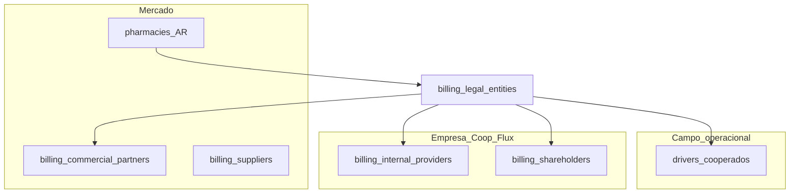

# Roadmap — Módulo de Faturamento (`/billing`)

Documento mestre de planejamento para o módulo de faturamento da plataforma Aethera (Flux Farma / CoopMob). Consolida decisões de negócio, arquitetura, funcionalidades, integrações e fases de implementação.

**Status:** planejamento — desenvolvimento **local-first** (sem deploy em produção até QA completo)  
**Última atualização:** 2026-05-23 (entidades de pagamento, folha empresa, parceiros comerciais, UI cadastro)  
**Relacionados:** [FINANCIAL_CYCLES.md](./FINANCIAL_CYCLES.md), [FLUX_DELIVERY_INTEGRATION.md](./FLUX_DELIVERY_INTEGRATION.md), [PHARMACY_DELIVERY_SCHEDULE.md](./PHARMACY_DELIVERY_SCHEDULE.md), [STAGING_QA_RUNBOOK.md](./STAGING_QA_RUNBOOK.md), [STAGING_PROD_DATABASE_MAP.md](./STAGING_PROD_DATABASE_MAP.md)

> ### PROIBIDO alterar o banco de produção
>
> Durante **todo** o desenvolvimento do módulo `/billing`, é **expressamente proibido** executar qualquer operação de **escrita** no banco de dados de **produção** (`omhlb` / ref `omhlbavfsttwcnybzvcd`):
>
> - **Proibido:** `INSERT`, `UPDATE`, `DELETE`, `TRUNCATE`, `DROP`, `ALTER`, migrations SQL, `supabase db push`, seeds ou scripts que usem `production-db-url.txt` como **destino**
> - **Proibido:** apontar `SUPABASE_URL` / pooler local da API para produção durante dev do billing
> - **Permitido:** `SELECT` read-only em produção **somente** via fixture amostral (`scripts/one-off/sample-billing-fixture-from-prod.mjs`), com guarda em `scripts/lib/billingDbGuard.mjs`
> - **Destino de escrita:** exclusivamente `.secrets/billing-dev-db-url.txt`, staging (`ojzzx`) ou Supabase dedicado de dev — **nunca** `omhlb`
>
> Violação desta regra invalida o ambiente de QA e pode corromper dados operacionais reais.

---

## 1. Visão geral

### 1.1 Objetivo

Substituir e estender o financeiro operacional atual (`/financial`) por um módulo completo de **faturamento, contas a receber/pagar, despesas, cotas e relatórios regulatórios**, com:

- Acerto por **entregador × farmácia × ciclo** (contratos independentes)
- **Duas faturas** por farmácia/ciclo: **CoopMob** e **Flux Farma**
- Controle interno + **relatório HTML** na v1 (sem NF-e/boleto)
- Relatórios **competência** e **caixa**
- Integração com entregas da **API Flux** (e fontes alternativas)
- Relatórios mensais para **contabilidade (INSS)** e **seguradora**
- **Arquivo de pagamento em lote** (PIX) por ciclo para envio ao banco
- Cadastro das **entidades jurídicas** CoopMob e Flux Farma (dados financeiros e comerciais)
- **Folha empresa** (prestadores internos, sócios) e **parceiros comerciais** (comissões) — fases 6–7, pós-MVP

### 1.2 Público operacional

| Papel | Responsabilidades |
|-------|-------------------|
| **Operador financeiro** | Entregas, acertos, despesas, baixas pós-aprovação, rascunhos de cotas e relatórios |
| **Gestor financeiro** | Aprovar faturas, pagamentos, fechamentos mensais, alterar splits e centros de custo |

### 1.3 Princípios

1. **MG por farmácia** — entregador em N farmácias = N contratos independentes
2. **Tarifas no Aethera** — API Flux fornece contagem de entregas; valores vêm do cadastro da farmácia
3. **INSS é custo da CoopMob** — não desconta do entregador; contabilidade calcula com lista exportada
4. **API Flux em produção** — MySQL Flux só para backfill/reconciliação (read-only)
5. **Convivência** — `/financial` permanece até migração completa das cotas e conferências
6. **Local-first** — implementar e testar **somente em ambiente local/dev**; produção só após checklist de QA (§1.4)
7. **Migrations billing** — toda migration `085+` e script de seed aplicam **somente** em billing-dev (`ojzzx` / `.secrets/billing-dev-db-url.txt`) com `billingDbGuard`; **nunca** destino `omhlb` até gate §12

### 1.4 Estratégia local-first (sem deploy até testes)

Todo o módulo `/billing` será desenvolvido **apenas localmente** até passar testes funcionais. **Não** aplicar migrations `billing_*` em produção (`omhlb`) nem deploy Cloud Run do módulo antes do gate de QA.

**Regra absoluta — banco de produção:** nenhum membro do time (humano ou agente) deve alterar dados ou schema em produção enquanto o billing estiver em desenvolvimento. Scripts de fixture, probes e diagnósticos que leem produção usam `guardReadOnlyClient()` e abortam em SQL de escrita. CI e runbooks de release **não** incluem passos de migration billing em `omhlb` antes do gate §12.

#### Ambientes

| Ambiente | Uso no projeto billing | Escrita |
|----------|------------------------|---------|
| **Local** (`npm run dev` web + api) | Desenvolvimento diário | Sim — só no banco **dev** |
| **Banco dev** | Supabase staging (`ojzzx`) **ou** URL em `.secrets/billing-dev-db-url.txt` | Sim |
| **Produção** (`omhlb` / aetheraai.com.br) | **Somente leitura** para amostragem de fixture | **Nunca** durante dev |
| **Flux API** | Homolog + `FLUX_DELIVERY_SKIP=true` no `.env` local | Read-only |
| **MySQL Flux** | Opcional reconciliação; credenciais só via env local | Read-only |

**Stack local típica:**

```powershell
# Terminal 1 — API (aponta para billing-dev, NÃO production-db-url)
cd apps/api-service
# SUPABASE_URL + SERVICE_ROLE do projeto dev em .env ou .secrets/billing-dev-api.env
npm run dev

# Terminal 2 — Web
cd apps/web
npm run dev
# http://localhost:3000/billing
```

Variáveis recomendadas no dev local:

| Variável | Valor dev |
|----------|-----------|
| `SUPABASE_URL` / keys | Projeto **dev** (não `omhlb`) |
| `FLUX_DELIVERY_SKIP` | `true` (ou homolog read-only) |
| `BILLING_MODULE_ENABLED` | `true` (flag feature local) |

#### Fixture: amostra read-only da produção

Script (Fase 0): `scripts/one-off/sample-billing-fixture-from-prod.mjs` — **produção só leitura**; escrita só no dev

- **Origem:** `.secrets/production-db-url.txt` (**SELECT only**)
- **Destino:** `.secrets/billing-dev-db-url.txt` (INSERT/UPSERT)
- **Dry-run** por padrão; `--execute` exige `CONFIRM_BILLING_FIXTURE_IMPORT=true`
- **Relatório:** `reports/billing-fixture-sample.json` (ids, contagens, workspace)

**Critério de seleção** (1 workspace operacional real — preferir o workspace dos líderes Wellington/Carlos em prod):

| Entidade | Quantidade alvo | Critério |
|----------|-------------------|----------|
| `workspaces` | 1 | Workspace principal operacional |
| `pharmacies` | 3–5 | Com `delivery_fee_*`, MG variado, líder ativo, status `active` |
| `drivers` | 8–15 | Vinculados às farmácias acima; **com** `pix_key`; mix single/multi-farmácia |
| `driver_pharmacy_links` | todos dos pares acima | `is_active = true` |
| `leaders` | 2–3 | Dos líderes das farmácias amostradas |
| `financial_entries` | ~60–120 | Últimos **21 dias**; tipos `daily`, `absence`, `quota`, `advance` dos drivers amostra |
| `financial_installments` | todas das entries acima | — |
| `app_settings` | chaves financeiras | `financial_discount_rules`, `financial_entry_types` (cópia do workspace) |
| `users` (operador/gestor) | **não copiar** senhas de prod | Criar usuários locais de teste ou usar seed staging |

**Não importar da produção:**

- Conversas, mensagens, campanhas, leads comerciais
- `audit_logs` completos (opcional: últimos offboards para testar seguradora)
- Credenciais Meta, tokens, `.env` secrets
- Dados de **todos** os entregadores/farmácias (evitar dump completo)

**Sanitização na importação:**

| Campo | Ação |
|-------|------|
| E-mails de contato farmácia | Substituir por `billing-dev+{id}@example.local` |
| Telefones | Manter formato; últimos dígitos fictícios se necessário |
| `pix_key` | Manter estrutura para teste PIX; opcional mascarar CPF real |
| CNPJ farmácia | **Manter** (necessário para acerto e match Flux futuro) |

Após import: rodar migrations `billing_*` **só no banco dev**; cadastrar CC de teste em `/billing/config`; vincular CC nas farmácias importadas.

#### Fluxo de trabalho por fase

```
Fase N (local):
  1. Migration SQL → aplicar só em billing-dev
  2. API + UI → testar em localhost
  3. Dados: fixture prod + lançamentos sintéticos de billing
  4. Checklist §16 (critérios MVP aplicáveis à fase)
  5. Só então → próxima fase

Gate deploy (após Fase 4 MVP):
  1. QA completo local
  2. Migration billing_* em staging (ojzzx) — smoke
  3. UAT com operador/gestor (opcional staging)
  4. Migration + deploy prod (omhlb + Cloud Run) — janela acordada
```

#### O que NÃO fazer até o gate

- [ ] `supabase db push` / migration billing em **omhlb**
- [ ] Deploy `flux-farma-api` / `flux-farma-web` com rotas `/billing` em prod
- [ ] Cron sync Flux entregas → billing em prod
- [ ] Export PIX real para banco
- [ ] E-mail/HTML público de fatura para farmácias reais

#### Entregáveis Fase 0 (infra local)

- [x] `.secrets/billing-dev-db-url.txt` + `.secrets/billing-dev-api.env` (gitignore)
- [x] Script `sample-billing-fixture-from-prod.mjs` + guarda `scripts/lib/billingDbGuard.mjs`
- [x] `npm run billing:fixture:sample` (dry-run) documentado em `scripts/README.md`
- [x] Flag `BILLING_MODULE_ENABLED` na API/web (esconde menu se false em prod até go-live)
- [x] `npm run billing:sync-api-env` — API + `apps/web/.env.local` (`NEXT_PUBLIC_*` ojzzx)
- [x] `npm run billing:seed-dev-config:execute` — 2 CC de teste + vínculo nas 5 farmácias da fixture
- [x] `npm run billing:verify-dev` — smoke tabelas `billing_*` + contagens no ojzzx

---

## 2. Decisões de negócio (fechadas)

| # | Tema | Decisão |
|---|------|---------|
| 1 | Mínimo garantido (MG) | Por **farmácia**; acerto na granularidade `driver × pharmacy × ciclo` |
| 2 | Entregador multi-farmácia | Cada vínculo é contrato separado; settlements independentes |
| 3 | Centro de custo | CRUD em **Configurações**; **select só na farmácia**; entregador **herda** via vínculo (sem campo CC) |
| 4 | Falta **sem** diarista | Desconto de 1 dia proporcional: `MG_farmácia ÷ 6` (semana operacional 6 dias) |
| 5 | Falta **com** diarista | Diária soma no acerto; desconto MG proporcional conforme política já usada no operacional |
| 6 | Faturas | **Duas** por ciclo/farmácia: uma **CoopMob**, outra **Flux Farma** (não fatura única com split) |
| 7 | v1 fiscal | Só **controle interno + relatório HTML** (sem NF-e, boleto, DANFE) |
| 8 | Relatórios financeiros | Visões separadas: **competência** vs **caixa** |
| 9 | INSS | **Não desconta** do entregador; CoopMob arca; sistema gera **lista para contabilidade** (nome, CPF, valor faturado no mês) |
| 10 | Seguradora | Relatório mensal: **ativos** + **desligados no mês** (export CSV/PDF/HTML) |
| 11 | Cotas cooperativas | **Manter** `financial_entries` + parcelas; tela `/billing/cotas` = visão; desconto na folha do ciclo |
| 12 | Entregas — fontes | API Flux + app externo (credenciais depois) + manual + import CSV |
| 13 | Despesas | Tipos **fixos e variáveis** cadastráveis na UI |
| 14 | Pagamento entregadores | Relatório/arquivo por **ciclo** com nome, chave PIX e **valor líquido** para **pagamento em lote no banco** |
| 15 | Entidades Coop / Flux | Cadastro completo das duas empresas (dados financeiros, bancários, comerciais e fiscais de referência) |
| 16 | Compensações (cota, adiantamento, uniforme…) | Descontam **AP cooperado** (PIX), **não** faturamento farmácia; leem `financial_entries` + `financial_installments` |
| 17 | Acerto cooperado | Cálculo **automático** pelo motor; operador fecha ciclo + recalcula; gestor **aprova** (`aberto` → `em_revisao` → `aprovado` → `pago`) |
| 18 | MG multi-entregador | Farmácia pode ter `mg_mode`: `per_driver` (default) ou `shared_pool` (1× MG/ciclo rateado) — validar por farmácia com operação |
| 19 | Uniforme/bag | Meta: split configurável Coop/entregador (ex. 50/50); hoje portal líder cobra 100% entregador — parametrizar em tipo despesa / regra alvo |
| 20 | Despesas rateadas | `allocation_mode` + `RateioEditor` entre CCs; multi-farmácia via `per_delivery` ou ∝ entregas |
| 21 | Contas movimentação v1 | **Uma conta** embutida em `billing_legal_entities`; baixa com conta sugerida; multi-conta + conciliação Fase 8 |
| 22 | INSS cooperado vs sócio | Lista INSS §9.1 = **cooperados**; INSS pró-labore **sócio** = export separado §9.7 (sem cálculo de guia) |
| 23 | Parceiro comercial | Entidade `billing_commercial_partners` com `partner_kind` (`sales_agent` \| `referrer` \| `both`); FK em `commercial_leads` |
| 24 | Ambiente de desenvolvimento | Todas as fases billing: **local/dev first**; produção **read-only** (fixture) até QA completo e gate §12 |

### 2.1 Entidades financeiras — quem paga e quem recebe

**Centro de custo (`billing_cost_centers`)** = unidade de **faturamento** regional (split Coop/Flux, agrupamento de farmácias). **Não** é cadastro de pessoa (entregador, prestador, sócio).

| Entidade | Tabela | Ciclo típico | Não confundir com |
|----------|--------|--------------|-------------------|
| Cooperado entregador | `drivers` | Semanal (acerto/PIX) | CC, prestador interno, sócio |
| Líder de campo | `leaders` | Ocorrências; comissão operação = fluxo Fase 7 | Prestador interno |
| Usuário plataforma | `users` | Login/inbox | Beneficiário financeiro |
| **Prestador interno** | `billing_internal_providers` *(Fase 6)* | Mensal (benefícios PJ, convênio, combustível) | Entregador, sócio |
| **Sócio proprietário** | `billing_shareholders` *(Fase 6)* | Mensal/anual (pró-labore, lucro, PLR) | Prestador interno |
| **Parceiro comercial** | `billing_commercial_partners` *(Fase 7)* | Evento/mês (comissão venda/indicação) | `contacts.profile_type = partner` (atendimento) |
| Fornecedor | `billing_suppliers` *(Fase 3+)* | AP despesa | Parceiro comercial |
| Farmácia | `pharmacies` | AR (devedora das faturas) | Beneficiário AP |
| Coop / Flux | `billing_legal_entities` | Conta movimentação + emissor faturas | — |

`contacts.profile_type = partner` permanece **triagem de atendimento**; parceiro financeiro/comercial usa cadastro billing dedicado.

**Beneficiários de AP** (polimorfismo em `billing_payables`): `driver` \| `internal_provider` \| `shareholder` \| `commercial_partner` \| `supplier`.



---

## 3. Estado atual vs alvo

### 3.1 O que existe hoje

| Área | Situação |
|------|----------|
| `/financial` | Ciclo semanal: diárias, faltas, adiantamentos, cotas (`quota`), descontos |
| Tabelas | `financial_entries`, `financial_installments`, `financial_imports` |
| Pacote | `@plataforma/financial-cycle` — regras, apuração, parcelas |
| Ocorrências | Portal líder / financeiro → `leaderOccurrences.ts` |
| Farmácia | `delivery_fee_*`, `minimum_guaranteed_*` em `pharmacies` (migration 039) |
| Flux API | Sync **cadastro** entregadores (cron 6h); `fetchEntregasPorPeriodo` implementado mas não usado em prod |
| Comercial | `/commercial` — projeção MG vs por-entrega; **não** gera cobrança operacional |
| Desligamento | `offboardDriver()` → `status = inactive`; `last_worked_at` no audit log apenas |
| Entregadores PIX | `drivers.pix_key`, `drivers.pix_key_type` (cadastro + sync Flux) |
| Entidades Coop/Flux | **Não existe** cadastro estruturado; dados espalhados em env/docs |

### 3.2 Lacunas para o billing

| Lacuna | Ação planejada |
|--------|----------------|
| Sem AR/AP farmácia | Tabelas `billing_invoices`, `billing_payments` |
| Sem `delivery_records` | Nova tabela + sync Flux |
| Sem centros de custo | `billing_cost_centers` (catálogo) + `pharmacies.billing_cost_center_id` |
| Sem split Coop/Flux na farmácia | Campos `contract_scope`, `split_*` em `pharmacies` |
| Sem data de desligamento confiável | `drivers.inactive_at`, `drivers.termination_reason` |
| Sem mapeamento Flux farmácia | `pharmacies.flux_codpes`, `pharmacies.flux_codloc` (ou match CNPJ) |
| Cotas só manuais em `/financial` | **Manter** `financial_entries`; adicionar visão `/billing/cotas` (filtro + calendário) |
| Import XLSX faturamento | Legado; substituído por `delivery_records` |
| Sem cadastro Coop/Flux | Tabela `billing_legal_entities` + UI `/billing/config/entidades` |
| Sem arquivo PIX banco | Relatório exportável por ciclo a partir de AP aprovado |
| Sem prestador interno / sócio | `billing_internal_providers`, `billing_shareholders` (Fase 6) |
| Sem parceiro comercial estruturado | `billing_commercial_partners` + FK em `commercial_leads` (Fase 7) |
| MG compartilhado entre entregadores | `pharmacies.mg_mode` + regra pool (§4.7) |
| Uniforme/bag 100% entregador | Split Coop/entregador parametrizável (meta 50/50) |
| Comissão líder Flux / vendedor externo | Motor comissões Fase 7; líder operação dia 15 pós-margem |
| Catálogo multi-conta bancária | v1: conta em `billing_legal_entities`; v2: `billing_bank_accounts` |
| Sem fornecedor estruturado | `billing_suppliers` CRUD (Fase 3) |

---

## 4. Motor de cálculo

### 4.1 Granularidade

```
Por (driver_id, pharmacy_id, billing_cycle):
  → settlement_line (receita farmácia, custo entregador, split Coop/Flux)
```

### 4.2 Regra MG vs por-entrega

```
entregas = COUNT(delivery_records WHERE verified AND NOT cancelled)
min_entregas = pharmacy.minimum_deliveries_count
               OU FLOOR(minimum_guaranteed_driver_payout_cents / delivery_fee_driver_payout_cents)

SE pharmacy.mg_enabled E entregas <= min_entregas:
  cobranca_farmacia     = minimum_guaranteed_cents
  pagamento_entregador  = minimum_guaranteed_driver_payout_cents
SENÃO:
  cobranca_farmacia     = entregas × delivery_fee_cents
  pagamento_entregador  = entregas × delivery_fee_driver_payout_cents
```

### 4.3 Ocorrências do ciclo

```
+ diárias (financial_entries type=daily, mesma farmácia)
- falta SEM cobertura (diarista):
    − minimum_guaranteed_cents / 6           (lado farmácia)
    − minimum_guaranteed_driver_payout_cents / 6  (lado entregador, se aplicável)
- falta COM diarista: diária credita; ajuste MG conforme regra operacional
- cotas cooperativas: desconto no AP entregador (não no INSS)
```

### 4.4 Split Coop / Flux

```
SE pharmacy.contract_scope = 'both':
  valor_coop = valor × pharmacy.split_coop_pct
  valor_flux = valor × pharmacy.split_flux_pct
SENÃO contract_scope = 'coop_only' | 'flux_only':
  100% na entidade contratada
```

### 4.5 Duas faturas

Por ciclo fechado e farmácia, gerar:

| Documento | Entidade | Conteúdo |
|-----------|----------|----------|
| `billing_invoice` #1 | CoopMob | Linhas rateio Coop + link HTML entregas |
| `billing_invoice` #2 | Flux Farma | Linhas rateio Flux + detalhe entregas |

Fluxo v1: rascunho → aprovação gestor → link HTML público → e-mail para `pharmacy.billing_email` (e-mail automático pode ser v2).

### 4.6 Compensações na folha do cooperado (não entram na fatura farmácia)

**Faturamento farmácia (AR):** entregas + MG + split Coop/Flux — **sem** abater cotas, adiantamentos ou uniforme do entregador.

**Folha cooperado (AP / PIX), ordem do líquido:**

```
(+) Repasse bruto Coop do ciclo     ← settlements driver×farmácia
(+) Diárias do ciclo
(−) Faltas / ajustes MG÷6
(−) Cotas (parcela com due_date no ciclo)
(−) Adiantamentos (parcela no ciclo)
(−) Uniforme, bag, certificado digital, outros (affects_net = discount)
(=) Valor líquido → export PIX
```

- INSS **não entra** na dedução PIX (custo CoopMob; lista §9.1).
- Cotas **separadas** de INSS.
- Motor: [`packages/billing-engine`](packages/billing-engine); leitura parcelas: [`financialSummaries.ts`](apps/api-service/src/lib/financialSummaries.ts).

### 4.7 MG compartilhado entre entregadores (lacuna crítica)

O motor atual (`computeDeliverySettlement`) aplica MG **por linha** `driver × pharmacy × ciclo`. Se a farmácia rateia **um único MG** entre vários entregadores, o modelo `per_driver` pode **cobrar a farmácia N× o MG**.

| Modo | Comportamento |
|------|----------------|
| `per_driver` | Default — cada linha settlement avalia MG independentemente |
| `shared_pool` | Agrega entregas da farmácia no ciclo; **1×** cobrança MG; rateio repasse entre entregadores ativos |
| `mg_share_pct` (vínculo) | Fração do MG por `driver_pharmacy_links` |
| `mg_bearer` (vínculo) | Um entregador “titular” leva MG; demais só por entrega |

Campos propostos: `pharmacies.mg_mode`, `pharmacies.mg_pool_split_rule` (`equal` \| `by_deliveries`).

**Fase 1:** implementar após levantamento com operação de quais farmácias usam pool compartilhado.

---

## 5. Competência vs caixa

| Visão | Base temporal | Uso |
|-------|---------------|-----|
| **Competência** | `billing_cycles.apuracao_start/end`, `event_date` / `delivered_at` | Faturamento, acerto entregador, relatório operacional |
| **Caixa** | `due_date`, `paid_at` das baixas | AR/AP, aging, conciliação bancária |

**UI:** toggle Competência | Caixa nos relatórios; KPIs “a vencer hoje” e “em atraso” sempre em caixa.

---

## 6. Modelo de dados (proposto)

### 6.1 Novas tabelas principais

| Tabela | Propósito |
|--------|-----------|
| `billing_cost_centers` | Catálogo de centros de custo (workspace); criado em **Configurações** |
| `billing_expense_types` | Tipos de despesa fixa/variável |
| `billing_cycles` | Ciclos de faturamento (semana/mês) |
| `billing_settlements` | Acerto por driver×pharmacy×ciclo |
| `billing_settlement_lines` | Detalhe (entregas, MG, diária, falta, ajuste) |
| `billing_invoices` | Faturas AR (Coop ou Flux) |
| `billing_invoice_lines` | Linhas da fatura |
| `billing_payables` | Contas a pagar — `beneficiary_type` + `beneficiary_id` (driver, internal_provider, shareholder, commercial_partner, supplier) |
| `billing_payments` | Baixas — valor, data, forma; `legal_entity_id` ou `bank_account_id`; flag `conciliada` (Fase 8) |
| `billing_expenses` | Lançamentos de despesa |
| `billing_delivery_records` | Entregas apuradas (multi-fonte) |
| `billing_monthly_report_runs` | Registro de geração/envio relatórios mensais |
| `billing_legal_entities` | Cadastro CoopMob e Flux Farma (dados financeiros/comerciais) |
| `billing_payment_batch_exports` | Registro de exportações PIX em lote por ciclo |
| `billing_internal_providers` | Prestadores internos (funcionários PJ da empresa) — **Fase 6** |
| `billing_shareholders` | Sócios proprietários (pró-labore, lucro) — **Fase 6** |
| `billing_commercial_partners` | Vendedores/indicadores externos — **Fase 7** |
| `billing_suppliers` | Fornecedores AP — **Fase 3+** |
| `billing_commission_rules` | Regras de comissão (parceiro, líder) — **Fase 7** |
| `billing_commission_accruals` | Provisão de comissão por lead/farmácia/competência — **Fase 7** |
| `billing_bank_accounts` | Múltiplas contas por entidade jurídica — **v2 / Fase 8** |

### 6.2 Alterações em tabelas existentes

**`pharmacies`** (campos de faturamento — contrato e defaults)

| Coluna | Tipo | Descrição |
|--------|------|-----------|
| `billing_cost_center_id` | uuid FK → `billing_cost_centers` | CC ao qual a farmácia pertence (**select no cadastro**) |
| `contract_scope` | enum | `flux_only` \| `coop_only` \| `both` |
| `split_coop_pct` | numeric | % Coop default quando `both` |
| `split_flux_pct` | numeric | % Flux default quando `both` |
| `mg_enabled` | boolean | MG ativo nesta farmácia |
| `minimum_deliveries_count` | integer | Mínimo entregas (override calculado) |
| `billing_email` | text | E-mail faturamento |
| `flux_codpes` | integer | ID rede Flux |
| `flux_codloc` | integer | ID loja Flux |
| `mg_mode` | enum | `per_driver` \| `shared_pool` (Fase 1+, §4.7) |
| `mg_pool_split_rule` | enum | `equal` \| `by_deliveries` (quando `shared_pool`) |

**`billing_cost_centers`** (catálogo do workspace — **CRUD em `/billing/config`**)

| Coluna | Descrição |
|--------|-----------|
| `name` | Nome do CC (ex.: CoopMob SP, Flux Filial Norte) |
| `code` | Código curto opcional (ex.: `CC-01`) |
| `cnpj` | CNPJ faturável deste CC (opcional) |
| `split_coop_pct` / `split_flux_pct` | Split Coop × Flux **deste** CC |
| `active` | Ativo/inativo |

**Vínculo farmácia:** `pharmacies.billing_cost_center_id` — campo **select** em:

- `/pharmacies/new`
- `/pharmacies/[id]` (ficha e formulário de edição)
- drawer/modal de cadastro em `/pharmacies` (se existir)

Sem CRUD de CC na ficha da farmácia. Split efetivo do faturamento = do CC selecionado (override de contrato da farmácia só se parametrizado depois).

**Entregador — sem campo de CC**

- **Não** existe `drivers.billing_cost_center_id` nem select de CC no cadastro do entregador.
- O CC do acerto é sempre o da **farmácia** do vínculo (`driver_pharmacy_links` → `pharmacies.billing_cost_center_id`).
- Entregador em **N farmácias** → N settlements independentes (`driver × pharmacy × ciclo`), cada um com o CC **da farmácia daquele vínculo** — evita duplicar CC no entregador e simplifica faturamento/repasse/PIX.
- Motor de settlement: `cost_center_id = pharmacy.billing_cost_center_id` (join via `pharmacy_id` da linha).

> **Fonte única de verdade (UI):** CC → **Configurações Financeiro** + **select só na farmácia**; taxas/MG → **Condições comerciais**; contrato/e-mail/Flux → **Faturamento** na ficha; entregadores → **Entregadores vinculados** (sem CC).

**`drivers`**

| Coluna | Tipo | Descrição |
|--------|------|-----------|
| `inactive_at` | date | Data efetiva desligamento |
| `termination_reason` | text | Motivo (opcional) |

Preencher `inactive_at` em `offboardDriver()`.

### 6.3 `billing_delivery_records` (campos)

```typescript
{
  source: 'flux_api' | 'flux_db' | 'manual' | 'csv' | 'external_app',
  external_id: string,        // ex. "7:11:24545:5"
  flux_codpes: number,
  flux_codloc: number,
  pharmacy_id: uuid,
  driver_id: uuid,
  delivered_at: timestamptz,  // competência
  document_number: string,
  route_id: string,
  cancelled: boolean,
  verified: boolean,
  billing_cycle_id: uuid | null,
}
```

**Idempotência:** `workspace_id + source + external_id` UNIQUE.

### 6.4 Tipos de despesa (`billing_expense_types`)

| Campo | Descrição |
|-------|-----------|
| `name` | Nome (ex.: Aluguel sede) |
| `kind` | `fixed` \| `variable` |
| `default_cost_center_id` | CC padrão |
| `default_entity` | `coop` \| `flux` \| `both` |
| `allocation_mode` | `none` \| `per_pharmacy` \| `per_driver` \| `per_delivery` |
| `recurrence` | mensal, semanal, anual (fixas) |
| `active` | boolean |

### 6.5 Entidades jurídicas (`billing_legal_entities`)

Cadastro das empresas **CoopMob** (cooperativa) e **Flux Farma** (operadora). Uma linha por `entity_type` por workspace (`coop` \| `flux`).

**Identificação**

| Campo | Descrição |
|-------|-----------|
| `entity_type` | `coop` \| `flux` |
| `legal_name` | Razão social |
| `trade_name` | Nome fantasia |
| `cnpj` | CNPJ (único por workspace) |
| `state_registration` | Inscrição estadual |
| `municipal_registration` | Inscrição municipal |
| `tax_regime` | Regime tributário (referência; sem emissão NF na v1) |

**Endereço e contato**

| Campo | Descrição |
|-------|-----------|
| `address_*` | CEP, logradouro, número, bairro, cidade, UF |
| `financial_email` | E-mail financeiro / faturamento |
| `commercial_email` | E-mail comercial |
| `phone` | Telefone principal |

**Dados bancários (conta de operação / recebimento)**

| Campo | Descrição |
|-------|-----------|
| `bank_code` | Código do banco |
| `bank_name` | Nome do banco |
| `branch_number` | Agência |
| `account_number` | Conta |
| `account_digit` | Dígito |
| `account_type` | `checking` \| `savings` |
| `pix_key` | Chave PIX da empresa (recebimentos) |
| `pix_key_type` | Tipo da chave |

**Parâmetros comerciais / faturamento**

| Campo | Descrição |
|-------|-----------|
| `default_split_coop_pct` | % padrão Coop em contratos `both` (override por farmácia) |
| `default_split_flux_pct` | % padrão Flux em contratos `both` |
| `flux_service_margin_pct` | Margem de serviço Flux (ex.: 30%) — referência comercial |
| `invoice_header_notes` | Texto padrão em faturas HTML |
| `invoice_footer_notes` | Rodapé em faturas HTML |
| `logo_storage_path` | Logo para relatórios HTML (opcional) |

**Uso no sistema**

- Cabeçalho das **duas faturas** (Coop vs Flux)
- Conta origem sugerida em **pagamentos** e **conciliação**
- Defaults de split ao cadastrar farmácia `contract_scope = both`
- Dados exibidos em relatórios regulatórios quando aplicável

**UI:** `/billing/config/entidades` — abas **Cooperativa** e **Flux Farma** (ou lista com edição por entidade).

### 6.6 Prestadores internos (`billing_internal_providers`) — Fase 6

Funcionários PJ da empresa (convênio, combustível, PLR quadro). **Não** são entregadores nem sócios.

| Grupo | Campos |
|-------|--------|
| Identificação | `legal_name` (nome completo), `trade_name`, `cpf_cnpj`, `contract_type` (PJ), `role_title` |
| Contato | `email`, `phone`, `phone_secondary`, `financial_email` |
| Endereço | `address_cep`, `address_street`, `address_number`, `address_neighborhood`, `address_city`, `address_state` |
| Pagamento | `pix_key`, `pix_key_type`, `bank_code`, `bank_name`, `branch_number`, `account_number`, `account_digit`, `account_type` |
| Vínculo | `default_entity` (coop/flux), `default_cost_center_id`, `contract_started_at`, `inactive_at`, `termination_reason` |
| Status | `active`, `notes`, `workspace_id` |

### 6.7 Sócios proprietários (`billing_shareholders`) — Fase 6

Mesmos grupos de identificação/contato/pagamento, mais:

| Campo | Descrição |
|-------|-----------|
| `entity_type` | `coop` \| `flux` |
| `ownership_pct` | Participação societária |
| `pro_labore_default_cents` | Pró-labore mensal padrão |
| `is_administrator` | Sócio administrador |

Fluxos: pró-labore mensal, retirada de lucro, PLR anual (lançamento manual ou regra v2).

### 6.8 Parceiros comerciais e fornecedores — Fases 7 / 3+

**`billing_commercial_partners`** (Fase 7): identificação + PIX/bancário; `partner_kind` (`sales_agent` \| `referrer` \| `both`); `default_entity`, `active`.

**`billing_suppliers`** (Fase 3+): nome, cpf_cnpj, contato, PIX/bancário, categoria.

**Alterações relacionadas:**

- `commercial_leads`: `sales_partner_id`, `referrer_partner_id` (nullable; `owner_id` continua para vendedor interno `users`)
- `billing_expense_types`: opcional `coop_share_pct` para uniforme/frete 50/50
- `billing_commission_rules` + `billing_commission_accruals`: regras e provisão de comissão (Fase 7)

---

## 7. Integrações

### 7.1 API Flux Delivery

| Endpoint | Status | Uso |
|----------|--------|-----|
| `POST /oauth2/token` | Produção | Auth |
| `GET /v1/relatorios/obter-todos-entregadores` | Produção (cron 6h) | Sync cadastro → `drivers` |
| `GET /v1/relatorios/obter-todos-farmacias` | Disponível | Sync CNPJ / codpes/codloc |
| `GET /v1/relatorios/obter-entregas-por-periodo` | Implementado, não em prod | **Sync entregas → billing_delivery_records** |

Cliente: `apps/api-service/src/lib/fluxDelivery/client.ts`  
Doc: [FLUX_DELIVERY_INTEGRATION.md](./FLUX_DELIVERY_INTEGRATION.md)

**Limitação:** endpoint de ganhos (`ganhoPorEntrega`) retorna 403 com token SD — não usar para faturamento.

**Plano:** promover `fetchEntregasPorPeriodo` para `@plataforma/flux-delivery`; job diário + sob demanda no fechamento de ciclo.

### 7.2 MySQL Flux (read-only, reconciliação)

| Banco | Papel |
|-------|-------|
| `dbfluxadm` | Cadastro central: `view_farmacias`, precificação |
| `dbfluxsinc` | Operação: rotas e entregas |

**Chave farmácia Flux:** `(Codpes, Codloc)` + `CNPJLoc`.

**Entrega apurável (fonte de verdade DB):**

```sql
arqrotasite s
JOIN arqrotas r ON r.Codpes=s.Codpes AND r.Codloc=s.Codloc AND r.IDRota=s.IDRota
WHERE s.DatHorEnt IS NOT NULL AND r.IndCanc = 0
```

| Campo Flux | Mapeamento Aethera |
|------------|-------------------|
| `arqrotas.IDEntr` | `drivers.flux_delivery_driver_id` |
| `arqrotas.CNPJ` | `pharmacies.cnpj` |
| `Codpes` + `Codloc` | `pharmacies.flux_codpes/loc` |
| `arqrotasite.DatHorEnt` | `delivered_at` |
| `arqrotasite.NroDocto` | `document_number` |

**Vínculo entregador↔farmácia:** `arqentregador_grupo_hist` (confirma multi-farmácia).

Scripts de estudo (credenciais via env, não commitar senha):

- `scripts/one-off/probe-flux-mysql-schema.mjs`
- `scripts/one-off/probe-flux-mysql-deep.mjs`

### 7.3 Outras fontes de entregas

| Fonte | v1 |
|-------|-----|
| Lançamento manual | Sim |
| Import CSV | Sim |
| App externo entregadores | Fase posterior (credenciais depois) |

---

## 8. Implementação de UI

Referência visual e de fluxo: protótipo **`project-revive-main`** (`src/pages/financeiro/*`, `FarmaciaFicha.tsx`, `FarmaciaFaturamentoEditor.tsx`).  
Destino no Aethera: **`apps/web`** (Next.js App Router), rota **`/billing`**, design system existente (`PageHeader`, `CadastroPrimitives`, `reviveSurfaces`).

### 8.0 Diretrizes de UI (design system Aethera)

Toda UI `/billing` deve reutilizar:

| Camada | Componentes / padrão |
|--------|----------------------|
| Layout | `PageHeader`, `BillingSubNav`, `CadastroPageScroll` |
| Formulários | `CadastroSection`, `CadastroField`, `cadastroSwitchRowClassName` (toggles ativo/inativo) |
| Tabelas | `rounded-xl border border-border bg-surface`; cabeçalho `text-[10px] uppercase tracking-wider text-subtle-foreground` (padrão `BillingCostCenterPanel`) |
| Ícones | `lucide-react` por seção (`User`, `Building2`, `Wallet`, etc.) |
| Cores/status | Tokens do tema (`text-muted-foreground`, `text-destructive`, badges success/warning) — **sem cores hardcoded** |
| Inputs | `BrInputs`, `BrCentsInput` onde aplicável |

**Cadastro prestador interno** — ficha rica (espelhar entregador/farmácia):

1. **Identificação** — nome completo*, CPF/CNPJ PJ*, cargo, tipo contrato (toggle PJ), ativo
2. **Contato** — e-mail*, telefone*, telefone secundário, e-mail financeiro
3. **Endereço** — padrão `PharmacyAddressFields` / CEP
4. **Pagamento** — PIX (tipo + chave)*; opcional dados bancários TED
5. **Vínculo** — entidade pagadora default (Coop/Flux), CC default, datas contrato/inativação, observações

Validações: e-mail válido, PIX obrigatório para AP automático, bloqueio pagamento se inativo.

### 8.1 Escopo UI — o que adotar vs ignorar

| Adotar do revive | Ignorar / adiar |
|------------------|-----------------|
| `FinanceiroSubNav` — sub-nav horizontal por seção | **DRE** (`/financeiro/dre`) — fora do MVP; relatório gerencial fase posterior |
| Visão geral com KPIs caixa | Dados mock estáticos de métricas/SLA na ficha farmácia |
| Acertos lista + detalhe com workflow | Rota `/financeiro` — usamos `/billing` |
| Entregas, Faturamento, AR, AP (3 abas), Despesas | **Cartões de crédito** em baixas (v2; v1 só conta/PIX) |
| Cotas (tabela + calendário + templates) | Conciliação bancária completa (Fase 5) |
| Hub relatórios + INSS / Seguradora / PIX | Duplicar cadastro operacional já existente na ficha |
| Config: Entidades, **CC (CRUD completo)**, Tipos despesa | CRUD de CC na ficha da farmácia (removido) |
| `FarmaciaFaturamentoEditor` | Só contrato/e-mail/Flux; CC = select no cadastro farmácia |
| `EmpresaBadge`, `BaixaDialog`, `SaldoCell` | React Router — portar para Next `Link` / `useParams` |
| Fatura pública HTML (`/public/billing/:token`) | |

### 8.2 Navegação e layout

**Sidebar principal** (`Sidebar.tsx`): novo item **Faturamento** → `/billing` (ícone `Wallet` ou `Receipt`).  
Manter **`/financial`** até migração das cotas/conferência semanal.

**Layout do módulo** — `apps/web/src/app/(app)/billing/layout.tsx`:

- `PageHeader` com título **Faturamento**
- `BillingSubNav` — port de `project-revive-main/src/components/financeiro/SubNav.tsx`:

| Item sub-nav | Rota Aethera |
|--------------|--------------|
| Visão geral | `/billing` |
| Acertos | `/billing/acertos` |
| Entregas | `/billing/entregas` |
| Faturamento | `/billing/faturamento` |
| A receber | `/billing/receber` |
| A pagar | `/billing/pagar` |
| Despesas | `/billing/despesas` |
| Cotas | `/billing/cotas` |
| Relatórios | `/billing/relatorios` |
| Configurações | `/billing/config` |
| ~~Conciliação~~ | Fase 5 — não exibir no MVP |
| ~~DRE~~ | Fora do escopo v1 |

Estilo: pill nav `rounded-xl border bg-surface p-1` (igual revive); responsivo com `flex-wrap`.

### 8.3 Mapa de rotas e páginas

| Rota | Componente | Base revive | Dados |
|------|------------|-------------|-------|
| `/billing` | `BillingOverviewPage` | `VisaoGeral.tsx` | API AR/AP/baixas |
| `/billing/acertos` | `BillingSettlementsPage` | `Acertos.tsx` | `GET /api/billing/settlements` |
| `/billing/acertos/[id]` | `BillingSettlementDetailPage` | `AcertoDetalhe.tsx` | settlement + linhas driver×farmácia |
| `/billing/entregas` | `BillingDeliveriesPage` | `Entregas.tsx` | `delivery_records` + import CSV |
| `/billing/faturamento` | `BillingInvoicesPage` | `Faturamento.tsx` | 2 faturas Coop/Flux por acerto |
| `/billing/receber` | `BillingReceivablesPage` | `AReceber.tsx` | AR + `BaixaDialog` |
| `/billing/pagar` | `BillingPayablesPage` | `APagar.tsx` | Abas: entregadores \| prestadores \| sócios \| parceiros \| op Coop \| op Flux |
| `/billing/despesas` | `BillingExpensesPage` | `Despesas.tsx` | fixas + variáveis |
| `/billing/cotas` | `BillingQuotasPage` | `Cotas.tsx` | agendas + templates |
| `/billing/cadastro/prestadores` | `BillingInternalProvidersPage` | — | lista + ficha (Fase 6) |
| `/billing/cadastro/prestadores/new` | `BillingInternalProviderFormPage` | — | formulário completo §8.0 |
| `/billing/cadastro/prestadores/[id]` | `BillingInternalProviderDetailPage` | — | edição ficha |
| `/billing/cadastro/socios` | `BillingShareholdersPage` | — | lista + ficha (Fase 6) |
| `/billing/cadastro/parceiros` | `BillingCommercialPartnersPage` | — | `partner_kind` segmented (Fase 7) |
| `/billing/relatorios` | `BillingReportsHubPage` | `Relatorios.tsx` | 3 cards |
| `/billing/relatorios/inss-contabilidade` | `BillingReportInssPage` | `RelatorioInss.tsx` | |
| `/billing/relatorios/seguradora` | `BillingReportInsurancePage` | `RelatorioSeguradora.tsx` | abas Ativos \| Desligados |
| `/billing/relatorios/pagamento-pix` | `BillingReportPixBatchPage` | `RelatorioPixBatch.tsx` | |
| `/billing/config` | `BillingConfigPage` | `Configuracoes.tsx` | tabs |
| `/public/billing/[token]` | `PublicBillingReportPage` | `FaturaPublica` | sem auth |

### 8.4 Estrutura de arquivos (`apps/web`)

```
src/app/(app)/billing/
  layout.tsx                    # BillingSubNav + children
  page.tsx                      # visão geral
  acertos/page.tsx
  acertos/[id]/page.tsx
  entregas/page.tsx
  faturamento/page.tsx
  receber/page.tsx
  pagar/page.tsx
  despesas/page.tsx
  cotas/page.tsx
  cadastro/prestadores/page.tsx
  cadastro/prestadores/new/page.tsx
  cadastro/prestadores/[id]/page.tsx
  cadastro/socios/page.tsx
  cadastro/parceiros/page.tsx
  relatorios/page.tsx
  relatorios/inss-contabilidade/page.tsx
  relatorios/seguradora/page.tsx
  relatorios/pagamento-pix/page.tsx
  config/page.tsx

src/components/billing/
  BillingSubNav.tsx
  EmpresaBadge.tsx              # Coop | Flux
  BaixaDialog.tsx
  SaldoCell.tsx
  BillingCostCenterPanel.tsx    # CRUD CC em /billing/config
  PharmacyBillingEditor.tsx     # só aba Contrato (sem CC)
  PharmacyCostCenterSelect.tsx  # select reutilizável no cadastro farmácia
  PharmacyBillingSummary.tsx    # resumo CC + contrato na ficha
  BillingInternalProviderForm.tsx   # ficha prestador (Fase 6)
  BillingShareholderForm.tsx        # ficha sócio (Fase 6)
  BillingCommercialPartnerForm.tsx  # ficha parceiro (Fase 7)
  QuotaCalendarPanel.tsx         # vencimentos from financial_installments
  // NovaCotaDialog: reutilizar NewEntryModal (financial)
  CompetenciaCaixaToggle.tsx    # toggle em relatórios aplicáveis

src/lib/billing/
  billingApi.ts                 # cliente HTTP (padrão commercialApi)
  billingFormat.ts              # fmt BRL, status labels
  quotaCalendar.ts              # agrega due_date de financial_installments (type=quota)
  types.ts
```

API client: React Query (`useQuery` / `useMutation`), mesmo padrão de `apps/web/src/lib/commercial/commercialApi.ts`.

### 8.5 Telas — comportamento por seção

#### Visão geral (`/billing`)

4 cards KPI (regime **caixa**): a receber, a pagar, em atraso, baixas p/ conciliar.  
Duas listas: próximos vencimentos AP + AR pendente.  
Empty state AR aponta para **Acertos**.

#### Acertos

- **Lista:** ciclo, farmácia/CC, qtd entregadores, repasse total, a faturar, status (`aberto` → `em_revisao` → `aprovado` → `pago`)
- **Detalhe:** cards resumo + tabela linhas por entregador (entregas, base, diárias, desc., adiant., **cotas**, a pagar, a faturar)
- Ações: Recalcular, Enviar revisão, Aprovar (gera faturas Coop/Flux + AP)
- Toggle **Competência** no filtro da lista (default); detalhe sempre por ciclo fechado

#### Entregas

Tabela: data, farmácia, entregador, documento, origem (`flux_api` \| `manual` \| `csv`), verified, cancelled.  
Ações: Lançar manual, Importar CSV, Sync Flux (quando API disponível).  
Filtros: ciclo, farmácia, entregador.

#### Faturamento

Lista faturas com `EmpresaBadge`, farmácia/CC, ciclo, vencimento, valor.  
Ação **Enviar** → marca enviada + link HTML público (v1).  
Empty state: “Aprove um acerto…”.

#### A receber / A pagar

- **Receber:** tabela AR + baixa parcial/total (`BaixaDialog`)
- **Pagar:** 3 abas (revive `APagar.tsx`): Entregadores | Operacional Coop | Operacional Flux  
  Colunas: descrição, empresa, vencimento, valor, `SaldoCell`, status, botão Baixar

#### Despesas

Formulário + lista; select **tipo de despesa** (fixa/variável); rateio opcional por CC (componente `RateioEditor` — fase 3).

#### Cotas (`/billing/cotas`)

Layout **2 colunas** (inspirado revive): tabela de `financial_entries` type=quota + calendário de `financial_installments`.  
Botão **Nova cota** → `NewEntryModal` (`type=quota`). Sem nova API de cotas na v1.

#### Relatórios

Hub com 3 cards (INSS, Seguradora, PIX). Cada subpágina: seletor competência/ciclo, prévia tabela, export CSV/HTML, “Marcar enviado”.

#### Configurações (`/billing/config`)

Tabs (revive `Configuracoes.tsx`):

| Tab | Conteúdo |
|-----|----------|
| **Entidades** | Cards Coop + Flux; dialog com abas Identificação / Endereço / Bancário / Comercial |
| **Centros de custo** | **CRUD completo** (port `CentrosCusto.tsx`): nome, código, CNPJ, split Coop/Flux, ativo; lista farmácias vinculadas por CC |
| **Tipos de despesa** | CRUD fixa/variável, CC default, entidade default |

**Componente:** `BillingCostCenterPanel.tsx` — tabela + dialog criar/editar; API `GET/POST/PATCH/DELETE /api/billing/cost-centers`.

### 8.6 Cadastro e ficha da farmácia

**Telas:** `/pharmacies/new`, `/pharmacies/[id]`, drawer de edição em `/pharmacies`.

**Campo novo (obrigatório antes de faturar):**

| Campo UI | API | Comportamento |
|----------|-----|---------------|
| **Centro de custo** | `pharmacies.billing_cost_center_id` | `Select` ou `FormSearchCombobox` listando CC ativos de `/api/billing/cost-centers` |

Helper text: “Configure centros de custo em Faturamento → Configurações.”

**Seção Faturamento (ficha)** — read-only + editar contrato:

| Exibição | Origem |
|----------|--------|
| Nome do CC + split Coop/Flux | Resolvido do CC selecionado (read-only) |
| Escopo contrato, e-mail, Flux ids | Campos da farmácia; botão **Editar faturamento** → dialog **só aba Contrato** (sem CRUD de CC) |

**Não incluir** na farmácia: criar CC, editar split do CC, tabela de múltiplos CC.

Persistência farmácia: `PATCH /api/pharmacies/:id` com `billing_cost_center_id` + campos de contrato.

**Validação:** ao aprovar acerto, farmácia sem CC → bloqueio com link para editar cadastro.

**Entregador:** nenhum campo de CC. Settlement usa `pharmacy.billing_cost_center_id` da farmácia da linha `driver × pharmacy`.

### 8.7 Componentes compartilhados

| Componente | Uso |
|------------|-----|
| `EmpresaBadge` | Chips `coop` / `flux` em faturas e AP |
| `BaixaDialog` | AR, AP, despesas — valor, data, conta origem (da entidade Coop) |
| `SaldoCell` | Barra progresso pago/total |
| `CompetenciaCaixaToggle` | Relatórios e filtros de lista onde aplicável |
| `PharmacyBillingEditor` | Dialog ficha farmácia |

### 8.8 Permissões e papéis na UI

- Operador: todas as telas exceto aprovar acerto/fatura/pagamento e editar entidades
- Gestor: botões Aprovar, Config entidades, alterar splits
- Usar `roleNav` / matriz de acesso existente — adicionar hrefs `/billing/*`

### 8.9 Fases de entrega UI

| Fase UI | Telas |
|---------|-------|
| **0** | `layout` + SubNav + Config (entidades, tipos despesa) + ficha farmácia billing |
| **1** | Entregas + Acertos lista/detalhe |
| **2** | Faturamento + A receber + HTML público |
| **3** | A pagar + Despesas + BaixaDialog |
| **4** | Cotas + Relatórios (3) |
| **5** | Conciliação (entrada no SubNav) |

### 8.10 API (prefixo)

```
/api/billing/cycles
/api/billing/settlements
/api/billing/deliveries
/api/billing/invoices
/api/billing/payables
/api/billing/payments
/api/billing/expenses
/api/billing/expense-types
/api/billing/cost-centers
/api/billing/reports/inss-accounting
/api/billing/reports/insurance
/api/billing/reports/pix-payment-batch
/api/billing/legal-entities
/api/billing/internal-providers    # Fase 6
/api/billing/shareholders          # Fase 6
/api/billing/commercial-partners   # Fase 7
/api/billing/suppliers             # Fase 3+
```

Pacote compartilhado: `@plataforma/billing-engine` (regras MG, falta ÷6, split).

### 8.11 Contas de movimentação e baixas

| Versão | Comportamento |
|--------|---------------|
| **v1 (Fases 2–3)** | Conta única em `billing_legal_entities`; `BaixaDialog` sugere conta da entidade emissora; AR farmácia credita conta Coop/Flux da fatura |
| **v2 (Fase 8)** | `billing_bank_accounts` — múltiplas contas por entidade; cartão na baixa |
| **Conciliação (Fase 8)** | `billing_bank_movements` + import OFX/CSV |

Referência protótipo: `project-revive-main` — `BaixaDialog.tsx`, `Conciliacao.tsx`.

### 8.12 Cadastro folha empresa e parceiros (Fases 6–7)

Sub-nav **Configurações** ou grupo **Cadastro** no billing:

| Rota | Entrega |
|------|---------|
| `/billing/cadastro/prestadores` | CRUD prestador interno — ficha §8.0 |
| `/billing/cadastro/socios` | CRUD sócio — pró-labore default, participação |
| `/billing/cadastro/parceiros` | CRUD parceiro comercial — `partner_kind`, PIX |

**Ambiente:** migrations e seeds **somente** billing-dev (`ojzzx`); `billingDbGuard` em scripts novos.

---

## 9. Relatórios mensais

### 9.1 INSS → Contabilidade

**O sistema não calcula INSS.** Exporta lista para a contabilidade da CoopMob recolher (custo da cooperativa, sem desconto no entregador).

| Coluna | Origem |
|--------|--------|
| Nome | `drivers.name` |
| CPF | `drivers.cpf` |
| Valor faturado no mês | Soma remuneração bruta Coop no mês civil (settlements + diárias) |

**Inclusão:** cooperados com remuneração > 0 no mês.

**Export:** CSV, PDF/HTML. Opcional: marcar “enviado” em `billing_monthly_report_runs`.

### 9.2 Seguradora — Ativos

Cooperados **ativos** na data de corte (último dia do mês ou data escolhida):

- `drivers.status = 'active'`
- Pelo menos um `driver_pharmacy_links.is_active = true`

**Campos sugeridos** (validar com seguradora): nome, CPF, nascimento, telefone, data vínculo, líder, farmácias.

### 9.3 Seguradora — Desligados

Cooperados com desligamento **no mês** de competência:

- `drivers.inactive_at` dentro do mês (requer coluna nova)
- Mesmos campos + data desligamento + motivo

**Dependência:** implementar `inactive_at` em `offboardDriver()`.

### 9.4 Fluxo mensal (dia 1–3 do mês seguinte)

1. Operador fecha competência do mês anterior  
2. Gera e exporta INSS contabilidade  
3. Gera e exporta Seguradora Ativos  
4. Gera e exporta Seguradora Desligados  
5. (Opcional) Registra envio no sistema  

### 9.5 Pagamento em lote — PIX (banco)

**Objetivo:** após aprovação do ciclo, gerar arquivo com cooperados a pagar para upload no internet banking (pagamento PIX em lote).

**Quando:** ciclo semanal **aprovado** pelo gestor; tipicamente na **data de pagamento** configurada (`@plataforma/financial-cycle`).

**Granularidade:** **uma linha por entregador por ciclo** — valor = soma do líquido Coop de todos os settlements `driver × pharmacy` do ciclo, já descontadas cotas e adiantamentos configurados, **sem INSS**.

| Coluna export | Origem |
|---------------|--------|
| Nome | `drivers.name` |
| CPF | `drivers.cpf` |
| Tipo chave PIX | `drivers.pix_key_type` |
| Chave PIX | `drivers.pix_key` |
| Valor líquido | Soma AP aprovado do ciclo |
| Identificador | `{cycle_id}-{driver_id}` ou protocolo interno |
| Descrição / histórico | Ex.: `Repasse ciclo 09/06–15/06` (parametrizável) |

**Validações antes de exportar**

- Ciclo em status `approved` (pagamentos liberados)
- Entregador com `pix_key` preenchida — listar **pendências** e bloquear linha ou export parcial (configurável)
- Valor líquido > 0
- Opcional: CPF válido e tipo PIX coerente com chave

**Formatos de export (v1)**

| Formato | Uso |
|---------|-----|
| **CSV genérico** | Colunas acima; compatível com import manual de vários bancos |
| **Template por banco** | v2 — mapear colunas conforme banco da conta Coop (`billing_legal_entities` entity_type=coop) |

**Fluxo operacional**

1. Operador abre `/billing/relatorios/pagamento-pix` → seleciona ciclo  
2. Sistema exibe prévia (nome, PIX, valor) + alertas de cadastro incompleto  
3. Gestor confirma (se política exigir segunda aprovação para export)  
4. Download CSV  
5. Registro em `billing_payment_batch_exports` (quem exportou, quando, totais)  
6. Após pagamento no banco: operador registra baixa em massa ou importa retorno (v2)

**Relacionado:** conta bancária **origem** sugerida a partir do cadastro da **CoopMob** em `billing_legal_entities`.

### 9.6 Workflow acerto cooperado (semi-automático)

Duas camadas de aprovação: **`financial_entries`** (cota, adiantamento, uniforme…) aprovadas **antes**; o acerto **consome** apenas entries ativas no ciclo.

| Etapa | Ator | Ação |
|-------|------|------|
| 1 | Operador | Importa/confere entregas e **fecha ciclo** |
| 2 | Sistema | Gera/atualiza rascunho `billing_settlements` via `@plataforma/billing-engine` |
| 3 | Operador | **Recalcular** / **Enviar revisão** (`aberto` → `em_revisao`) |
| 4 | Gestor | **Aprova** (`aprovado`) → dispara geração faturas Coop/Flux + AP |
| 5 | Operador | Baixa recebimentos / exporta PIX / marca `pago` |

O cálculo do líquido PIX segue §4.6 (compensações na folha cooperado, não na fatura farmácia).

### 9.7 INSS pró-labore sócios (Fase 6)

**O sistema não calcula guias.** Exporta lista separada da §9.1 (cooperados):

| Coluna | Origem |
|--------|--------|
| Nome | `billing_shareholders.legal_name` |
| CPF/CNPJ | `billing_shareholders.cpf_cnpj` |
| Pró-labore do mês | Soma AP `shareholder` tipo pró-labore na competência |

Destino: contabilidade CoopMob/Flux — **sem** desconto em PIX de cooperado.

---

## 10. Cotas cooperativas

### 10.1 Conceito

**Cota** = desconto cooperativo devido pelo entregador (ex.: taxa de manutenção da cooperativa), **separado do INSS** (INSS é custo da CoopMob e não entra no líquido do entregador).

As cotas **são descontadas da folha de pagamento do entregador** — isto é, do **repasse líquido do ciclo semanal** (AP Coop), na data de vencimento de cada parcela.

### 10.2 Estado atual (`/financial`)

Hoje **não existe módulo dedicado de cotas**. O tipo `quota` usa a **mesma infraestrutura** dos demais descontos do entregador:

| Aspecto | Implementação atual |
|---------|---------------------|
| **Lançamento** | Manual em `/financial` → `NewEntryModal` (tipo padrão = `quota`) |
| **Persistência** | `financial_entries` (`type = 'quota'`) + `financial_installments` |
| **Parcelas** | `installments_count` + `installment_amount`; datas geradas por `@plataforma/financial-cycle` |
| **Regra de vencimento** | `monthly_weekday` — padrão **2ª quinta do mês** (`financial_discount_rules.quota`) |
| **Efeito no líquido** | `affects_net: 'discount'` em `financial_entry_types` |
| **Quando desconta** | Na **data de conferência/pagamento** do ciclo, se houver parcela com `due_date` naquele dia |
| **Aprovação** | Fluxo `draft` → `pending_approval` → `approved` → `active` (como outros lançamentos) |
| **Baixa de parcela** | Manual por parcela (`financial_installments.status = paid`) |
| **UI dedicada** | **Não** — sem `/financial/cotas` nem calendário de cotas |

**Outros tipos no mesmo modelo** (também descontam da folha): `uniform`, `bag`, `digital_cert`, `advance`, `absence`, `other`.

**Resumo operacional hoje:** operador lança cota como qualquer desconto parcelado; o painel semanal soma `cycleDiscounts` pelas parcelas que vencem na data de conferência selecionada.

### 10.3 Decisão: manter o modelo atual

**Sim — faz sentido manter o formato de hoje** para dados e regras:

| Camada | O que permanece |
|--------|-----------------|
| **Persistência** | `financial_entries` (`type = quota`) + `financial_installments` |
| **Regras de vencimento** | `app_settings.financial_discount_rules.quota` (`monthly_weekday`, 2ª quinta) |
| **Parcelamento** | `installments_count`, `installment_amount` (já funciona) |
| **Desconto na folha** | `affects_net: discount` + parcela na data de pagamento do ciclo |
| **Lançamento** | Mesmo fluxo de aprovação dos demais descontos |

**O que muda (só UX / billing):**

| Melhoria | Como |
|----------|------|
| Tela dedicada | `/billing/cotas` — lista só `type=quota`, calendário de vencimentos |
| Lançamento | Reutilizar **`NewEntryModal`** (tipo `quota` pré-selecionado) ou atalho que chama a mesma API `POST /api/financial/entries` |
| Integração PIX/acerto | Motor `@plataforma/billing-engine` **lê** parcelas pendentes de `financial_installments` (não duplicar tabela) |
| Templates (opcional v2) | Presets em `app_settings` ou UI “Modelos de agenda” que **preenchem** o modal — sem `billing_quota_schedules` |

**Não criar** `billing_quota_schedules` nem migrar histórico. `/financial` continua válido; `/billing/cotas` é visão operacional + atalhos.

### 10.4 Lacunas reais (com o modelo mantido)

| Lacuna | Solução (sem novo schema) |
|--------|---------------------------|
| Sem tela dedicada | `/billing/cotas` filtrando `financial_entries` |
| Sem calendário | Derivar de `financial_installments.due_date` |
| Billing não lê cotas | API acerto consulta parcelas `quota` no ciclo |
| Lançamento em lote | v2: repetir `NewEntryModal` / endpoint batch sobre mesma tabela |

### 10.5 UI `/billing/cotas` (sobre o modelo existente)

Layout inspirado no revive (`Cotas.tsx`), **dados = financial_entries**:

| Coluna esquerda | Coluna direita |
|-----------------|----------------|
| Tabela: entregador, valor total, parcelas `paid/total`, próxima parcela, status | **Próximos vencimentos** (query em `financial_installments`) |

Botão **Nova cota** → abre `NewEntryModal` com `type=quota` (componente existente em `apps/web`).  
Opcional v2: **Modelos de agenda** = atalho que preenche valor/parcelas/regra no modal (não nova entidade).

#### Gestão de descontos parcelados (inalterada na engine)

```
Cota R$ 960 em 12 parcelas de R$ 80
  → regra monthly_weekday (2ª quinta)
  → parcela 6 vence na 2ª quinta do mês corrente
  → no fechamento do ciclo cuja data de pagamento = due_date:
       desconta R$ 80 do líquido do entregador
```

| Regra | Comportamento |
|-------|----------------|
| Vencimento | `financial_discount_rules.quota` + `generateInstallmentDueDates` |
| Parcela única | `installments_count = 1` |
| Múltiplas cotas ativas | Soma dos descontos com vencimento no mesmo ciclo |
| Cota quitada | Todas parcelas `paid` ou entry `settled` |
| Cancelamento | Cancelar entry / parcelas `pending` (fluxo financial existente) |

#### Integração na folha de pagamento (ciclo semanal)

Ordem de cálculo do **líquido a pagar** (export PIX):

```
(+) Repasse bruto Coop do ciclo     ← settlements driver×farmácia
(+) Diárias do ciclo
(−) Faltas / ajustes MG÷6
(−) Cotas com parcela vencendo no ciclo
(−) Adiantamentos com parcela no ciclo
(−) Uniforme, bag, certificado digital, outros (affects_net = discount)
(=) Valor líquido → arquivo PIX
```

**INSS não entra** nesta dedução.

#### Telas

| Rota | Conteúdo |
|------|----------|
| `/billing/cotas` | Visão cooperativa: filtro `type=quota`, calendário, atalho **Nova cota** → `NewEntryModal` |
| `/financial` | Mantido; mesma API; operadores podem usar qualquer um |

#### Migração

**Nenhuma.** Cotas não migram de tabela. Billing consome `financial_entries` + `financial_installments` via API financial existente ou join no settlement.

#### Papéis

| Ação | Operador | Gestor |
|------|----------|--------|
| Criar/editar cota (rascunho) | ✓ | — |
| Aprovar cota / cancelar agenda | — | ✓ |
| Ver calendário e pendências | ✓ | ✓ |
| Aplicar desconto no ciclo | Automático após acerto aprovado | — |

---

## 11. Papéis e aprovações

| Ação | Operador | Gestor |
|------|----------|--------|
| Importar/ajustar entregas | ✓ | — |
| Calcular acerto (rascunho) | ✓ | — |
| Aprovar acerto / faturas | — | ✓ |
| Registrar despesa | ✓ | — |
| Aprovar pagamentos | — | ✓ |
| Baixa após aprovação | ✓ | — |
| Gerar relatórios mensais | ✓ | — |
| Exportar arquivo PIX do ciclo | ✓ | — (ou — / ✓ se exigir confirmação gestor) |
| Cadastrar entidades Coop / Flux | — | ✓ |
| Aprovar fechamento mensal | — | ✓ |
| Alterar CC / splits | — | ✓ |

---

## 12. Fases de implementação

### Visão geral

| Fase | Entrega | Estimativa |
|------|---------|------------|
| **0** | Schema `billing_*`, **CC em config**, select CC no cadastro farmácia, `billing-engine` | 2–3 sem |
| **1** | Entregas (manual + CSV) + acertos driver×farmácia | 3 sem |
| **2** | 2 faturas + HTML público + AR + e-mail | 3 sem |
| **3** | AP (entregadores, Coop, Flux) + despesas + aprovação | 3 sem |
| **4** | Cotas + relatórios INSS/seguradora | 2 sem |
| **5** | Sync Flux API + reconciliação MySQL | 2–3 sem |
| **6** | Folha empresa (prestadores, sócios) — **pós-MVP** | ~3 sem |
| **7** | Parceiros comerciais e comissões — **pós-MVP** | 2–3 sem |
| **8** | Tesouraria (multi-conta, conciliação OFX) — **pós-gate** | 2–3 sem |

**MVP operável (1 operador + 1 gestor):** Fases 0–4 ≈ **10–11 semanas** — **todas em local/dev** antes do deploy.

**Regra em todas as fases (0–8):** ambiente local/dev (`ojzzx`); **proibido** escrita em `omhlb` até gate §12; migrations `085+` com `billingDbGuard`.

### Gate de deploy (pós-Fase 4)

| Etapa | Ambiente | Ação |
|-------|----------|------|
| 1 | Local | Critérios §16 OK + testes manuais operador/gestor |
| 2 | Staging (`ojzzx`) | Migrations billing + smoke `/billing` |
| 3 | Produção (`omhlb`) | Migration em janela + deploy API/Web + `BILLING_MODULE_ENABLED=true` |
| 4 | Produção | Monitor 1 ciclo real com operador (sem PIX real na 1ª semana se preferir) |

Ver [GO_LIVE_CHECKLIST.md](./GO_LIVE_CHECKLIST.md) e [DEPLOY_CLOUD_RUN.md](./DEPLOY_CLOUD_RUN.md) — seção billing a adicionar no go-live.

### Fase 0 — Fundação (**local only**)

- [x] Ambiente dev configurado (§1.4) — ojzzx restaurado; `billing-dev-db-url.txt` + `billing-dev-api.env`
- [x] Script fixture prod → dev + primeira carga de amostra (`reports/billing-fixture-sample.json`)
- [x] Migration `084_billing_foundation.sql` + `npm run billing:migrate:084` (dev only, `billingDbGuard`)
- [x] Tabela `billing_cost_centers` (catálogo workspace, sem `pharmacy_id`)
- [x] Coluna `pharmacies.billing_cost_center_id`
- [x] Colunas `pharmacies.*` (contract_scope, split, flux ids, mg_enabled, billing_email)
- [x] Colunas `drivers.inactive_at`, `termination_reason`
- [x] Pacote `@plataforma/billing-engine` com testes (MG, falta÷6, split via CC)
- [x] UI: `BillingCostCenterPanel` em `/billing/config`
- [x] UI: `PharmacyCostCenterSelect` em cadastro/ficha farmácia
- [x] UI: `PharmacyBillingEditor` (só contrato) + resumo na ficha
- [x] UI: entidades Coop/Flux, tipos despesa, `BillingSubNav`, sidebar `/billing`
- [x] Rotas API `/api/billing/*` + flag `BILLING_MODULE_ENABLED`
- [x] Ambiente local validado: ojzzx + fixture + 2 CC seed + API `GET /health` OK

### Fase 1 — Entregas e acertos (**local only**)

- [x] Migration `085` — `billing_cycles`, `billing_delivery_records`, `billing_settlements`, `billing_settlement_lines`
- [x] CRUD entregas manual + import CSV
- [x] Tela acertos por ciclo (competência)
- [x] Motor settlement driver×pharmacy (`billingSettlementEngine` + `@plataforma/billing-engine`)
- [x] Integração leitura `financial_entries` (diárias/faltas/cotas/adiantamentos — §4.6)
- [x] Workflow §9.6: `open` → `in_review` → `approved` → `paid`
- [x] `pharmacies.mg_mode` + `shared_pool` (§4.7)

### Fase 2 — Faturamento farmácia (**local only**)

- [x] Geração 2 faturas (Coop + Flux) ao aprovar acertos
- [x] Relatório HTML entregas (`/public/billing/:token`)
- [x] AR + baixa simples (`/billing/receber`)
- [ ] E-mail faturamento (v2)

### Fase 3 — Pagamentos e despesas (**local only**)

- [x] AP entregadores (3 visões) + geração automática ao aprovar acertos
- [x] Relatório/export **pagamento PIX em lote** por ciclo (`/billing/relatorios/pagamento-pix`)
- [x] `billing_suppliers` CRUD básico (API)
- [x] Despesas fixas/variáveis (`billing_expenses` + UI)
- [x] Baixa AP com conta origem (`BillingBaixaDialog` + `billing_payments`)
- [x] Rateio por CC (`BillingRateioEditor` — `allocation` jsonb; modos igual / % / R$)
- [x] UI fornecedores (`/billing/config` → aba Fornecedores)
- [x] Recorrência mensal despesas fixas (`POST /expenses/generate-recurring`)
- [x] Regra uniforme/bag split 50/50 Coop/entregador (`supplyDiscountSplit` + `gross_amount`)

### Fase 4 — Cotas e relatórios regulatórios (**local only**)

- [x] UI `/billing/cotas` (visão + calendário sobre `financial_entries`; lançamento via `NewEntryModal`)
- [x] Settlement/PIX lê parcelas `quota` de `financial_installments` (motor Fase 1)
- [x] Relatório INSS contabilidade (`/billing/relatorios/inss-contabilidade`)
- [x] Relatório seguradora (ativos + desligados) (`/billing/relatorios/seguradora`)
- [x] `billing_monthly_report_runs` (migration 088 + marcar enviado)

### Fase 5 — Integrações avançadas (**local only**)

- [x] Job sync `obter-entregas-por-periodo` (cron `FLUX_DELIVERY_SYNC_CRON` + API manual)
- [x] Mapeamento farmácias Flux (`obter-todos-farmacias` + CNPJ → `flux_codpes/loc`)
- [x] Reconciliação opcional MySQL Flux (`arqrotasite` read-only + import `flux_db`)
- [x] Conector app externo (`POST /integrations/external/deliveries` + `BILLING_EXTERNAL_APP_TOKEN`)

### Fase 6 — Folha empresa (~3 sem, **pós-MVP, local/dev only**)

- [x] Migration `billing_internal_providers` + `billing_shareholders` — `billing:migrate:089` no **ojzzx** apenas
- [x] API CRUD + ficha UI completa prestador (`/billing/cadastro/prestadores`)
- [x] Ficha sócio (pró-labore, lucro, PLR manual via AP `category`)
- [x] AP mensal abas Prestadores | Sócios + botão **Gerar folha**
- [x] Benefícios: convênio, combustível (`per_provider` allocation em despesas)
- [x] Export base INSS pró-labore sócios (`/billing/relatorios/inss-pro-labore-socios`)

### Fase 7 — Parceiros comerciais e comissões (~2–3 sem, **pós-MVP**)

- [x] `billing_commercial_partners` + FK em `commercial_leads`
- [x] `billing_commission_rules` + `billing_commission_accruals` + AP
- [x] Comissão líder operação sobre margem Flux (apuração mensal, venc. dia 15) — documentado; implementação após DRE/margem
- [x] UI `/billing/cadastro/parceiros` + relatório comissões

### Fase 8 — Tesouraria avançada (**pós-gate**)

- [x] `billing_bank_accounts` multi-conta por entidade
- [x] Conciliação OFX/CSV + `billing_bank_movements`
- [x] Templates PIX por banco
- [x] Cartão de crédito em baixas (v2)
reti] Template **C6 Bank** (XLSX aba PIX chave) + emissão automática ao aprovar acertos — ver `docs/BILLING_DRE_INTEGRATION.md`

### Fase 9 — DRE gerencial (cutover **2026-07**)

- [x] Migration `095_billing_dre_managerial.sql` — contas, impostos, períodos, snapshots
- [x] Motor `billingDreEngine` — Coop × Flux separados, competência, rateio por `pharmacy_id`
- [x] Impostos na competência da receita (Simples Flux, ISS Coop — alíquotas configuráveis)
- [x] Provisão INSS cooperados automática (% sobre base relatório INSS)
- [x] Pró-labore só Flux (`shareholder` + `entity_type=flux`)
- [x] API `/api/billing/dre/{coop|flux}` + recalcular/fechar/reabrir período
- [x] UI `/billing/relatorios/dre` — consolidado, farmácia, centro de custo
- [x] Config alíquotas em `/billing/config` → Impostos DRE
- [x] Export CSV DRE
- [ ] Export XLSX DRE (opcional)

Ver `docs/BILLING_DRE_PLAN.md`.

---

## 13. O que NÃO está no escopo MVP (Fases 0–4)

Itens abaixo ficam **fora do MVP campo + faturamento** (Fases 0–4), mas podem entrar nas Fases 5–8:

- NF-e, NFS-e, boleto, DANFE
- Cálculo automático de alíquota INSS / GPS / guias
- Desconto de INSS no pagamento do entregador
- Integração eSocial / SEFIP
- API de ganhos Flux (`ganhoPorEntrega`)
- Escrita de dados na Flux ou no MySQL Flux
- Substituição imediata de `/financial` (convivência gradual)
- CNAB 240 / integração API direta com banco (v1 = CSV; templates por banco em Fase 8)
- Prestadores internos, sócios, parceiros comerciais (Fases 6–7)
- PLR automático, DRE gerencial, comissão líder Flux automática (Fase 7+)
- Multi-conta bancária e conciliação completa (Fase 8)

---

## 14. Reaproveitamento do código atual

| Ativo | Uso no billing |
|-------|----------------|
| `financial_entries` (daily, absence) | Fonte de ocorrências no acerto |
| `pharmacies.*_cents` | Rate card do motor |
| `@plataforma/financial-cycle` | Datas de ciclo seg–dom e pagamento |
| `leaderOccurrences.ts` | Continua alimentando faltas/diárias |
| `fluxDelivery/client.ts` | Base para sync entregas |
| `driverOffboarding.ts` | Estender com `inactive_at` |
| `drivers.pix_key` | Fonte do arquivo pagamento em lote |
| `financial_import_rows` | Legado; não expandir |

---

## 15. Riscos e mitigações

| Risco | Mitigação |
|-------|-----------|
| Farmácias sem mapeamento Flux | Match por CNPJ + UI para vincular codpes/codloc |
| Divergência API vs MySQL | Job reconciliação + flag `verified` manual |
| MG divergente Flux vs Aethera | Aethera é fonte de tarifas; Flux só conta entregas |
| Desligados sem `inactive_at` histórico | Backfill via `audit_log` (`drivers.offboard`) |
| Duas faturas confundem farmácia | PDF/HTML com cabeçalho claro Coop vs Flux |
| Entregador sem PIX no fechamento | Prévia com pendências; bloqueio configurável na exportação |
| Layout CSV diverge por banco | CSV genérico v1; templates por banco vinculados à conta Coop |
| Deploy acidental em prod | Local-first §1.4; migrations billing só com checklist; flag `BILLING_MODULE_ENABLED` |
| Fixture prod vaza PII | Sanitização e-mails; amostra mínima; relatório dry-run antes de `--execute` |
| MG pool mal configurado | Faturamento duplicado na farmácia — validar `mg_mode` por farmácia antes de fechar ciclo |
| Misturar entidades (driver como CC) | CC = unidade regional; entregador = dimensão `driver_id` — §2.1 |
| Prestador interno sem PIX | Bloqueio AP; alerta na ficha antes de fechamento mensal |
| Migration ou `.env` apontando para `omhlb` | Invalidar QA; `billingDbGuard` em todo script/migration billing |

---

## 16. Critérios de aceite (MVP)

1. Operador fecha ciclo semanal com entregas (manual ou import) e vê acerto por entregador×farmácia  
2. Gestor aprova e sistema gera 2 faturas HTML por farmácia contratada  
3. Baixa de recebimento registra caixa corretamente  
4. AP entregador reflete diárias, faltas (MG÷6), cotas; **sem** linha INSS  
5. Relatório INSS exporta nome, CPF, valor mês  
6. Relatório seguradora separa ativos e desligados do mês  
7. Tipos de despesa fixa/variável cadastráveis e usáveis em lançamentos  
8. CC cadastrado em **Configurações**; farmácia com **select** de CC + contrato na ficha  
9. CoopMob e Flux Farma cadastradas com CNPJ, dados bancários e parâmetros comerciais  
10. Export PIX do ciclo lista entregadores com chave e valor líquido; bloqueia ou alerta sem PIX  

**Nota:** critérios 1–10 cobrem **MVP Fases 0–4** (campo + faturamento cooperados). Folha empresa (Fase 6) e parceiros (Fase 7) têm critérios próprios a definir no gate pós-MVP.

## 17. Próximos passos imediatos

1. **Configurar ambiente dev** — `.secrets/billing-dev-db-url.txt` (staging ou Supabase dedicado)  
2. **Rodar fixture dry-run** — `npm run billing:fixture:sample` (amostra §1.4); import com `--execute` só no dev  
3. **Fase 1 local** — entregas + acertos (após migration 084 + fixture no dev)  
4. **Validar** campos relatório seguradora com apólice vigente  
5. **Smoke Flux** homolog (`obter-entregas-por-periodo`) — local, read-only  
6. **Deploy prod** — somente após gate §12 (checklist §16)

---

## 18. Histórico de decisões

| Data | Decisão |
|------|---------|
| 2026-05 | MG por farmácia; acerto driver×pharmacy×ciclo |
| 2026-05 | Duas faturas (Coop + Flux); v1 só HTML interno |
| 2026-05 | Competência e caixa em relatórios separados |
| 2026-05 | INSS: custo CoopMob; lista simples para contabilidade |
| 2026-05 | Seguradora: relatórios mensais ativos + desligados |
| 2026-05 | Falta sem diarista: desconto MG÷6 |
| 2026-05 | Tipos despesa fixa/variável na UI |
| 2026-05 | Entregas Flux: `arqrotasite.DatHorEnt` (DB) / API por período |
| 2026-05 | Cotas no módulo billing; não misturar com INSS |
| 2026-05 | Arquivo PIX em lote por ciclo para pagamento bancário |
| 2026-05 | Cadastro estruturado CoopMob + Flux Farma em `billing_legal_entities` |
| 2026-05 | CC: config + select farmácia; entregador herda CC da farmácia |
| 2026-05 | Desenvolvimento **local-first**; fixture amostral prod→dev; deploy prod só pós-QA |
| 2026-05 | **Proibido** INSERT/UPDATE/DELETE/migration em produção (`omhlb`) durante dev billing; guarda `billingDbGuard.mjs` |
| 2026-05 | Cotas: desconto na folha do entregador; parceláveis; módulo dedicado no billing |
| 2026-05-23 | Mapa entidades §2.1: prestador interno, sócio, parceiro comercial ≠ CC ≠ entregador |
| 2026-05-23 | Compensações (cota, adiantamento, uniforme) descontam AP cooperado, não fatura farmácia |
| 2026-05-23 | Acerto semi-automático: motor calcula; operador fecha; gestor aprova (§9.6) |
| 2026-05-23 | MG compartilhado: `pharmacies.mg_mode` `per_driver` \| `shared_pool` (§4.7) |
| 2026-05-23 | Uniforme/bag meta 50/50 Coop/entregador; gap portal líder 100% documentado |
| 2026-05-23 | Fases 6–8: folha empresa, parceiros/comissões, tesouraria — pós-MVP local-first |

## 19. Referências técnicas

| Recurso | Caminho |
|---------|---------|
| Ciclos financeiros atuais | [FINANCIAL_CYCLES.md](./FINANCIAL_CYCLES.md) |
| Integração Flux API | [FLUX_DELIVERY_INTEGRATION.md](./FLUX_DELIVERY_INTEGRATION.md) |
| Cliente Flux | `apps/api-service/src/lib/fluxDelivery/client.ts` |
| Ocorrências líder | `apps/api-service/src/lib/leaderOccurrences.ts` |
| Desligamento | `apps/api-service/src/lib/driverOffboarding.ts` |
| Termos comerciais farmácia | `supabase/migrations/039_pharmacy_commercial_delivery.sql` |
| Probe MySQL Flux | `scripts/one-off/probe-flux-mysql-*.mjs` |
| **Protótipo UI Financeiro** | `project-revive-main/src/pages/financeiro/` |
| **Protótipo ficha farmácia billing** | `project-revive-main/src/pages/FarmaciaFicha.tsx`, `components/financeiro/FarmaciaFaturamentoEditor.tsx` |
| Ficha farmácia atual (Aethera) | `apps/web/src/app/(app)/pharmacies/[id]/page.tsx` |
| Condições comerciais (taxas/MG) | `apps/web/src/components/cadastro/pharmacy/PharmacyCommercialTermsFields.tsx` |
| Design system cadastro | `apps/web/src/components/cadastro/CadastroPrimitives.tsx` |
| Painel CC billing | `apps/web/src/components/billing/BillingCostCenterPanel.tsx` |
| Guard produção billing | `scripts/lib/billingDbGuard.mjs` |
| Motor acerto | `packages/billing-engine/src/settlement.ts` |
