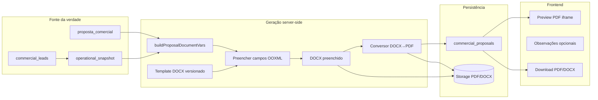
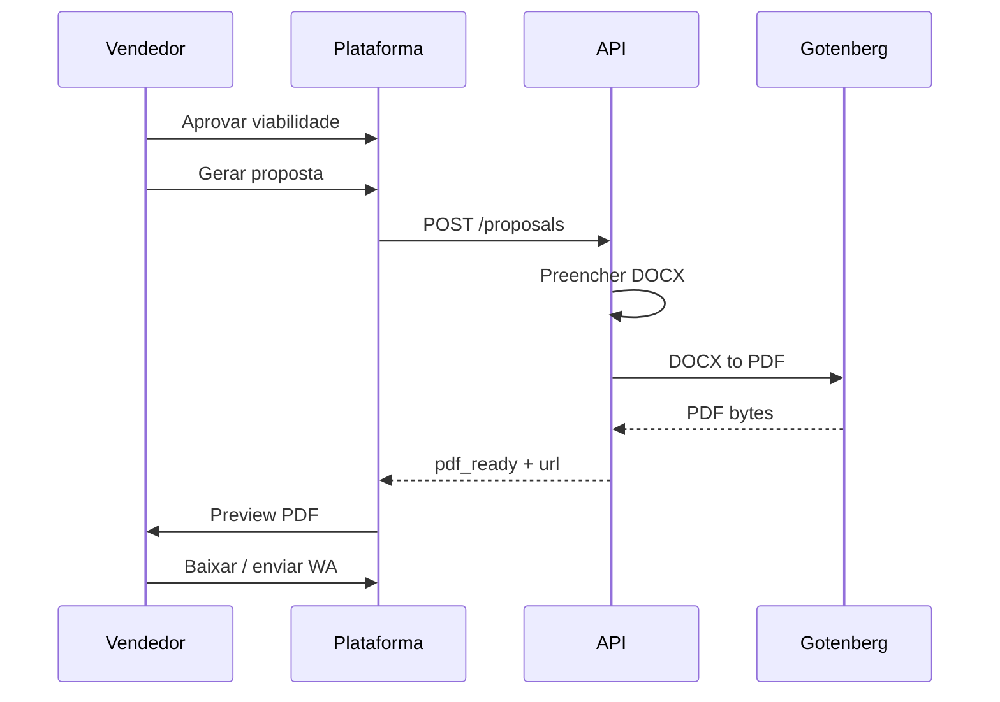

# Plano — Proposta comercial: template fixo + campos + PDF

**Data:** 2026-06-04  
**Status:** Fases 0–5 implementadas (2026-06-03)  
**Substitui (parcialmente):** fluxo “Word → Mammoth → editor HTML → PDF por texto” do plano arquivado `archive/plans/COMMERCIAL_VIABILITY_TEXTS_PLAN.md` §2.1  
**Princípio:** *dados estruturados + template versionado + PDF fiel* — sem licença Office, sem editar layout no browser.

---

## 1. Objetivo e princípios

### Objetivo

Entregar ao cliente um **PDF idêntico ao modelo** `Proposta_Royal_Farma.docx`, preenchido automaticamente a partir da viabilidade aprovada, com revisão mínima pelo vendedor (observações e reenvio), **sem desconfigurar** moeda, campos ou identidade visual.

### Princípios (melhores práticas)

| # | Princípio | Implicação |
|---|-----------|------------|
| P1 | **Separação dados × layout** | Snapshot operacional + `PropostaComercialSnapshot` = fonte da verdade; `.docx` = apresentação. |
| P2 | **Template imutável em runtime** | Consultor não edita o `.docx` na plataforma; mudanças de layout = nova versão de template + deploy. |
| P3 | **PDF gerado do DOCX preenchido** | Não usar HTML convertido como artefato principal de layout. |
| P4 | **Campos explícitos** | Toda variável no template tem nome estável (`NOME_FANTASIA`, `SETUP`, …) documentada no repositório. |
| P5 | **Idempotência** | Mesmo snapshot + mesma versão de template → mesmo PDF (byte-stable desejável, tolerância a metadados). |
| P6 | **Rastreabilidade** | Guardar `template_version`, `document_source` (JSON das variáveis), hash do snapshot na proposta. |
| P7 | **Falha visível** | Se conversão PDF falhar, status `draft` + mensagem clara; nunca enviar PDF truncado. |

---

## 2. Situação atual vs alvo

### Hoje (implementado)

```
Viabilidade → POST /proposals
  → injeção OOXML (docxInjectFieldValues)
  → mammoth → document_html (~5MB ou ~22KB)
  → contentEditable (CommercialProposalEditor)
  → PUT document → PDFKit strip HTML (perda de layout)
```

**Problemas observados:** R$ desalinhado, `,00` órfão, HTML pesado, `dirty` bloqueando PDF, PDF final sem fidelidade ao Word.

### Alvo

```
Viabilidade aprovada → POST /proposals
  → buildProposalDocumentVars(snapshot)
  → preencher Proposta_Royal_Farma.template.docx (OOXML)
  → opcional: persistir .docx preenchido (storage)
  → DOCX → PDF (Gotenberg ou LibreOffice headless)
  → status pdf_ready + pdf_storage_path
  → UI: preview PDF + download; edição limitada a “observações” (texto)
```

**O que sai do caminho crítico:** Mammoth, `document_html` como editor principal, PDFKit sobre HTML para proposta Royal Farma.

**O que permanece:** motor de dimensionamento, cenários, setup/parcelamento na aba Viabilidade, `document_source` JSON, migration 053.

---

## 3. Arquitetura alvo



### Componentes backend (api-service)

| Módulo | Responsabilidade |
|--------|------------------|
| `proposalDocumentVars.ts` | `buildProposalDocumentVars` (já em `proposalDocumentHtml.ts` — renomear/agrupar) |
| `proposalTemplateCatalog.ts` | Versão ativa do template, path, lista de tags obrigatórias |
| `proposalDocxFill.ts` | Injeção OOXML (evoluir `docxInjectFieldValues`) |
| `proposalDocxToPdf.ts` | Adapter Gotenberg/LibreOffice |
| `proposalService.ts` | Orquestração: create, regenerate, generatePdf |
| `proposalStorage.ts` | Upload/download Supabase Storage ou GCS |

### Conversor DOCX → PDF (recomendação)

| Opção | Prós | Contras |
|-------|------|---------|
| **Gotenberg** (container HTTP) | API simples, escala horizontal, qualidade boa | +1 serviço no compose/prod |
| **LibreOffice headless** (CLI no mesmo container) | Sem serviço extra | Imagem Docker maior, concorrência frágil |
| **PDFKit/HTML** | Já existe | **Não usar** para Royal Farma |

**Recomendação:** Gotenberg em `docker-compose` local e Cloud Run sidecar ou serviço dedicado em produção.

---

## 4. Governança do template Word

### Repositório

```
apps/api-service/assets/proposals/
  Proposta_Royal_Farma.v1.docx      # template com MERGEFIELD ou {TAG}
  Proposta_Royal_Farma.v1.manifest.json
scripts/
  build-royal-farma-template.mjs    # MERGEFIELD → {TAG} se necessário
  validate-proposal-template.mjs    # CI: tags ↔ manifest
```

### Manifest (`*.manifest.json`)

```json
{
  "id": "royal_farma",
  "version": 1,
  "file": "Proposta_Royal_Farma.v1.docx",
  "fields": [
    "NOME_FANTASIA", "RAZAO_SOCIAL", "CNPJ", "CONTATO",
    "TAXA_1", "QT_ENTREGAS", "MINIMO_GARANTIDO", "SETUP",
    "QT_ENTREGADORES", "SEG_A_SEX", "SAB", "DOM", "FER"
  ],
  "optional_fields": [
    "SETUP_PAGAMENTO", "QT_DIARIAS_SEMANA", "VALOR_DIARIA",
    "TEXTO_FOLGUISTA", "TEXTO_ESCALA_RESUMIDA", "DATA_PROPOSTA"
  ],
  "currency_fields": ["SETUP", "MINIMO_GARANTIDO", "TAXA_1", "VALOR_DIARIA"],
  "notes": "R$ fica como texto fixo antes do campo; valor sem prefixo R$"
}
```

### Regras de edição do `.docx` (designer)

1. Um campo = um bloco MERGEFIELD (evitar quebrar valor em vários runs manualmente).
2. Não colocar `,00` **fora** do campo para moedas — o sistema envia `1.000,00` completo.
3. `R$` permanece **fixo** no template; variáveis trazem só número formatado pt-BR.
4. Alteração de layout → incrementar `version` no manifest + teste visual automatizado (smoke PDF).

---

## 5. Modelo de dados

### `commercial_proposals` (evolução)

| Coluna | Uso alvo |
|--------|----------|
| `operational_snapshot` | Congelado na criação (já existe) |
| `document_source` | JSON `ProposalDocumentVars` + `template_id` + `template_version` |
| `document_html` | **Deprecar** para Royal Farma; manter nullable para propostas legadas |
| `document_saved_at/by` | Manter para observações ou última regeneração |
| `template_version` | **Novo** integer |
| `docx_storage_path` | **Novo** — DOCX preenchido opcional |
| `pdf_storage_path` | **Novo** — PDF oficial |
| `pdf_generated_at` | Já previsto |
| `setup_cents`, `package_name`, … | Manter |

### Status

| Status | Significado |
|--------|-------------|
| `draft` | Proposta criada; PDF não gerado ou inválido |
| `pdf_ready` | PDF gerado do DOCX e armazenado |
| `sent` | Enviada ao cliente |
| `accepted` | Ganho |

**Regra:** alterar viabilidade/setup após `pdf_ready` → exigir **Regenerar proposta** (novo PDF, versão++ ou overwrite com confirmação).

---

## 6. APIs REST

| Método | Rota | Comportamento alvo |
|--------|------|-------------------|
| `POST` | `/commercial/proposals` | Cria proposta, preenche DOCX, gera PDF, retorna `pdf_url`, `status: pdf_ready` |
| `GET` | `/commercial/proposals/:id` | Metadados + URLs de preview (sem `document_html` grande) |
| `GET` | `/commercial/proposals/:id/pdf` | Stream PDF (storage ou cache) |
| `GET` | `/commercial/proposals/:id/docx` | **Novo** — download DOCX preenchido (secundário) |
| `POST` | `/commercial/proposals/:id/regenerate` | Recalcula vars do snapshot atual → novo DOCX + PDF |
| `PUT` | `/commercial/proposals/:id/notes` | **Novo** — só `notes` / observações comerciais (texto) |
| ~~`PUT`~~ | ~~`/document`~~ | **Deprecar** para Royal Farma |

### Resposta `POST /proposals` (exemplo)

```json
{
  "id": "uuid",
  "version": 1,
  "status": "pdf_ready",
  "template_version": 1,
  "pdf_url": "/api/commercial/proposals/{id}/pdf",
  "docx_url": "/api/commercial/proposals/{id}/docx",
  "document_source": { "nome_fantasia": "...", "setup": "10.000,00", ... },
  "pdf_generated_at": "2026-06-04T12:00:00Z"
}
```

---

## 7. UX (frontend)

### Tela `/commercial/proposals/[id]` — refatoração

| Zona | Conteúdo |
|------|----------|
| Cabeçalho | Cliente, versão, status, data do PDF |
| **Principal** | `<iframe>` ou viewer PDF (URL assinada) — preview fiel |
| Lateral / rodapé | Resumo dos valores (somente leitura): cenário, setup, parcelas, taxa, MG |
| Ações primárias | **Baixar PDF**, **Regenerar do sistema**, **Marcar enviada** |
| Ações secundárias | Baixar DOCX, voltar à ficha do lead |
| Observações | `textarea` + Salvar → `PUT .../notes` (não mexe no layout) |

### Remover / ocultar

- `CommercialProposalEditor` (`contentEditable`) do fluxo Royal Farma.
- Botão “Salvar documento” de HTML.
- Dependência de `dirty` / `savedHtml` para habilitar PDF.

### Aba Viabilidade (inalterada conceitualmente)

- Cenário, setup, parcelamento, aprovar análise.
- Ao alterar dados após proposta existente: banner *“Regenere a proposta para refletir no PDF.”*

### Fluxo vendedor (simplificado)



---

## 8. Fases de implementação

### Fase 0 — Preparação (1–2 dias)

- [ ] Congelar template `v1` + `manifest.json`
- [ ] Script `validate-proposal-template.mjs` no CI
- [ ] Documentar campos e regras de moeda para designers
- [ ] Decisão infra: Gotenberg local/prod

### Fase 1 — Pipeline DOCX → PDF (core)

- [ ] `proposalDocxToPdf.ts` + healthcheck Gotenberg
- [ ] `proposalService.create`: preencher DOCX → PDF → storage
- [ ] Persistir `document_source`, `template_version`, `pdf_storage_path`
- [ ] `GET /pdf` lê do storage (fallback regenerar se ausente)
- [ ] Smoke: `scripts/smoke-proposal-pdf.mjs` (vars conhecidas → PDF não vazio, contém nome do lead)

### Fase 2 — UI preview (sem editor HTML)

- [ ] Refatorar `CommercialProposalPage`: iframe PDF + ações
- [ ] `POST /proposals` na ficha: redirecionar para preview já com PDF
- [ ] Remover gate `dirty` / save HTML
- [ ] Banner propostas legadas com `document_html` only

### Fase 3 — Regenerar e observações

- [ ] `POST /regenerate` com confirmação
- [ ] `PUT /notes` para observações
- [ ] `GET /docx` download opcional
- [ ] Atividade no lead: “Proposta vN regenerada”

### Fase 4 — Campos extras no template

- [ ] Incluir no `.docx` v1.1: `SETUP_PAGAMENTO`, `DATA_PROPOSTA`, textos folguista/escala (se couber no design)
- [ ] Atualizar manifest + injeção
- [ ] Versão 1.0 mantida para propostas antigas (`template_version` na row)

### Fase 5 — Deprecação e limpeza

- [ ] Desativar Mammoth no caminho Royal Farma
- [ ] Remover ou arquivar `proposalRoyalFarmaDocx` conversão HTML
- [ ] Marcar `document_html` read-only legado; não popular em novas propostas
- [ ] Atualizar `COMMERCIAL_VIABILITY_TEXTS_PLAN.md` com referência a este doc

### Fase 6 — Envio WhatsApp (opcional)

- [ ] `POST /send` anexa PDF do storage
- [ ] Template de mensagem com link assinado temporário

---

## 9. Infraestrutura e DevOps

### Docker Compose (dev)

```yaml
gotenberg:
  image: gotenberg/gotenberg:8
  ports:
    - "3006:3000"
```

Variável: `GOTENBERG_URL=http://gotenberg:3000`

### Produção

- Serviço Gotenberg com CPU/memória para pico de conversão (ex. 1–2 vCPU, 512MB–1GB).
- Timeout HTTP 60s por proposta (documentos grandes).
- Fila opcional (Pub/Sub + worker) se geração > 5s P95.

### Storage

- Bucket `commercial-proposals/{workspace_id}/{proposal_id}/v{version}.pdf`
- Política: apenas membros do workspace; URL assinada TTL 15 min.

### Assets no build

- Copiar `assets/proposals/` no Dockerfile api-service (já há precedente com `assets/`).

---

## 10. Segurança e compliance

- Sanitizar **apenas** campos de texto livre (`notes`, `setup_observacao`) — não injetar HTML no DOCX.
- Variáveis numéricas: sempre formatar no backend (`formatBrlCents`, `formatBrlValue`).
- Logs sem CNPJ completo em produção (mascarar).
- Rate limit em `POST /proposals` e `/regenerate` por workspace.

---

## 11. Testes

| Tipo | O que validar |
|------|----------------|
| Unit | `buildProposalDocumentVars`, `qt_entregas = ceil(mg/taxa)`, normalização tags |
| Unit | `injectMergeFieldDisplayValues` com fixture XML (moeda, sufixo `,00`) |
| Integration | DOCX preenchido contém valor; PDF contém string do lead (pdf-parse ou texto extraído) |
| Visual manual | Checklist Royal Farma: capa, tabela valores, R$ alinhado |
| Regression | 3 cenários (enxuto, enxuto_domingo, integral) + setup parcelado |

---

## 12. Métricas de sucesso

- **0** relatórios de “layout desconfigurado” em propostas novas (30 dias).
- Tempo P95 `POST /proposals` < 15s (com Gotenberg).
- 100% propostas novas com `pdf_storage_path` e `template_version`.
- Vendedor conclui fluxo sem salvar HTML intermediário.

---

## 13. Fora de escopo (explícito)

- Editor WYSIWYG do layout da proposta no browser.
- Office 365 / OnlyOffice embed.
- Edição de MERGEFIELD pelo vendedor.
- Múltiplos templates por workspace (futuro: `template_id` por marca).

---

## 14. Mapeamento código atual → ação

| Artefato atual | Ação |
|----------------|------|
| `docxInjectFieldValues.ts` | **Manter** — core do preenchimento |
| `proposalRoyalFarmaDocx.ts` (mammoth) | **Remover** do fluxo após Fase 1 |
| `proposalDocumentHtml.ts` (HTML genérico) | **Manter** só vars builder; remover `generateProposalDocumentHtml` se não usado |
| `proposalPdfFromHtml.ts` | **Deprecar** para Royal Farma |
| `proposalPdf.ts` (PDFKit snapshot) | **Fallback** legado ou remover |
| `CommercialProposalEditor.tsx` | **Ocultar** / remover da página |
| `CommercialProposalPage.tsx` | **Refatorar** Fase 2 |
| Migration 053 | **Estender** Fase 1 (`template_version`, paths) |
| `docs/COMMERCIAL_VIABILITY_TEXTS_PLAN.md` | Atualizar §2 para apontar para este plano |

---

## 15. Parecer executivo

A plataforma já possui **80% da lógica de negócio** (dimensionamento, cenários, setup, variáveis). O desvio está na **camada de apresentação** (Mammoth + HTML + PDFKit). Realinhar para **DOCX preenchido → PDF** é mudança de **arquitetura de saída**, não de produto comercial.

**Investimento recomendado:** Fases 0–2 primeiro (PDF fiel + UI preview); Fases 3–4 em seguida; deprecação HTML na 5.

**Risco principal:** operação do Gotenberg/LibreOffice em produção — mitigar com smoke tests e container dedicado.

---

*Referências internas:* `COMMERCIAL_VIABILITY_TEXTS_PLAN.md`, `COMMERCIAL_OPS_IMPLEMENTATION_PLAN.md`, `CRM_FRONTEND_BRIEF.md` §4.7.
