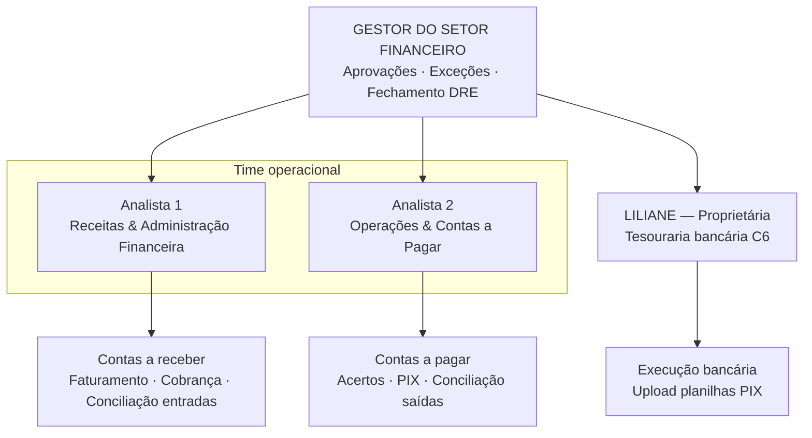
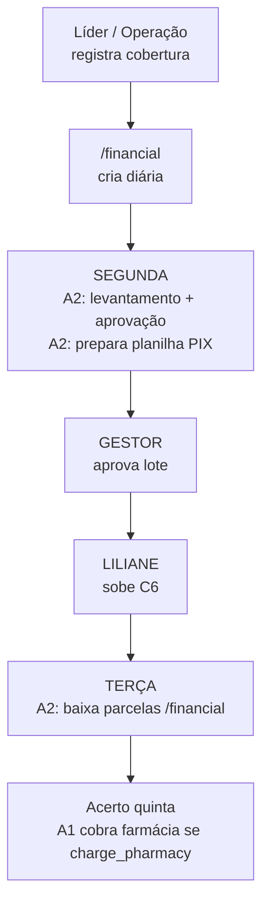
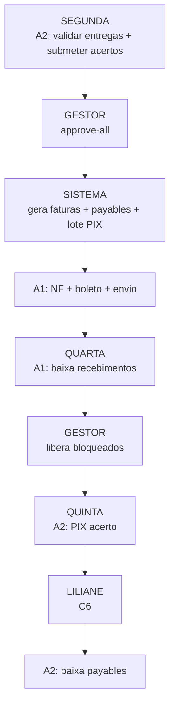
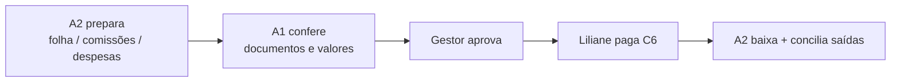
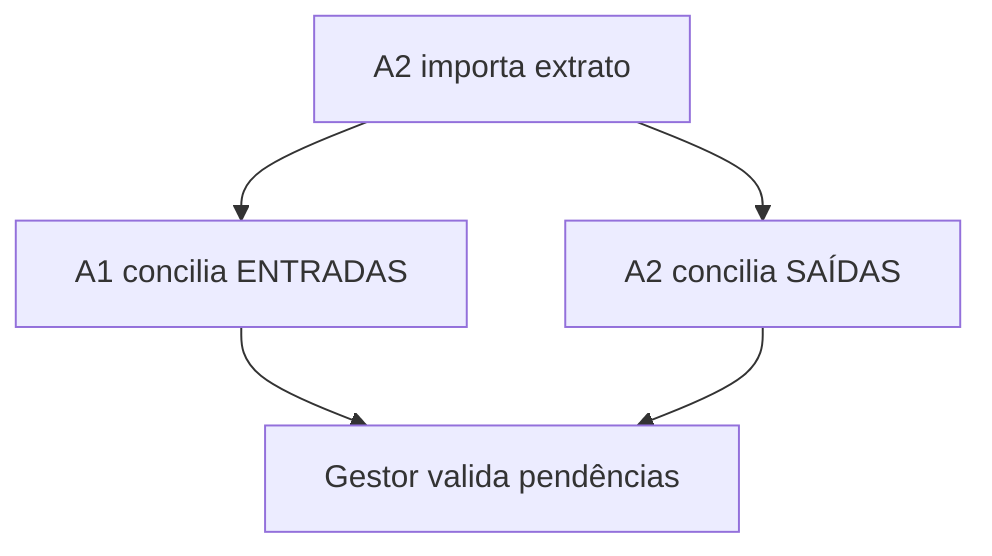
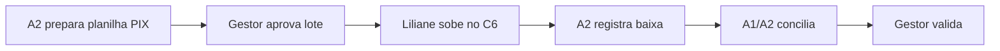

# Onboarding Operacional — Setor Financeiro

Documento de referência para estrutura, fluxos, matriz RACI e rotinas do setor financeiro (Flux Farma / CoopMob).

**Versão:** 1.0  
**Última atualização:** 2026-07-13  
**Relacionados:** [FINANCIAL_CYCLES.md](./FINANCIAL_CYCLES.md), [BILLING_MODULE_ROADMAP.md](./BILLING_MODULE_ROADMAP.md), [BILLING_IMPLEMENTATION_PLAN_MG_DAILIES_OFFBOARDING.md](./BILLING_IMPLEMENTATION_PLAN_MG_DAILIES_OFFBOARDING.md), [access-matrix-by-role.md](./access-matrix-by-role.md)

---

## 1. Estrutura do time

### 1.1 Organograma



### 1.2 Papéis e acesso na plataforma

| Pessoa | Papel operacional | Role sugerido | Módulos principais |
|--------|-------------------|---------------|-------------------|
| **Gestor** | Direção, aprovações, fechamento | `supervisor` ou `admin` | `/billing`, `/financial`, `/operacao` (gestor financeiro) |
| **Analista 1** | Receitas e administração | `financial` | `/billing` (AR), `/billing/cadastros`, `/billing/relatorios` |
| **Analista 2** | Operações e pagamentos | `financial` + setor **Financeiro** | `/billing` (AP), `/financial`, `/operacao` (execução) |
| **Liliane** | Tesouraria bancária | Sem acesso ao sistema* | Internet banking C6 |

\* Liliane opera exclusivamente no banco. Recebe planilhas PIX aprovadas pelo gestor (e-mail/WhatsApp).

### 1.3 Resumo em uma frase por pessoa

| Pessoa | Responsabilidade |
|--------|------------------|
| **Analista 1** | Tudo que **entra**: faturar, cobrar, baixar recebimentos, conciliar entradas, cadastros e regulatório |
| **Analista 2** | Tudo que **opera e sai**: acertos, diárias, preparar PIX, baixar pagamentos, conciliar saídas |
| **Liliane** | **Executa** no C6 o que o gestor aprovou |
| **Gestor** | **Aprova**, libera exceções e **fecha** o mês (DRE) |

---

## 2. Princípios de governança

| Princípio | Aplicação |
|-----------|-----------|
| **Segregação AR/AP** | Analista 1 = entradas; Analista 2 = saídas |
| **Maker-checker** | Analista prepara → Gestor aprova → Liliane executa no banco |
| **4 olhos no banco** | Somente Liliane faz upload PIX no C6 |
| **Baixa ≠ conciliação** | Baixa na qua/qui; conciliação na sexta; gestor valida |
| **Competência × caixa** | Lançamentos por competência; Liliane opera por caixa |
| **Fonte única diárias** | `/financial` lança; `/billing` consome no acerto |

---

## 3. Configuração do sistema

### 3.1 Financeiro (`financial_discount_rules`)

Fonte: `app_settings.financial_discount_rules` — UI: Financeiro → Configuração regras.

| Regra | Padrão | Efeito |
|-------|--------|--------|
| Diária `daysOfWeek` | `[2, 4]` | Pagamento **terça** e **quinta** (1=Seg … 7=Dom) |
| Corte diária | `11h` (SP) | Após 11h no dia de pagamento → próximo lote; **segunda após 11h** → quinta (não terça) |
| Falta `daysOfWeek` | `[4]` | Desconto na **quinta** (ciclo seg–dom do evento) |
| Conferência terça | Exclusiva | **Somente diárias** |
| Conferência quinta | Liquidação | Diárias + descontos com parcela nesta data |

Ver [FINANCIAL_CYCLES.md](./FINANCIAL_CYCLES.md).

### 3.2 Faturamento (`billingPaymentPolicy` / centro de custo)

| Regra | Padrão |
|-------|--------|
| Vencimento fatura farmácia | **Quarta** |
| Pagamento acerto entregador | **Quinta** |
| Bloquear PIX sem baixa fatura | **Sim** (`block_c6_without_invoice_payment`) |
| Liberação alternativa | `manager_release` (gestor) |

### 3.3 Gatilho `approve-all` dos acertos

Ao aprovar todos os acertos de um ciclo (`POST /cycles/:cycleId/settlements/approve-all`), o sistema dispara em sequência:

1. Efeitos financeiros cooperativos (cotas/recuperações)
2. Geração de faturas Coop + Flux
3. Geração de payables dos entregadores
4. Pré-exportação do lote PIX

A **execução** no banco (Liliane) e o **envio** de NF/boleto são etapas operacionais distintas.

### 3.4 Três camadas de conciliação

| Camada | O que é | Tela | Estado |
|--------|---------|------|--------|
| **Baixa** | Registro de pagamento/recebimento | `/billing/receber`, `/billing/pagar`, `/financial` | `billing_payments.reconciled = false` |
| **Extrato** | Movimento real no banco | `/billing/conciliacao` | `billing_bank_movements` |
| **Conciliação** | Casar extrato ↔ baixa | `/billing/conciliacao` | Ambos `reconciled = true` |

---

## 4. Fluxos operacionais

### 4.1 Visão geral da semana


**Dois fluxos paralelos na mesma semana:**

| | Diárias (terça) | Acerto semanal (quinta) |
|--|-----------------|-------------------------|
| **Módulo** | `/financial` + `/operacao` | `/billing` + `/financial` |
| **Segunda** | Levantamento e aprovação (A2) | Aprovar acertos + faturar (Gestor + A1) |
| **Terça** | PIX somente diárias | — |
| **Quarta** | — | Baixa recebimentos (A1) |
| **Quinta** | Diárias com parcela nesta data → PIX diárias (mesmo relatório) | PIX acerto completo (sem diárias) |
| **Depende de fatura farmácia?** | **Não** | **Sim** (ou liberação manual) |

### 4.2 Fluxo A — Diárias (terça)



| Etapa | Responsável | Sistema |
|-------|-------------|---------|
| Líder registra folguista/cobertura | Líder | `/lider`, `/operacao` |
| Sistema cria entry `daily` | Automático | `/financial` |
| Levantamento: aprovar, resolver `pending_audit` | **A2** | `/financial`, `/operacao` |
| Preparar planilha PIX diárias | **A2** | `/billing/relatorios/pagamento-pix-diarias` (ou botão em `/financial` na conferência de terça) |
| Aprovar lote | **Gestor** | — |
| Executar no banco | **Liliane** | C6 |
| Baixa parcelas pagas | **A2** | `/billing/pagar` (AP gerado no export) e/ou `/financial` |
| Conciliar débitos | **A2** | `/billing/conciliacao` (sexta) |

**Estado atual:** lote C6 de diárias em `/billing/relatorios/pagamento-pix-diarias` (lê diárias aprovadas do Financeiro). O acerto de quinta continua em `/billing/relatorios/pagamento-pix` e **não** inclui APs `financial_daily`. No motor de acerto, a diária ainda aparece na fatura da farmácia (`charge_pharmacy`), mas o **repasse ao entregador** fica só na trilha de diárias — evita pagamento em dobro.

### 4.3 Fluxo B — Acerto semanal (quinta)



| Etapa | Responsável | Sistema |
|-------|-------------|---------|
| Validar entregas ciclo seg–dom | **A2** | `/billing/entregas` |
| Revisar acertos, submeter `in_review` | **A2** | `/billing/acertos` |
| Tratar faltas/adiantamentos do ciclo | **A2** | `/financial`, `/operacao` |
| **Aprovar acertos** (`approve-all`) | **Gestor** | `/billing/acertos` |
| Conferir faturas, emitir NF/boleto, enviar | **A1** | `/billing/faturamento` + emissor externo |
| Cobrança ativa | **A1** | — |
| Baixa recebimentos (venc. quarta) | **A1** | `/billing/receber` |
| Liberar payables bloqueados | **Gestor** | `/billing/pagar` |
| Preparar lote PIX acerto | **A2** | `/billing/relatorios/pagamento-pix` |
| Executar no banco | **Liliane** | C6 |
| Baixa payables | **A2** | `/billing/pagar` |

### 4.4 Fluxo C — Pagamentos mensais



### 4.5 Fluxo D — Conciliação bancária (sexta)



### 4.6 Fluxo de pagamentos com Liliane



**Regra:** Analista 2 **não** executa PIX diretamente no banco.

---

## 5. Calendários

### 5.1 Semanal

| Dia | Analista 1 | Analista 2 | Liliane | Gestor |
|-----|------------|------------|---------|--------|
| **Dom** | — | — | — | Ciclo fecha |
| **Seg manhã** | — | Levantamento diárias terça; fila `/operacao` | — | — |
| **Seg tarde** | NF/boleto/envio farmácias | Validar entregas; revisar acertos; submeter | — | **Aprovar acertos** + faturas |
| **Ter** | Cobrança ativa | PIX diárias → baixa pós-Liliane | **PIX diárias** | Aprovar lote diárias |
| **Qua** | Cobrança; **baixa recebimentos** | Preparar PIX quinta | — | `manager_release` se necessário |
| **Qui** | — | PIX acerto → baixa payables | **PIX acerto** | Aprovar lote acerto |
| **Sex** | **Conciliação entradas**; validar entregas | **Conciliação saídas** | — | **Validar conciliação** |

### 5.2 Mensal

| Semana | Analista 1 | Analista 2 | Liliane | Gestor |
|--------|------------|------------|---------|--------|
| **1ª** | Conferir despesas recorrentes | Gerar folha + comissões líderes | Paga folha/comissões | Aprovar folha e comissões |
| **2ª** | Validar comissões parceiros | Gerar payables comissões | — | Aprovar |
| **3ª** | Revisar cadastros | Lançar despesas variáveis | Paga fornecedores | Aprovar despesas > alçada |
| **Última** | Enviar pacote contador | Export DRE; capital cooperativo | — | **Fechar DRE** |

---

## 6. Mapa de atividades

### Bloco A — Ciclo semanal

| ID | Atividade | Módulo | Freq. |
|----|-----------|--------|-------|
| A01 | Importar/validar entregas | `/billing/entregas` | Semanal |
| A02 | Revisar acertos entregador×farmácia | `/billing/acertos` | Semanal |
| A03 | Submeter acertos (`in_review`) | `/billing/acertos` | Segunda |
| A04 | Aprovar acertos (`approve-all`) | `/billing/acertos` | Segunda |
| A05 | Conferir faturas Coop+Flux geradas | `/billing/faturamento` | Segunda |
| A06 | Emitir NF + boleto (externo) | Emissor + `/billing` | Segunda |
| A07 | Enviar cobrança às farmácias | — | Segunda |
| A08 | Cobrança ativa / 2ª via | — | Ter–qua |
| A09 | Baixa recebimentos farmácias | `/billing/receber` | Quarta |
| A10 | Liberar payables bloqueados | `/billing/pagar` | Qua–qui |
| A11 | Preparar PIX diárias (terça) | `/billing/relatorios/pagamento-pix-diarias` | Seg–ter |
| A12 | Preparar PIX acerto (quinta) | `/billing/relatorios/pagamento-pix` | Quarta |
| A13 | Executar PIX no C6 | Banco | Ter + qui |
| A14 | Baixa parcelas diárias | `/financial` | Terça |
| A15 | Baixa payables acerto | `/billing/pagar` | Quinta |
| A16 | Conciliação entradas | `/billing/conciliacao` | Sexta |
| A17 | Conciliação saídas | `/billing/conciliacao` | Sexta |

### Bloco B — Diárias e financeiro operacional

| ID | Atividade | Módulo | Freq. |
|----|-----------|--------|-------|
| B01 | Levantamento diárias (aprovar pendentes) | `/financial` | Segunda |
| B02 | Resolver `daily_billing_treatment` | `/financial` | Segunda |
| B03 | Tratar faltas / adiantamentos / cotas | `/financial`, `/operacao` | Contínuo |
| B04 | Conferência exclusiva terça (só diárias) | `/financial` | Terça |
| B05 | Desligamento cooperado | `/billing/desligamento` | Evento |

### Bloco C — Receitas não-cíclicas

| ID | Atividade | Módulo | Freq. |
|----|-----------|--------|-------|
| C01 | Boleto/NF setup comercial | Comercial + externo | Evento |
| C02 | Cobrança setup | — | Evento |
| C03 | Relatório público farmácia | `/public/billing` | Semanal |
| C04 | Monitorar aging inadimplência | `/billing/receber` | Semanal |

### Bloco D — Folha e comissões

| ID | Atividade | Módulo | Freq. |
|----|-----------|--------|-------|
| D01 | Gerar folha (pró-labore + prestadores) | `/billing/pagar` | Mensal |
| D02 | Conferir valores folha × contrato | `/billing/cadastros` | Mensal |
| D03 | Provisionar comissões líderes | `/billing/relatorios/comissoes-lideres` | Mensal |
| D04 | Validar comissões parceiros × leads | `/billing/relatorios/comissoes` | Mensal |
| D05 | Gerar payables comissões | `/billing/pagar` | Mensal |

### Bloco E — Despesas

| ID | Atividade | Módulo | Freq. |
|----|-----------|--------|-------|
| E01 | Conferir despesas recorrentes | `/billing/despesas` | Mensal |
| E02 | Lançar despesas (DRE/rateio) | `/billing/despesas` | Contínuo |
| E03 | Coletar NF fornecedor | — | Contínuo |
| E04 | Pagar fornecedores via PIX | `/billing/pagar` | Por vencimento |
| E05 | Reembolso: documentação | — | Evento |
| E06 | Reembolso: lançamento AP | `/billing/pagar` | Evento |

### Bloco F — Regulatório e fechamento

| ID | Atividade | Módulo | Freq. |
|----|-----------|--------|-------|
| F01 | INSS cooperados (contabilidade) | `/billing/relatorios/inss-contabilidade` | Mensal |
| F02 | INSS pró-labore sócios | `/billing/relatorios/inss-pro-labore-socios` | Mensal |
| F03 | Relatório seguradora | `/billing/relatorios/seguradora` | Mensal |
| F04 | Capital cooperativo | `/billing/capital-cooperativo` | Mensal |
| F05 | Fechar DRE | `/billing/dre` | Mensal |
| F06 | Export DRE contador | `/billing/relatorios/dre` | Mensal |

### Bloco G — Cadastros e configuração

| ID | Atividade | Módulo | Freq. |
|----|-----------|--------|-------|
| G01 | Fornecedores | `/billing/cadastros` | Sob demanda |
| G02 | Prestadores internos | `/billing/cadastros` | Sob demanda |
| G03 | Sócios | `/billing/cadastros` | Sob demanda |
| G04 | Parceiros comerciais | `/billing/cadastros` | Sob demanda |
| G05 | Centros de custo / políticas | `/billing/config` | Gestor |
| G06 | Integrações Flux | `/billing/integracoes` | Contínuo |

---

## 7. Matriz RACI

**Legenda:** **R** = executa · **A** = aprova/responsável final · **C** = consultado · **I** = informado · **—** = não envolvido

### 7.1 Ciclo semanal

| Atividade | A1 | A2 | Liliane | Gestor |
|-----------|----|----|---------|--------|
| A01 Validar entregas | I | **R** | — | I |
| A02 Revisar acertos | I | **R** | — | C |
| A03 Submeter acertos | — | **R** | — | I |
| A04 Aprovar acertos | I | C | — | **A** |
| A05 Conferir faturas geradas | **R** | I | — | C |
| A06 Emitir NF/boleto | **R** | — | — | **A** |
| A07 Enviar cobrança | **R** | — | — | I |
| A08 Cobrança ativa | **R** | — | — | C |
| A09 Baixa recebimentos | **R** | — | — | A* |
| A10 Liberar bloqueados | I | C | — | **A** |
| A11 Preparar PIX diárias | — | **R** | — | **A** |
| A12 Preparar PIX acerto | — | **R** | — | **A** |
| A13 Executar PIX C6 | — | I | **R** | I |
| A14 Baixa diárias | — | **R** | — | I |
| A15 Baixa payables acerto | — | **R** | — | I |
| A16 Conciliação entradas | **R** | — | — | **A** |
| A17 Conciliação saídas | — | **R** | — | **A** |

### 7.2 Diárias e financeiro

| Atividade | A1 | A2 | Liliane | Gestor |
|-----------|----|----|---------|--------|
| B01 Levantamento diárias (seg) | — | **R** | — | C |
| B02 Resolver billing treatment | C | **R** | — | **A** |
| B03 Faltas/adiantamentos/cotas | I | **R** | — | **A** |
| B04 Conferência terça | — | **R** | — | I |
| B05 Desligamento | C | **R** | I | **A** |

### 7.3 Receitas eventuais

| Atividade | A1 | A2 | Liliane | Gestor |
|-----------|----|----|---------|--------|
| C01 NF/boleto setup | **R** | I | — | **A** |
| C02 Cobrança setup | **R** | — | — | I |
| C03 Relatório público farmácia | **R** | — | — | I |
| C04 Aging inadimplência | **R** | I | — | **A** |

### 7.4 Folha e comissões

| Atividade | A1 | A2 | Liliane | Gestor |
|-----------|----|----|---------|--------|
| D01 Gerar folha | I | **R** | — | I |
| D02 Conferir folha × contrato | **R** | C | — | **A** |
| D03 Comissões líderes | I | **R** | — | I |
| D04 Validar comissões parceiros | **R** | C | — | I |
| D05 Payables comissões | I | **R** | — | **A** |
| Executar PIX folha/comissões | I | C | **R** | **A** |

### 7.5 Despesas e reembolsos

| Atividade | A1 | A2 | Liliane | Gestor |
|-----------|----|----|---------|--------|
| E01 Conferir recorrentes | **R** | C | — | I |
| E02 Lançar despesas (DRE) | C | **R** | — | A* |
| E03 Coletar NF fornecedor | **R** | I | — | — |
| E04 Pagar fornecedores | I | **R** | **R** | **A** |
| E05 Reembolso documentação | **R** | I | — | I |
| E06 Reembolso AP + pagamento | C | **R** | **R** | **A** |

### 7.6 Regulatório e fechamento

| Atividade | A1 | A2 | Liliane | Gestor |
|-----------|----|----|---------|--------|
| F01 INSS cooperados | **R** | C | — | **A** |
| F02 INSS pró-labore | **R** | C | — | **A** |
| F03 Seguradora | **R** | C | — | **A** |
| F04 Capital cooperativo | I | **R** | — | **A** |
| F05 Fechar DRE | C | C | — | **R/A** |
| F06 Export DRE | I | **R** | — | **A** |
| Enviar pacote contador | **R** | C | — | **A** |

### 7.7 Cadastros

| Atividade | A1 | A2 | Liliane | Gestor |
|-----------|----|----|---------|--------|
| G01–G04 Cadastros financeiros | **R** | C | — | **A** |
| G05 Config CC/políticas | C | C | — | **R/A** |
| G06 Integrações Flux | I | **R** | — | A* |

\* Gestor aprova exceções e valores acima da alçada.

---

## 8. Distribuição de carga (~50/50)

| Cluster | Analista 1 | Analista 2 |
|---------|------------|------------|
| Ciclo operacional (acertos, entregas, diárias) | 5% | **35%** |
| Faturamento / AR / cobrança | **30%** | 5% |
| Pagamentos PIX / AP | 10% | **30%** |
| Conciliação | **15%** (entradas) | **15%** (saídas) |
| Despesas / folha / comissões | **15%** (conferência) | **10%** (lançamento) |
| Regulatório / cadastros | **20%** | 5% |
| **Total estimado** | **~50%** | **~50%** |

### Atribuição por analista

**Analista 1 — Receitas & Administração**

- Faturamento farmácias, NF/boleto, cobrança, setup
- Baixa recebimentos e conciliação **entradas**
- Relatórios INSS, seguradora, envio contador
- Cadastros financeiros
- Conferência despesas recorrentes e folha
- Validação comissões parceiros e documentação reembolsos

**Analista 2 — Operações & Contas a Pagar**

- Ciclo: entregas, acertos, levantamento diárias
- PIX preparação (terça + quinta) e baixas saídas
- Conciliação **saídas**
- `/financial`: faltas, adiantamentos, cotas
- Lançamento despesas (DRE/rateio)
- Folha/comissões (geração), desligamentos, Flux

---

## 9. Alçadas do gestor

| Situação | Quando |
|----------|--------|
| Aprovar acertos (`approve-all`) | Segunda |
| Aprovar faturas antes do envio | Segunda |
| Aprovar lotes PIX (diárias + acerto) | Terça e quinta |
| `manager_release` — pagar sem baixa fatura | Qua–qui (documentado) |
| Abonar falta / adiantamento fora da política | Contínuo |
| Aprovar folha, comissões, despesas acima do limite | Mensal |
| Validar conciliação semanal | Sexta |
| Fechar DRE mensal | Última semana do mês |
| Alterar políticas de centro de custo | Sob demanda |

### Sugestão de limites

| Tipo | Analistas resolvem | Exige gestor |
|------|-------------------|--------------|
| Despesa | Até R$ 500 | Acima |
| Reembolso | Documentação OK | Sempre aprovar |
| Liberação PIX bloqueado | — | Sempre |
| Desconto em cobrança farmácia | — | Sempre |

---

## 10. Alertas do sistema

| Código | Tela | Responsável |
|--------|------|-------------|
| `C6_BLOCKED_INVOICE_NOT_PAID` | `/billing` overview | A2 identifica · Gestor libera |
| `PAYMENT_WITHOUT_BANK_MOVEMENT` | `/billing/conciliacao` | A1 (entrada) / A2 (saída) |
| `BANK_MOVEMENT_UNRECONCILED` | `/billing/conciliacao` | A1 / A2 |
| `BANK_MATCH_REVIEW_REQUIRED` | `/billing/conciliacao` | Gestor valida |
| Faltas `pending_approval` | `/financial`, `/operacao` | A2 + Gestor |
| `pending_audit` em diária | `/financial` | Gestor decide treatment |

---

## 11. Onboarding — 90 dias

| Fase | Semanas | Analista 1 | Analista 2 | Gestor |
|------|---------|------------|------------|--------|
| **Fundamentos** | 1–2 | Tour AR, cadastros | Tour `/financial`, acertos, diárias | Apresentar governança |
| **Assistido** | 3–6 | 1º faturamento completo | 1º ciclo diárias + acerto | Aprovar tudo; documentar desvios |
| **Autonomia** | 7–12 | AR semanal sem retrabalho | 2 PIX/semana + conciliação limpa | Só aprovações e exceções |

**Critérios de pronto (fase 3):**

- Zero PIX sem aprovação prévia do gestor
- Zero item órfão na conciliação de sexta
- Liliane recebe planilha padronizada: `PIX-{tipo}-{AAAA-MM-DD}.xlsx`
- Payables bloqueados só liberados com baixa ou `manager_release` documentado

---

## 12. Checklists operacionais

### 12.1 Segunda-feira — Analista 2

```
□ 08h — Fila /operacao (faltas, adiantamentos, desligamentos)
□ 09h — /financial → conferência TERÇA → aprovar diárias pendentes
□ 10h — Resolver pending_audit com gestor
□ 11h — /billing/relatorios/pagamento-pix-diarias → preview + export C6 (ou botão “Exportar PIX diárias” em /financial)
□ 13h — /billing/entregas → validar ciclo seg–dom
□ 14h — /billing/acertos → revisar divergências (MG, tarifas, Flux)
□ 15h — /financial → faltas/adiantamentos do ciclo
□ 16h — Submeter acertos (in_review) → notificar gestor
```

### 12.2 Segunda-feira — Analista 1

```
□ 14h — Aguardar approve-all do gestor
□ 14h30 — /billing/faturamento → conferir faturas Coop+Flux geradas
□ 15h — Emitir NF + boleto (venc. quarta) no emissor externo
□ 16h — Enviar pacote cobrança às farmácias + relatório público
□ 16h30 — Notificar gestor: faturas prontas para validação final
```

### 12.3 Segunda-feira — Gestor

```
□ Aprovar acertos (approve-all) após revisão do A2
□ Aprovar faturas antes do envio às farmácias
□ Decidir exceções: pending_audit, adiantamentos fora da política
```

### 12.4 Terça-feira

```
□ A2 — Revisão final diárias /financial (filtro terça)
□ A2 — /billing/relatorios/pagamento-pix-diarias → export C6 (ou botão no Financeiro)
□ GESTOR — Aprovar lote
□ A2 — Enviar planilha à Liliane
□ LILIANE — Upload C6 + confirmar execução
□ A2 — Baixa APs em /billing/pagar (e parcelas no Financeiro sincronizam)
□ A1 — Cobrança ativa farmácias
```

### 12.5 Quarta-feira — Analista 1

```
□ Conferir extrato — créditos de farmácias
□ /billing/receber → registrar baixas
□ Listar inadimplentes → cobrança ativa
□ Informar A2 quais payables foram desbloqueados
```

### 12.6 Quinta-feira

```
□ A2 — /billing/relatorios/pagamento-pix → lote acerto (só desbloqueados)
□ GESTOR — Aprovar lote
□ A2 — Enviar planilha à Liliane
□ LILIANE — Upload C6
□ A2 — /billing/pagar → baixa payables
```

### 12.7 Sexta-feira — Conciliação

```
□ A2 — Importar extrato em /billing/conciliacao
□ A1 — Casar créditos × baixas /billing/receber
□ A2 — Casar débitos × baixas /billing/pagar e /financial
□ GESTOR — Revisar alertas BANK_MATCH_REVIEW_REQUIRED e unmatched
□ A1 — Validar entregas da semana corrente (base para próxima segunda)
```

### 12.8 Implantação do setor (antes do dia 1)

```
□ Criar usuários: financial (analistas), supervisor/admin (gestor)
□ Configurar setor Financeiro em Settings → Setores
□ Validar BILLING_MODULE_ENABLED no ambiente
□ Cadastrar entidades jurídicas Coop/Flux em /billing/config
□ Configurar centros de custo, contas bancárias e política de pagamento
□ Definir emissor NF/boleto e credenciais C6 (Liliane)
□ Revisar financial_discount_rules em /financial
□ Tour das telas com ambos os analistas
□ Piloto: 2–3 farmácias no primeiro ciclo real
```

---

## 13. Integração Financeiro ↔ Faturamento (diárias)

```
Líder registra cobertura
        ↓
/financial cria entry type=daily (start_date = terça ou quinta)
        ↓
Segunda: A2 aprova (levantamento)
        ↓
Terça: paga via /financial (parcela) — não depende de fatura farmácia
        ↓
Quinta (acerto): /billing lê a diária para COBRAR farmácia
        (daily_billing_treatment = charge_pharmacy)
```

O **Financeiro** é fonte de verdade do lançamento; o **Faturamento** consome para cobrança/repasse no acerto semanal.

---

## 14. NF-e, boleto e faturamento externo

Na v1 do módulo `/billing`, o sistema faz **controle interno** + relatório HTML. **NF-e/NFS-e e boleto** são emitidos em ferramenta externa; a baixa é registrada na plataforma.

| Atividade externa | Onde executar | Registrar na plataforma |
|-------------------|---------------|-------------------------|
| NFS-e / NF-e | Prefeitura, SEFAZ ou emissor (Conta Azul, Omie, etc.) | `/billing/receber` |
| Boleto | Banco ou gateway (C6, Inter, etc.) | `/billing/receber` |
| PIX em lote | C6 via Liliane | `/billing/pagar` ou `/financial` |
| Contabilidade | Contador externo | Export `/billing/relatorios/inss-contabilidade`, DRE |

---

## 15. Resumo do calendário integrado

| Fluxo | Segunda | Terça | Quarta | Quinta | Sexta |
|-------|---------|-------|--------|--------|-------|
| **Diárias** | Levantamento (A2) | PIX (Liliane) | — | — | Conciliação saída (A2) |
| **Acerto** | Approve (Gestor) + Faturar (A1) | Cobrança (A1) | Baixa AR (A1) | PIX (Liliane) | Conciliação entrada (A1) |

| Lote PIX Liliane | Dia | Conteúdo |
|------------------|-----|----------|
| **PIX diárias** | Terça | Folguistas/coberturas |
| **PIX acerto** | Quinta | Entregas, MG, descontos, cotas |
| **PIX mensais** | Conforme vencimento | Folha, comissões, fornecedores |

---

## Manutenção

Ao alterar regras de ciclo (`financial_discount_rules`), políticas de centro de custo ou fluxos de aprovação no código, atualizar este documento e [access-matrix-by-role.md](./access-matrix-by-role.md).
