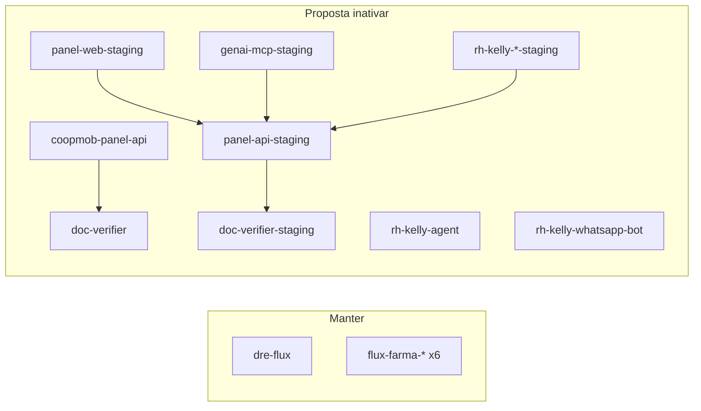

# Plano de inativação — Cloud Run (`rh-coopmob-bot`)

**Data:** 2026-06-06  
**Status:** aguardando aprovação — **não executar sem OK explícito**  
**Método recomendado:** **inativação soft** (sem apagar) — ver seção 5  
**Projeto GCP:** `rh-coopmob-bot` · região principal `us-central1`

---

## 1. Objetivo

Reduzir custo e superfície operacional no GCP **mantendo apenas**:

1. **Aethera / plataforma_atendimento** — serviços `flux-farma-*` (6)
2. **DRE Flux** — serviço `dre-flux` (1)

Inativar os demais serviços Cloud Run legados do ecossistema **Coopmob / RH-Kelly / panel**, que não pertencem a este repositório — **sem deletar**, para permitir rollback rápido.

---

## 2. Inventário atual (18 serviços)

| # | Serviço | Região | Projeto | min | Custo idle* | Dependências Cloud Run |
|---|---------|--------|---------|-----|-------------|----------------------|
| **MANTER** |
| 1 | `flux-farma-api` | us-central1 | Aethera | 0 | baixo | webhook (URL pública) |
| 2 | `flux-farma-web` | us-central1 | Aethera | 0 | baixo | api |
| 3 | `flux-farma-webhook` | us-central1 | Aethera | 0 | baixo | Pub/Sub |
| 4 | `flux-farma-orchestrator` | us-central1 | Aethera | 1 | médio | Pub/Sub |
| 5 | `flux-farma-scheduler` | us-central1 | Aethera | 1 | médio | — (crons internos) |
| 6 | `flux-farma-campaign` | us-central1 | Aethera | 0 | ~zero | Pub/Sub |
| 7 | `dre-flux` | us-central1 | DRE Flux | 0 | baixo | **nenhuma** (só Supabase próprio) |
| **INATIVAR (proposta)** |
| 8 | `coopmob-panel-api` | us-central1 | Legado panel | 0 | baixo | `doc-verifier` |
| 9 | `coopmob-panel-api-staging` | us-central1 | Legado staging | 0 | baixo | `coopmob-doc-verifier-staging` |
| 10 | `coopmob-panel-web-staging` | us-central1 | Legado staging | 0 | baixo | `coopmob-panel-api-staging` |
| 11 | `coopmob-doc-verifier-staging` | us-central1 | Legado staging | 0 | baixo | — |
| 12 | `coopmob-genai-mcp-staging` | us-central1 | Legado staging | 0 | baixo | `coopmob-panel-api-staging` |
| 13 | `doc-verifier` | us-central1 | Legado panel | 0 | baixo | — (chamado pelo panel-api) |
| 14 | `rh-kelly-agent` | us-central1 | Legado RH-Kelly | 0 | baixo | Redis, Sheets |
| 15 | `rh-kelly-agent` | southamerica-east1 | Legado RH-Kelly | 0 | baixo | duplicata regional |
| 16 | `rh-kelly-agent-staging` | us-central1 | Legado staging | 0 | baixo | — |
| 17 | `rh-kelly-wa-staging` | us-central1 | Legado staging | 0 | baixo | `coopmob-panel-api-staging` |
| 18 | `rh-kelly-whatsapp-bot` | us-central1 | Legado RH-Kelly | 0 | baixo | WhatsApp Meta |

\*Com `min=0`, custo só sob tráfego; exceção: `flux-farma-orchestrator` e `flux-farma-scheduler` com `min=1` (~R$ 145/mês combinados).

---

## 3. Análise de dependências

### 3.1 DRE Flux (`dre-flux`)

- **Imagem:** `panel-services/dre-flux:latest`
- **Banco:** Supabase dedicado (`luboqqopfjpxbuphyitw`) — **não** é o `omhlb` da Aethera
- **Variáveis:** apenas `SUPABASE_URL` + `SUPABASE_KEY` (anon)
- **Não chama** outros serviços Cloud Run do projeto

**Conclusão:** `dre-flux` é **autossuficiente**. Nenhum serviço legado precisa permanecer ativo para o DRE funcionar.

### 3.2 Aethera (`flux-farma-*`)

- Stack fechada: web → api → Supabase `omhlb` + Pub/Sub + Meta webhook
- **Não depende** de `coopmob-*`, `doc-verifier` nem `rh-kelly-*`
- Produção web: [aetheraai.com.br](https://www.aetheraai.com.br)

### 3.3 Ecossistema legado (a inativar)



---

## 4. Riscos e validações antes de executar

| Risco | Mitigação |
|-------|-----------|
| **Webhook WhatsApp** apontando para `rh-kelly-whatsapp-bot` | Confirmar no Meta Business que o webhook ativo é `flux-farma-webhook` |
| **Número WhatsApp compartilhado** (`692486823954602`) entre legado e Aethera | Após inativar bots RH-Kelly, só Aethera deve receber eventos Meta |
| **Usuários ainda acessam** panel staging / RH-Kelly | Comunicar time; URLs `*.run.app` deixarão de responder |
| **Bucket GCS** `rh-kelly-panel-docs` | **Não** será apagado neste plano — só Cloud Run |
| **Redis** usado por rh-kelly | Pode continuar existindo (custo separado); avaliar depois |
| **Secrets expostos em env** em serviços legados | Rotacionar tokens Meta/API após descomissionamento |

### Checklist pré-execução

- [ ] Confirmar que **ninguém usa** `coopmob-panel-api` / staging em produção
- [ ] Confirmar webhook Meta → `https://flux-farma-webhook-...run.app`
- [ ] Confirmar URL de acesso ao **DRE Flux** (só `dre-flux-...run.app` ou domínio custom?)
- [ ] Backup opcional: exportar YAML dos serviços legados (`gcloud run services describe`)
- [ ] Janela de manutenção comunicada

---

## 5. Ação proposta (após aprovação)

### 5.1 Método recomendado: **inativação soft** (sem apagar)

Cloud Run **não tem** botão “pausar”. A alternativa segura e **reversível** é:

| Ação | Efeito |
|------|--------|
| `ingress=internal` | URL pública deixa de aceitar tráfego da internet |
| Remover `allUsers` / `allAuthenticatedUsers` de `roles/run.invoker` | Quem tinha acesso anônimo recebe 403 |
| `min-instances=0` + `cpu-throttling` | Sem custo idle (já era o caso na maioria) |
| Label `legacy-status=inactive` | Identificação no console e em `gcloud run services list` |
| Update com `--no-traffic` | Revisão nova não recebe tráfego; evita `Ready=False` se o container falhar no cold start |

Ordem no script: **IAM primeiro** → update com `--no-traffic` + **mesma imagem da revisão Ready** → fixa tráfego na revisão Ready (evita `Ready=False` por cold start falho).

O serviço **continua existindo** no GCP (revisões, imagem, URL `*.run.app`). Custo tende a **zero** sem tráfego. **Rollback** = script `reactivate-run-service.ps1` usando o backup gerado automaticamente.

Reparo manual (serviços já afetados): `.\scripts\gcp\repair-run-service-traffic.ps1 -ServiceName <nome>`

**Scripts no repositório:**

```powershell
$env:GCP_PROJECT_ID = "rh-coopmob-bot"

# Um servico
.\scripts\gcp\deactivate-run-service.ps1 -ServiceName rh-kelly-whatsapp-bot -DryRun
.\scripts\gcp\deactivate-run-service.ps1 -ServiceName rh-kelly-whatsapp-bot

# Lote — Fase A (staging) ou B (producao legado)
.\scripts\gcp\deactivate-legacy-services.ps1 -Phase A -DryRun
.\scripts\gcp\deactivate-legacy-services.ps1 -Phase A

# Reativar
.\scripts\gcp\reactivate-run-service.ps1 -BackupDir scripts/gcp/backups/deactivate-legacy-A-... -ServiceName rh-kelly-whatsapp-bot
```

**Limitação:** se um serviço for acionado por **Pub/Sub push** (service account com `run.invoker`), pode ainda subir sob mensagens. Para esses casos, pausar a subscription no console ou remover o binding da SA — raro nos serviços legados listados (maioria é HTTP/webhook).

### 5.2 Ordem de inativação (dependências primeiro)

**Fase A — staging (sem impacto em produção Aethera/DRE)**

1. `coopmob-genai-mcp-staging`
2. `coopmob-panel-web-staging`
3. `rh-kelly-wa-staging`
4. `rh-kelly-agent-staging`
5. `coopmob-panel-api-staging`
6. `coopmob-doc-verifier-staging`

**Fase B — legado produção panel / RH-Kelly**

7. `rh-kelly-whatsapp-bot`
8. `rh-kelly-agent` (us-central1)
9. `rh-kelly-agent` (southamerica-east1)
10. `coopmob-panel-api`
11. `doc-verifier`

### 5.3 Comandos (executar só após OK)

```powershell
$env:GCP_PROJECT_ID = "rh-coopmob-bot"

# Simular
.\scripts\gcp\deactivate-legacy-services.ps1 -Phase A -DryRun

# Fase A — staging (baixo risco)
.\scripts\gcp\deactivate-legacy-services.ps1 -Phase A

# Validar Aethera + DRE; depois Fase B
.\scripts\gcp\deactivate-legacy-services.ps1 -Phase B
```

Backups ficam em `scripts/gcp/backups/deactivate-legacy-*` (pasta no `.gitignore`).

### 5.4 Opcional (futuro): deletar serviços inativos

Só depois de **semanas** sem necessidade de rollback. `gcloud run services delete` é **irreversível** (imagens no Artifact Registry permanecem).

```powershell
gcloud run services delete <nome> --project=rh-coopmob-bot --region=us-central1 --quiet
```

### 5.5 O que **não** será alterado

- Serviços `flux-farma-*` (6)
- Serviço `dre-flux`
- Pub/Sub, Secret Manager, Artifact Registry, buckets GCS, Supabase

---

## 6. Estado final esperado

### 6.1 Serviços ativos (7)

| Serviço | Função |
|---------|--------|
| `flux-farma-web` | UI Aethera |
| `flux-farma-api` | API |
| `flux-farma-webhook` | Entrada Meta WhatsApp |
| `flux-farma-orchestrator` | Bot / fluxos |
| `flux-farma-scheduler` | Crons / SLA |
| `flux-farma-campaign` | Campanhas |
| `dre-flux` | DRE financeiro Flux |

### 6.2 Serviços legados (11)

Permanecem no projeto com `legacy-status=inactive`, **sem tráfego público**. No console: 18 serviços no total; na prática só os 7 acima respondem na internet.

**Economia estimada Cloud Run:** baixa a média (~R$ 30–80/mês) — a maioria já estava em `min=0`. Ganho principal: **menos confusão operacional**, menos risco de webhook duplicado e menos superfície de ataque.

---

## 7. Rollback (inativação soft)

```powershell
.\scripts\gcp\reactivate-run-service.ps1 `
  -BackupDir scripts/gcp/backups/deactivate-legacy-A-20260606-1500 `
  -ServiceName coopmob-panel-api-staging `
  -Region us-central1
```

Restaura ingress, min-instances (se registrado) e bindings IAM públicos do backup.

Se o serviço tiver sido **deletado** (seção 5.4), rollback = novo deploy da imagem no Artifact Registry — mais trabalhoso.

---

## 8. Aprovação

| Pergunta | Sim / Não |
|----------|-----------|
| Posso **inativar (soft)** os 11 serviços da seção 5.2 — **sem deletar**? | |
| Posso executar **Fase A** (só staging) primeiro e **Fase B** depois? | |
| Alguém ainda usa `coopmob-panel-api` ou RH-Kelly em produção? | |
| Webhook Meta já está só em `flux-farma-webhook`? | |
| Deletar permanentemente fica para **depois** (opcional)? | |

**Aprovado por:** _______________ **Data:** _______________

---

## 9. Pós-aprovação (agente / operador)

1. `deactivate-legacy-services.ps1 -Phase A -DryRun` → revisar
2. Fase A → smoke Aethera + DRE
3. Fase B (após confirmar webhook Meta)
4. `gcloud run services list --filter="metadata.labels.legacy-status=inactive"` — deve listar **11**
5. Smoke: `dre-flux` URL + `aetheraai.com.br` + WhatsApp teste
6. Atualizar este documento com data de execução e responsável
