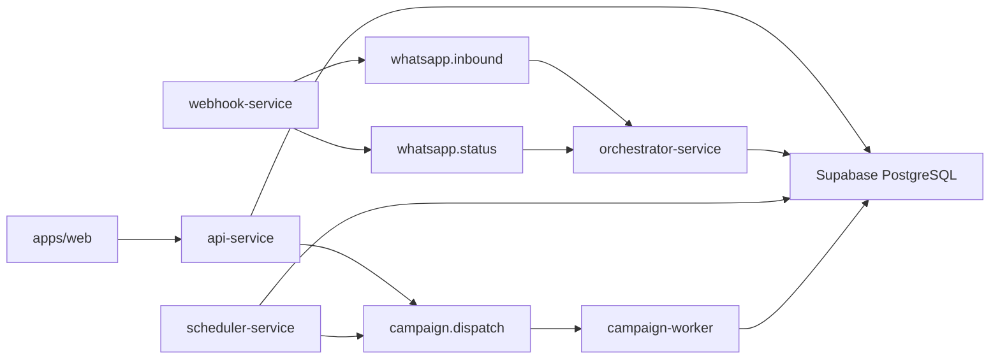

# Governança Enterprise Da Plataforma

## Sumário Executivo

A plataforma está organizada como um monorepo SaaS com frontend Next.js, API Fastify, workers Cloud Run, Supabase/PostgreSQL, Pub/Sub, runtime de canais e núcleo de IA. O desenho é viável para crescimento, mas o risco operacional atual está concentrado em quatro pontos:

- Isolamento multi-tenant depende majoritariamente de filtros `workspace_id` no código, sem RLS evidente nas migrations.
- Segredos reais já estiveram em manifests de deploy e devem ser tratados como comprometidos.
- Automação/fluxos convivem em formatos múltiplos (`routing_rules`, `bot_flows`, `automation_rules`, `conversation_flow_definitions`, `revive_blocos`), exigindo governança de ciclo de vida.
- Observabilidade de workers ainda é heterogênea, com logs `console.*` e baixa padronização de correlação/redação.

## Catálogo De Serviços

| Serviço | Caminho | Responsabilidade | Porta local | Cloud Run |
|---|---|---|---:|---|
| Web | `apps/web` | Portal operacional, inbox, automações, settings, copiloto | 3000 | Sim |
| API | `apps/api-service` | REST principal, auth, SaaS, cadastros, relatórios, IA, integrações | 3001 | Sim |
| Webhook | `apps/webhook-service` | Entrada Meta/WhatsApp e publicação Pub/Sub | 3002 | Sim |
| Orchestrator | `apps/orchestrator-service` | Consumo inbound/status, bot, ticketing, runtime de atendimento | 3003 | Sim |
| Scheduler | `apps/scheduler-service` | Jobs de SLA, campanhas, tarefas e rotinas temporizadas | 3004 | Sim |
| Campaign Worker | `apps/campaign-worker` | Consumo `campaign.dispatch` e envio em lote | 3005 | Sim |
| AI Core | `packages/ai-core` | Gemini, análise IA, NPS, tópicos, embeddings | n/a | Pacote |
| Channel Runtime | `packages/channel-runtime` | Criptografia e runtime de canais | n/a | Pacote |

## Barramento E Fluxos

## APIs Ativas

A API principal registra os prefixos abaixo em `apps/api-service/src/index.ts`:

- Operação: `/api/conversations`, `/api/messages`, `/api/tasks`, `/api/tickets`, `/api/contacts`, `/api/drivers`, `/api/pharmacies`, `/api/leaders`.
- Administração: `/api/users`, `/api/roles`, `/api/sectors`, `/api/settings`, `/api/audit-logs`, `/api/api-tokens`.
- SaaS e integrações: `/api/workspace`, `/api/workspace-catalogs`, `/api/platform`, `/api/integrations`, `/api/conversation-flows`.
- IA e MCP: `/api/ai`, `/api/copilot`, `/api/mcp`, `/api/mcp-metrics`.
- Campanhas/financeiro/relatórios: `/api/campaigns`, `/api/automations`, `/api/financial`, `/api/reports`, `/api/dashboard`, `/api/sla`.
- Público/controlado: `/health`, `/api/auth/login`, `/api/geo/*`.
- Dev-only: `/api/dev/*`, registrado apenas com `ENABLE_DEV_ROUTES=true`.

## Bancos E Migrations

O Supabase/PostgreSQL possui 32 migrations versionadas em `supabase/migrations`. Domínios principais:

- Identidade e tenant: `workspaces`, `workspace_memberships`, `roles`, `users`, `workspace_channels`.
- Atendimento: `contacts`, `conversations`, `messages`, `tickets`, `tasks`, `conversation_flow_*`.
- Operação: `drivers`, `pharmacies`, `leaders`, vínculos e cadastros.
- Financeiro: `financial_entries`, `financial_installments`, exports e resumos.
- IA: `ai_topics`, colunas `ai_*`, embeddings e RPCs.
- Auditoria: `audit_logs`, tokens API e logs de e-mail.

Use `npm run db:audit:governance` para gerar inventário read-only de tabelas globais, tabelas sem RLS, colunas de vetor/embedding e tabelas com `workspace_id` sem índice dedicado.

Resultado da auditoria read-only executada:

- 60 tabelas públicas.
- 50 tabelas com `workspace_id`.
- 10 tabelas globais.
- 60 tabelas sem RLS habilitado.
- 2 colunas de vetor/embedding.
- 22 tabelas com `workspace_id` sem índice explícito por `workspace_id`.

Tabelas globais identificadas: `ai_topics`, `conversation_tag_catalog`, `financial_import_rows`, `financial_imports`, `pending_tasks`, `platform_settings`, `processed_webhook_events`, `supply_requests`, `users`, `workspaces`.

Tabelas tenantizadas sem índice explícito por `workspace_id`: `api_tokens`, `audit_logs`, `automation_runs`, `bot_flows`, `bot_sessions`, `campaign_dispatch_logs`, `campaign_recipients`, `conversation_assignments`, `driver_pharmacy_links`, `financial_entries`, `financial_exports`, `financial_installments`, `internal_chat_messages`, `internal_notes`, `leader_pharmacy_links`, `message_templates`, `pharmacy_sector_attendants`, `routing_rules`, `sla_events`, `sla_policies`, `ticket_events`, `user_sectors`.

## Achados De Segurança

| Criticidade | Achado | Status |
|---|---|---|
| Alta | `JWT_SECRET` aceitava fallback inseguro | Corrigido: produção falha sem segredo forte |
| Alta | Credenciais podiam ser salvas sem `INTEGRATIONS_ENCRYPTION_KEY` | Corrigido: produção exige chave |
| Alta | Manifests de Cloud Run continham secrets em claro | Corrigido no repositório; rotacionar segredos reais |
| Média | Senhas temporárias retornadas pela API em produção | Corrigido: resposta só expõe com `USER_TEMP_PASSWORD_RESPONSE_ENABLED=true` |
| Média | Ausência aparente de RLS | Pendente de decisão arquitetural/RLS ou controles compensatórios |
| Média | Logs heterogêneos em workers | Pendente de padronização |

## Legado E Obsolescência

Itens já saneados:

- Cache `.npm-cache/` removido e ignorado.
- `pnpm-lock.yaml` removido; o monorepo fica padronizado em npm.
- `settingsMockPanels.tsx` renomeado para `settingsFormPanels.tsx`.
- Runtime de mocks web removido de build/docs/envs.
- Manifests sensíveis de Cloud Run substituídos por placeholders.

Itens que exigem refatoração controlada:

- `businessHours` duplicado entre API e orchestrator.
- Lógica de WhatsApp/canais distribuída entre API, workers e `channel-runtime`.
- Formatos coexistentes de automação e fluxo.
- Inbox concentrada em arquivo grande, misturando realtime, IA, SLA, tickets e layout.
- Rate limit do Copilot em memória, inadequado para múltiplas réplicas.

## Automação Oficial

A automação operacional oficial é baseada em `workspace_channels.config`, editada nas configurações do webhook/canal. Os demais mecanismos foram classificados em `docs/AUTOMATION_GOVERNANCE.md`.

- `workspace_channels.config`: padrão oficial para setores, filas, demandas, mensagens, SLA, horário e roteamento.
- `conversation_flow_definitions`: oficial para fluxos avançados versionados, desde que vinculados ao canal.
- `automation_rules`: oficial para campanhas/outbound e rotinas, não para substituir configuração inbound do webhook.
- `routing_rules` e `bot_flows`: compatibilidade temporária.
- `revive_blocos`: formato de UI/draft, não contrato de runtime.

Nenhum legado deve ser removido sem inventário por workspace, backup, validação operacional e rollback.

## Governança Técnica Recomendada

- APIs: prefixos por domínio, autenticação explícita, `requireWorkspace()` obrigatório em rotas tenantizadas e contrato OpenAPI futuro.
- Ambientes: `dev`, `sandbox`, `staging`, `production`, com projetos/DBs/secrets isolados.
- Secrets: somente Secret Manager em produção; `.env` apenas local; rotação imediata dos tokens que já apareceram em manifests.
- Logs: JSON estruturado, `request_id`, `workspace_id`, `actor_id`, nível, serviço, redaction de telefone/e-mail/token.
- Deploy: Cloud Run por serviço com service account dedicada, mínimo privilégio, timeout/concurrency definidos e rollback documentado.
- Banco: índices por `workspace_id`, auditoria de RLS ou controles compensatórios automatizados em CI.
- IA: catálogo de prompts versionado, flags por workspace, auditoria de uso e retenção/minimização de contexto.
- Automações: webhook/canal como fonte operacional primária; legados congelados e migrados com depreciação controlada.
- Logs: `@plataforma/logger` como base comum para workers e serviços, com redaction centralizada.

## Roadmap Priorizado

### 0-7 dias

- Rotacionar Supabase service role, Meta access token, Google API key, JWT e app secret expostos nos manifests antigos.
- Rodar `npm run db:audit:governance` contra staging.
- Revisar Cloud Run real e remover secrets de `--set-env-vars`, migrando para `--set-secrets`.
- Confirmar que `ENABLE_DEV_ROUTES=false` em produção.

### 8-30 dias

- Padronizar logs nos workers.
- Consolidar runtime de canais em `channel-runtime`.
- Definir modelo alvo para automações/fluxos e criar política de depreciação.
- Criar CI de governança: lint, build, env coverage, secret scan e auditoria de migrations.

### 31-90 dias

- Implementar RLS ou política formal de controles compensatórios.
- Separar módulos grandes da Inbox por domínio.
- Mover rate limit do Copilot para Redis/serviço compartilhado.
- Implantar dashboards de custo, latência, fila, erro, throughput e consumo de IA.

## Próxima Coleta Externa

O repositório não comprova estado real de Cloud Run, Redis, n8n, MySQL/PostgreSQL externos, buckets e custos. A coleta deve seguir `docs/GOVERNANCE_EXTERNAL_INVENTORY.md` e ser executada em modo read-only.
