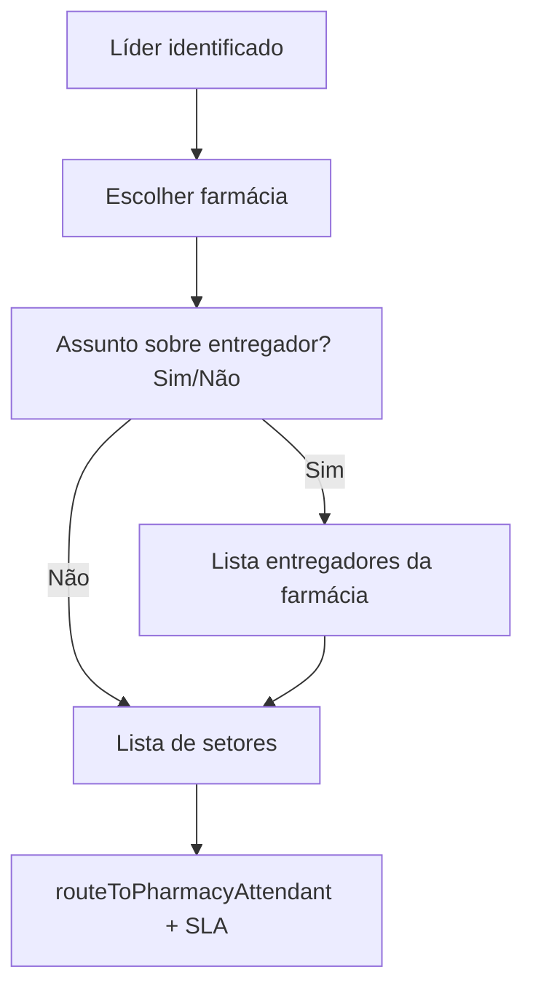

# Triagem guiada do líder (WhatsApp)

Fluxo do bot no **orchestrator** para contatos com `profile_type = leader`. Farmácias vêm apenas de `leader_pharmacy_links` (não usa `pharmacies.leader_id`).

## Fluxo



## Passos de sessão (`current_step`)

| Step | Descrição |
|------|-----------|
| `identify` | Ramo líder: 0 / 1 / N farmácias |
| `ask_pharmacy` | Várias farmácias (`leader_flow: true`) |
| `ask_leader_about_driver` | Botões `leader_driver_yes` / `leader_driver_no` |
| `ask_leader_driver` | Lista ou menu numerado de entregadores |
| `ask_intent` | Setor → roteamento final |

## Comportamentos de borda

| Caso | Comportamento |
|------|----------------|
| 0 farmácias | Mensagem `leader_no_pharmacy` → setores (sem `context_pharmacy_id`) |
| 1 farmácia | Pula lista; grava `context_pharmacy_id` → pergunta sobre entregador |
| Sim + 0 entregadores | `leader_no_drivers_at_pharmacy` → setores |
| “Não está na lista” | `leader_driver_none` → setores sem `context_driver_id` |
| >10 entregadores | Menu numerado (9 por página, 0/9 paginação) |
| Resposta inválida | Reenvio de botões/lista |

## Persistência

- `conversations.context_pharmacy_id` — farmácia escolhida
- `conversations.context_driver_id` — entregador opcional (validado em `driver_pharmacy_links`)
- `context_leader_id` — em `ensureContactContext`
- Encerramento: `completeGuidedIntakeSession` com `path: leader_pharmacy_driver_sector`

## Mensagens configuráveis

Chaves em `@plataforma/channel-runtime` (`channelMessages.ts`): `leader_greeting_pharmacy`, `leader_ask_about_driver`, `leader_ask_driver_list`, `leader_no_drivers_at_pharmacy`, `leader_ask_sector`, `leader_no_pharmacy`, etc.

## Smoke (queries)

```bash
npm run smoke:leader-intake-flow
# opcional:
LEADER_ID=<uuid> PHARMACY_ID=<uuid> npm run smoke:leader-intake-flow
```

## Checklist E2E manual (WhatsApp)

Pré-requisito: líder com vínculos em `leader_pharmacy_links` e canal com setores ativos.

- [ ] **N farmácias**: mensagem de boas-vindas → lista → farmácia → Sim/Não → setor → inbox com `context_pharmacy_id` e `sector_id`
- [ ] **1 farmácia**: pula lista; vai direto para Sim/Não entregador
- [ ] **Sim + entregador**: lista → escolhe entregador → setor → inbox com `context_driver_id`
- [ ] **Não entregador**: botão Não → setor sem `context_driver_id`
- [ ] **Sim + 0 entregadores**: aviso → setores sem driver
- [ ] **“Não está na lista”**: setor sem driver
- [ ] **0 farmácias**: `leader_no_pharmacy` → setor → roteamento por setor (sem farmácia)
- [ ] **>10 entregadores** (se existir fixture): menu numerado funciona

Após alterações no orchestrator, fazer deploy do serviço Cloud Run correspondente (ex.: `flux-farma-orchestrator`).

## Código

- `apps/orchestrator-service/src/leaderIntake.ts` — queries e menus
- `apps/orchestrator-service/src/index.ts` — steps e roteamento
