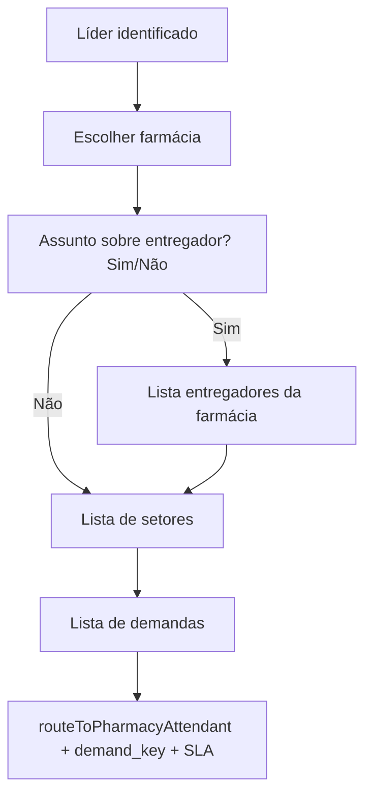

# Triagem guiada do líder (WhatsApp)

Fluxo do bot no **orchestrator** para contatos com `profile_type = leader`. Farmácias vêm apenas de `leader_pharmacy_links` (não usa `pharmacies.leader_id`).

## Vincular WhatsApp do líder (OTP no portal)

O portal envia o código via **Meta Cloud API** (`POST /api/leader-portal/whatsapp/otp/start`).

### Produção — template obrigatório

Fora da janela de 24h (líder ainda não conversou com o número Business), a Meta **não entrega** mensagem `type: text`. Use template **Authentication** com botão **Copy code** (ver guia abaixo).

1. Criar e aprovar template na Meta (nome sugerido: `aethera_leader_otp`, idioma `Portuguese (BR)` / `pt_BR`).
2. Cloud Run `flux-farma-api` → variáveis:
   - `LEADER_WHATSAPP_OTP_TEMPLATE_NAME` = nome exato do template (minúsculas, underscores)
   - `LEADER_WHATSAPP_OTP_TEMPLATE_LANGUAGE` = `pt_BR`
3. Redeploy da API (`scripts/gcp/deploy-production-api.ps1`).

Guia completo: [META_LEADER_OTP_TEMPLATE.md](./META_LEADER_OTP_TEMPLATE.md)

Diagnóstico no banco:

```powershell
node scripts/diagnose-leader-whatsapp-otp.mjs --url-file .secrets/production-db-url.txt --search robert
```

| `leader_whatsapp_verifications.status` | Significado |
|----------------------------------------|-------------|
| `pending` | API aceitou o pedido; Meta pode ter aceito HTTP sem entrega ao aparelho |
| `failed` | Erro explícito ao enviar (canal, token ou Meta) |

## Fluxo



## Passos de sessão (`current_step`)

| Step | Descrição |
|------|-----------|
| `identify` | Ramo líder: 0 / 1 / N farmácias |
| `ask_pharmacy` | Várias farmácias (`leader_flow: true`) |
| `ask_leader_about_driver` | Botões `leader_driver_yes` / `leader_driver_no` |
| `ask_leader_driver` | Lista ou menu numerado de entregadores |
| `ask_intent` | Setor → lista de demandas |
| `ask_demand` | Demanda (`driver` se há `context_driver_id`, senão `pharmacy`) → roteamento + `demand_key` |

## Comportamentos de borda

| Caso | Comportamento |
|------|----------------|
| 0 farmácias | Mensagem `leader_no_pharmacy` → setores (sem `context_pharmacy_id`) |
| 1 farmácia | Pula lista; grava `context_pharmacy_id` → pergunta sobre entregador |
| Sim + 0 entregadores | `leader_no_drivers_at_pharmacy` → setores |
| “Não está na lista” | `leader_driver_none` → setores sem `context_driver_id` |
| >10 entregadores | Menu numerado (9 por página, 0/9 paginação) |
| Resposta inválida | Reenvio de botões/lista |

## Persistência

- `conversations.context_pharmacy_id` — farmácia escolhida
- `conversations.context_driver_id` — entregador opcional (validado em `driver_pharmacy_links`)
- `context_leader_id` — em `ensureContactContext`
- `conversations.demand_key` — demanda escolhida após o setor
- Encerramento: `completeGuidedIntakeSession` com `path: leader_pharmacy_driver_sector_demand`

## Mensagens configuráveis

Chaves em `@plataforma/channel-runtime` (`channelMessages.ts`): `leader_greeting_pharmacy`, `leader_ask_about_driver`, `leader_ask_driver_list`, `leader_no_drivers_at_pharmacy`, `leader_ask_sector`, `leader_no_pharmacy`, etc.

## Smoke (queries)

```bash
npm run smoke:leader-intake-flow
# opcional:
LEADER_ID=<uuid> PHARMACY_ID=<uuid> npm run smoke:leader-intake-flow
```

## Checklist E2E manual (WhatsApp)

Pré-requisito: líder com vínculos em `leader_pharmacy_links` e canal com setores ativos.

- [ ] **N farmácias**: mensagem de boas-vindas → lista → farmácia → Sim/Não → setor → **lista de demandas** → inbox com `context_pharmacy_id`, `sector_id` e `demand_key`
- [ ] **1 farmácia**: pula lista; vai direto para Sim/Não entregador
- [ ] **Sim + entregador**: lista → escolhe entregador → setor → demandas perfil **driver** → inbox com `context_driver_id` e `demand_key`
- [ ] **Não entregador**: botão Não → setor → demandas perfil **pharmacy** → inbox sem `context_driver_id` e com `demand_key`
- [ ] **Sim + 0 entregadores**: aviso → setores sem driver
- [ ] **“Não está na lista”**: setor sem driver
- [ ] **0 farmácias**: `leader_no_pharmacy` → setor → roteamento por setor (sem farmácia)
- [ ] **>10 entregadores** (se existir fixture): menu numerado funciona

## Portal do líder (`/lider/chat`)

Triagem espelhada: farmácia → entregador opcional → setor → demanda → `POST /api/leader-portal/conversations/start`.

- Mensagens digitadas no portal: `direction: inbound` (sem envio Meta); respostas do líder no celular chegam via webhook.
- Bolhas: `MessageBubble` com `viewerRole="leader"` (inbound à direita).

Deploy sugerido (ordem): `flux-farma-api` → `flux-farma-web` → `flux-farma-orchestrator`.

```powershell
# API (script no repositório); web e orchestrator via pipeline/Cloud Run do projeto
.\scripts\gcp\deploy-production-api.ps1
```

Após alterações no orchestrator, fazer deploy do serviço Cloud Run correspondente (ex.: `flux-farma-orchestrator`).

## Código

- `apps/orchestrator-service/src/leaderIntake.ts` — queries e menus
- `apps/orchestrator-service/src/index.ts` — steps e roteamento
