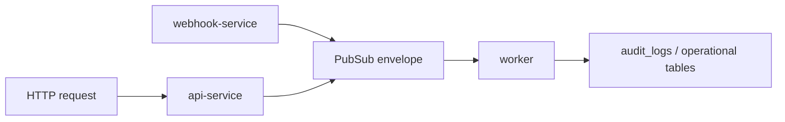

# Observabilidade E Logging Enterprise

## Padrão De Log

Todos os serviços devem emitir logs JSON estruturados. O pacote `@plataforma/logger` define o padrão base.

Campos recomendados:

- `ts`
- `severity`
- `service_name`
- `environment`
- `event_type`
- `request_id`
- `correlation_id`
- `workspace_id`
- `conversation_id`
- `ticket_id`
- `user_id`
- `queue_name`
- `retry_count`
- `execution_time`
- `error_code`
- `message`

## Redaction Obrigatória

Devem ser mascarados:

- telefone / WhatsApp;
- e-mail;
- token;
- secret;
- authorization;
- CPF/CNPJ;
- conteúdo de mensagens;
- payloads brutos de provedores externos.

## Propagação De Correlação

Diretrizes:

- HTTP deve aceitar ou gerar `x-correlation-id`.
- Webhook deve publicar `correlation_id` no envelope Pub/Sub.
- Workers devem criar logger filho por job/mensagem.
- Erros devem preservar `correlation_id` até o log final e auditoria de negócio.

## Dashboards Recomendados

- Pub/Sub backlog, ack/nack, retry e dead-letter.
- Webhook inbound/status por workspace e por canal.
- Orchestrator: mensagens processadas, falhas, tempo médio, bot fallback, flow runtime.
- Campaign worker: throughput, falhas Meta, recipients pendentes, custo estimado.
- Scheduler: execuções por cron, duração, erro por job.
- API: latência p50/p95/p99, erros 4xx/5xx, endpoints lentos.
- IA: chamadas, tokens/custo estimado, erros, fallback de modelo.
- SLA: vencidos, em risco, escalonamentos, tempo de resolução.
- Banco: queries lentas, locks, tamanho de tabelas, índices não usados.

## Alertas Mínimos

- Pub/Sub backlog acima do limiar por 10 minutos.
- Erro 5xx da API acima de 2% por 5 minutos.
- Webhook sem eventos por período esperado.
- Campaign worker com falha Meta recorrente.
- Orchestrator com nack/retry elevado.
- Scheduler sem heartbeat por mais de 2 ciclos.
- Banco com locks longos ou CPU elevada.
- Consumo de IA fora do orçamento.

## Rollout

1. `webhook-service` e `orchestrator-service`.
2. `campaign-worker`.
3. `scheduler-service`.
4. `api-service` middleware de `x-correlation-id`.
5. Dashboards e alertas.
