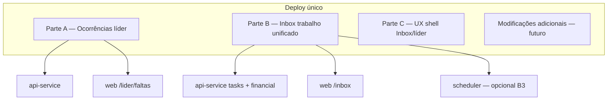
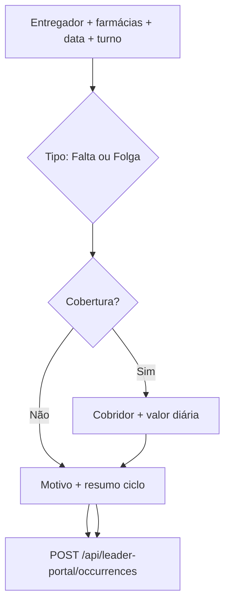
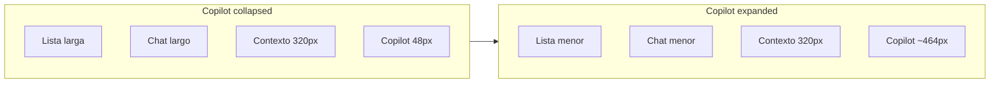

# Plano mestre de implementação em lote (Partes A + B + extensões)

**Documento vivo** para concentrar todas as alterações de produto/código antes de um **único deploy**.  
Novas solicitações devem ser acrescentadas na seção [Modificações adicionais](#modificações-adicionais-aguardando) e, quando aprovadas, promovidas ao corpo das partes A/B.

| Meta | Valor |
|------|--------|
| Última atualização | 2026-05-21 |
| Escopo inicial | Parte A + Parte B + **Parte C** (shell UX Inbox/líder) |
| Deploy | Único lote após fechamento deste documento |

**Documentos relacionados (não substituídos por este):**

- Portal líder + chat + demandas: [LEADER_PORTAL_CHAT_ALIGNMENT_PLAN.md](./LEADER_PORTAL_CHAT_ALIGNMENT_PLAN.md) — parte já implementada em código; manter alinhado ao deploy.
- Triagem WhatsApp líder: [LEADER_WHATSAPP_INTAKE.md](./LEADER_WHATSAPP_INTAKE.md)
- Detalhamento histórico A+B: [LEADER_ABSENCE_AND_INBOX_TASKS_PLAN.md](./LEADER_ABSENCE_AND_INBOX_TASKS_PLAN.md) (pode ficar como rascunho; **este arquivo é a fonte para o lote**)

---

## Como usar este documento

1. **Implementar** na ordem da seção [Ordem de desenvolvimento e deploy](#ordem-de-desenvolvimento-e-deploy).
2. **Marcar** checkboxes `[x]` conforme concluir cada item.
3. **Novas mudanças:** adicionar em [Modificações adicionais](#modificações-adicionais-aguardando) com data e autor; depois integrar nas seções A/B e remover da fila.
4. **Não fazer deploy parcial** até o escopo acordado deste arquivo estar fechado (salvo hotfix crítico).

---

## Changelog do documento

| Data | Alteração |
|------|-----------|
| 2026-05-21 | Criação: consolidação Parte A + Parte B (Inbox 3 colunas, adiantamento inline, cadastro inline, ocorrências falta/folga/cobertura). |
| 2026-05-21 | **Parte C** (rascunho aprovado para lote): header Inbox, contexto lateral fixo, sidebar hover-rail, copilot rail com expand explícito, barra workspace/canal em pills, wizard líder em `Drawer` ficha. |
| 2026-05-21 | **Parte C (refino):** contexto de atendimento **sempre visível** (sem recolher no desktop); copilot expande **dentro do grid** — colunas à esquerda encolhem proporcionalmente; copilot **nunca cobre** o painel de contexto. |
| 2026-05-21 | **C.12:** indicadores visuais de vencimento de SLA na **lista de conversas**, ao lado do pill de prioridade (ex.: Normal). |

---

## Modificações adicionais (aguardando)

<!-- Adicione aqui novos pedidos antes de implementar. Formato sugerido:

### [DATA] Título curto
- **Pedido:** ...
- **Impacto:** A | B | API | Web | DB | Orchestrator
- **Status:** rascunho | aprovado | em implementação | feito

-->

### [2026-05-21] UX shell — Inbox + portal líder (→ Parte C)

- **Pedido:** corrigir header do chat; contexto de atendimento fixo na lateral; menu páginas só ícones + expandir no hover; copilot só ícones + expandir/retrair por botão; barra operacional workspace/canal como no print; nova conversa líder em formato ficha.
- **Impacto:** Web (`inbox`, `Sidebar`, `CopilotPanel`, `OperationalContextBar`, `LeaderIntakeWizard`, `AppShell`)
- **Status:** aprovado para lote (corpo em [Parte C](#parte-c--ux-shell-inbox-e-portal-líder))
- **Refino 2026-05-21:** ao expandir copilot, demais colunas deslocam/encolhem proporcionalmente; contexto **sempre aberto** e **nunca coberto** pelo copilot.
- **Refino 2026-05-21:** badges de SLA na lista de conversas, ao lado da prioridade (C.12).

---

## Visão geral do lote



| Parte | Resumo | Principal usuário |
|-------|--------|-------------------|
| **A** | Falta vs folga + cobertura; sem valor de desconto no portal; vínculo diária↔ausente | Líder |
| **B** | Pendências na Inbox; conversa + tarefa + formulário **ao mesmo tempo**; adiantamento e cadastro inline | Atendente / gestor / financeiro |
| **C** | Layout shell: rails laterais, header chat, contexto fixo, copilot, barra workspace/canal, ficha nova conversa líder | Todos / líder |

### Experiência simultânea (Parte B — confirmado)

O atendente/gestor deve **ver mensagens recebidas (coluna 2)** e **preencher cadastro / lançar adiantamento (coluna 3)** sem trocar de rota. Em mobile: abas **Conversa | Tarefa | Ação** no mesmo `/inbox`.

---

# Parte A — Ocorrências de escala (portal do líder)

## A.1 Objetivo

Na hora do lançamento, o líder deixa explícito **falta vs folga** e **se houve cobertura**, **sem** informar valor de desconto da falta. O financeiro aplica valores no **fechamento do ciclo de apuração** (seg–dom + data de pagamento configurada em `financial-cycle`).

## A.2 Decisões de produto

| Tema | Decisão |
|------|---------|
| Falta | Ausência não programada → perfil desconto na apuração (valor definido pelo financeiro) |
| Folga | Dia sem escala → informativo; desconto só se política exigir |
| Cobertura | Outro entregador trabalhou → diária do **cobridor** + registro informativo do **ausente**, **vinculados** |
| Valor no portal | **Proibido** campo de desconto da falta; diária de cobertura **com** valor (como `/lider/diarias`) |
| Prazo | `event_date` permitido até fechamento do ciclo aberto |
| Conversas de teste antigas | Sem backfill (fora de escopo) |

## A.3 Tipos de ocorrência

| UI | `occurrence_kind` | `has_coverage` | Registros gerados |
|----|-------------------|----------------|-------------------|
| Falta | `unexcused` | false | 1× `financial_entries` `absence`, `total_amount: 0`, status `informed` |
| Folga | `day_off` | false | Idem |
| Falta com cobertura | `unexcused` | true | 1× informativo (ausente) + 1× `daily` (cobridor) + vínculo metadata |
| Folga com cobertura | `day_off` | true | Idem |

## A.4 Fluxo de UI (`/lider/faltas` ou “Ocorrências de escala”)



### Passos de tela

1. **Contexto** — entregador, farmácias (checkbox), data, turno (`full` | `morning` | `afternoon` | `night`).
2. **Tipo** — cards **Falta** / **Folga** com texto de ajuda.
3. **Cobertura** — “Outro entregador cobriu?” Sim/Não. Se sim: select cobridor (exclui ausente), valor diária obrigatório, notas opcionais.
4. **Motivo** — textarea; placeholder conforme tipo.
5. **Resumo** — tipo, cobertura, cobridor, ciclo apuração estimado, data pagamento prevista; **sem** valor de desconto.

### Copy (substituir texto atual)

- Remover: “desconto na data do evento”.
- Usar: “Registro informativo para o financeiro. Desconto da falta e conferência da diária de cobertura ocorrem no fechamento do ciclo (segunda a domingo).”

## A.5 API

### Endpoint

`POST /api/leader-portal/occurrences` (preferido) ou evolução v2 de `/absences`.

```ts
{
  driver_id: string,              // uuid — ausente / de folga
  pharmacy_ids: string[],
  event_date: string,             // YYYY-MM-DD
  shift?: 'full' | 'morning' | 'afternoon' | 'night',
  occurrence_kind: 'unexcused' | 'day_off',
  has_coverage: boolean,
  coverage?: {
    covering_driver_id: string,
    amount: number,
    notes?: string,
  },
  reason?: string,
}
```

### Persistência e status

- Sem cobertura: `insertLeaderFinancialEntries` / factory com `type: absence`, `total_amount: 0`, **`status: informed`** (novo enum).
- Com cobertura: ausente (`informed`) + `daily` cobridor (`pending_approval`), metadata:
  - `coverage_of_entry_id` / `covered_driver_id` / `occurrence_kind` / `shift` / `leader_id`
- **Stats líder** (`GET /leader-portal/stats`): contar `informed` e `pending_approval`, não só `active` (hoje faltas do líder entram `active` e stats buscam `pending_approval` — corrigir).

### Validações

- Escopo líder: `isDriverInLeaderScope`, `assertPharmaciesInLeaderScope`.
- `event_date` ≤ fim do ciclo aberto (`financial-cycle`).
- Cobridor ≠ ausente; `amount > 0` se cobertura.
- Deprecar gradualmente `POST /absences` legado ou redirecionar internamente ao novo handler.

## A.6 Banco de dados (migration)

| Campo / enum | Uso |
|--------------|-----|
| `financial_entries.status` + valor `informed` | Falta/folga só informativa até apuração |
| `financial_entries.occurrence_kind` | `unexcused` \| `day_off` |
| `financial_entries.coverage_of_entry_id` | FK opcional entre daily e absence |
| `financial_entries.metadata` jsonb | Campos extras se preferir json em vez de colunas |

## A.7 Arquivos a implementar (Parte A)

| Camada | Arquivo / ação |
|--------|----------------|
| API lib | `apps/api-service/src/lib/leaderOccurrences.ts` (novo) |
| API lib | Ajuste `leaderFinancialEntries.ts` — status `informed`, vínculo cobertura |
| API routes | `apps/api-service/src/routes/leader-portal.ts` — `POST /occurrences` |
| Pacote | `packages/financial-cycle` — helper validar `event_date` vs fechamento ciclo |
| Web | `apps/web/src/app/(app)/lider/faltas/page.tsx` — wizard completo |
| Web | Opcional: renomear título/rota sidebar “Ocorrências de escala” |
| Financeiro | Fase posterior: conferência ciclo com vínculo ausente↔cobridor (fora do mínimo A) |

## A.8 Critérios de aceite (Parte A)

- [ ] Líder escolhe **Falta** ou **Folga** em todo lançamento.
- [ ] Líder indica cobertura; se sim, cobridor + valor diária.
- [ ] Nenhum campo de valor de desconto da falta.
- [ ] API persiste vínculo quando há cobertura.
- [ ] Stats/dashboard líder refletem pendências corretas.
- [ ] Copy alinhada ao ciclo de apuração.

---

# Parte B — Inbox: pendências e trabalho unificado

## B.0 Problema atual

- Pendências em painel lateral estreito; pouco contexto.
- Aprovar adiantamento → `openAppRouteInNewTab('/financial?...')` — **não** permite ver conversa e formulário juntos.
- Cadastro → obriga `/drivers/[id]`.
- SLA conversa (`sla_events`) separado de `pending_tasks`.

## B.1 Princípio

Toda ação humana relevante resolve-se em **`/inbox`**, pasta **Pendências**, layout **3 colunas** (ou abas em mobile). Sem item de menu “Tarefas”.

## B.2 Layout

| Coluna | Conteúdo |
|--------|----------|
| 1 | Pastas + lista (conversas **ou** cards de pendência) |
| 2 | Thread WhatsApp (`conversation_id`) |
| 3 | `InboxTaskWorkspace` — playbook + formulários embutidos |

**Estado ativo:** `selectedTaskId` + `activeConversationId` (podem ser da mesma pendência ou conversa do líder/entregador aberta via CTA).

**Mobile:** abas `Conversa | Tarefa | Ação`.

### Componentes web (novos)

| Componente | Responsabilidade |
|------------|------------------|
| `InboxTaskWorkspace.tsx` | Shell coluna 3, playbook, CTAs |
| `InboxAdvanceEntryForm.tsx` | Lançamento adiantamento (extrair de `financial/page.tsx`) |
| `InboxDriverRegistrationForm.tsx` | Campos faltantes + PATCH driver |
| `InboxTaskContextPanel.tsx` | Cards de contexto (entregador, farmácia, SLA) |
| `InboxRequestInfoPanel.tsx` | Templates → composer coluna 2 |
| Ajuste `inbox/page.tsx` | Layout 3 colunas, pasta Pendências, remover `openAppRouteInNewTab` no approve |

## B.3 Pasta “Pendências”

- Sidebar: nova pasta, badge = abertas + vencidas (`/api/tasks/summary`).
- Lista: `task_type` legível, prioridade, `due_at`, entregador/contato.
- Clique: fixa coluna 3; carrega conversa na coluna 2 se `conversation_id`.

## B.4 API transversal — contexto de tarefa

### `GET /api/tasks/:id/context`

```ts
type TaskContextResponse = {
  task: PendingTask;
  playbook: {
    steps: { id: string; label: string; done?: boolean }[];
    current_step: string;
  };
  entities: {
    driver?: DriverSummary;
    pharmacy?: PharmacySummary;
    leader?: LeaderSummary & { conversation_id?: string };
    conversation?: ConversationSummary;
  };
  related_tasks: PendingTask[];
  suggested_messages: {
    label: string;
    body: string;
    target: 'driver' | 'leader' | 'pharmacy';
  }[];
  advance_context?: AdvanceTaskContext;       // B.5
  registration_context?: RegistrationTaskContext; // B.6
};
```

### `lib/taskPlaybooks.ts` (novo)

- Mapa `task_type` → passos, permissões (`attendant` | `financial` | `supervisor`), CTAs.
- Tipos cobertos na tabela abaixo.

### Playbooks resumidos (todos os `task_type` que geram trabalho)

| `task_type` | Quem resolve | Coluna 2 | Coluna 3 |
|-------------|--------------|----------|----------|
| `guided_demand` | Atendente | Thread | Checklist demanda + concluir |
| `queue_sla_treatment` | Atendente | Thread | SLA + concluir/escalar |
| `queue_sla_treatment_warning` / `_overdue` | Atendente | Thread | Link tarefa pai |
| `financial_advance_request` | Financeiro/gestor | Thread pedido | **B.5** elegibilidade + lançamento |
| `advance_sla_warning` / `_overdue` / `_reminder` | Financeiro | — | Ir à tarefa pai |
| `driver_registration_completion` | Atendente | Thread entregador/líder | **B.6** lacunas + form |
| `driver_termination_request` | Operacional | Opcional | Aprovar/reprovar (já existe) |
| `driver_termination_financial_review` | Financeiro | — | Resumo pendências driver (embed leve) |
| `internal_note_mention` | Mencionado | Thread | Nota + responder |
| `ticket_sla_notification` | Atendente/supervisor | Thread ticket | Sidecar ticketing |
| `ticket_sla_daily_report` | Supervisor | — | Resumo + concluir |
| `operational_pending` | Atendente | Thread | Genérico |

---

## B.5 Adiantamento na Inbox (detalhe de implementação)

### Objetivo

Antes de aprovar: ver se já tem adiantamento, quanto deve, limites. Após aprovar: **configurar e lançar** na coluna 3, conversa visível na coluna 2.

### `GET /api/financial/drivers/:driverId/advance-eligibility`

Retorno sugerido (`AdvanceTaskContext`):

```ts
{
  driver_id: string;
  open_advances: { entry_id: string; total_amount: number; remaining: number; start_date: string }[];
  open_advance_count: number;
  month_summary: {
    total_debits: number;
    pending_installments_amount: number;
    net_estimated?: number;
  };
  cycle_summary?: WeeklyDriverSummary;  // reutilizar financialSummaries
  policy: {
    max_open_count: number;
    max_percent_of_net?: number;
  };
  requested_amount?: number;   // metadata da tarefa
  alerts: { code: string; message: string; severity: 'warn' | 'block' }[];
  recommended_max_amount?: number;
}
```

Fontes: `financial_entries`, `financial_installments`, `buildMonthlyDriverSummary`, `buildWeeklyDriverSummary`, `app_settings`.

### Fluxo UI (3 passos)

1. **Analisar** — card situação + abrir conversa (coluna 2).
2. **Decidir** — Reprovar (motivo + WA) | Aprovar (não redireciona para `/financial`).
3. **Lançar** — `InboxAdvanceEntryForm` → `POST /api/financial/entries` + header `x-from-task`.

### Ajuste `PATCH /api/tasks/:id/decision`

| Comportamento atual | Comportamento alvo |
|---------------------|-------------------|
| `approved` → resolve conversa + `next_action.url` `/financial?...` | `approved` → `metadata.phase = 'awaiting_entry'`, status `in_progress`, **não** resolve conversa até POST entry OK |
| Inbox `openAppRouteInNewTab` | Remover; coluna 3 passo 3 |

Reprovação: manter WA + resolver conversa (como hoje).

### Permissões

- Aprovar/lançar: `financial`, `supervisor`, `admin`.
- Atendente: leitura + solicitar info na conversa.

### Critérios de aceite B.5

- [ ] Card de elegibilidade ao abrir pendência.
- [ ] Alertas configuráveis (bloqueio ou aviso).
- [ ] Lançamento inline com `x-from-task`.
- [ ] Conversa permanece na coluna 2 durante approve + lançamento.

---

## B.6 Cadastro de entregador na Inbox (detalhe de implementação)

### Objetivo

Ver lacunas, pedir dados via WA (entregador/líder), **preencher ficha na coluna 3** enquanto vê mensagens na coluna 2.

### `GET /api/drivers/:id/registration-gaps`

Extrair de `analyzeDriverRegistrationGaps` para `lib/driverRegistrationGaps.ts` (compartilhado com Copilot).

```ts
{
  driver_id: string;
  missing_required: { key: string; label: string }[];
  missing_optional: { key: string; label: string }[];
  completion_percent: number;
  pharmacies: { id: string; trade_name: string }[];
  leader?: { id: string; name: string; phone?: string; conversation_id?: string };
  contact?: { conversation_id?: string; wa_phone?: string };
}
```

### `GET /api/leaders/:id/contact-conversation` (opcional)

Retorna `conversation_id` do contact líder para `setActiveId` na Inbox.

### `InboxDriverRegistrationForm`

- Seções: Identidade, Documentos, Operação.
- Default: só `missing_required`; toggle “mostrar todos os campos”.
- `PATCH /api/drivers/:id` incremental.
- Upload: reutilizar endpoints existentes de drivers se houver.
- **Concluir tarefa** habilitado quando `missing_required.length === 0` (supervisor pode forçar com motivo).

### Contato guiado (coluna 2)

| Botão | Ação |
|-------|------|
| Abrir conversa do entregador | `activeId = contact.conversation_id` |
| Abrir conversa do líder | resolver via `leader.conversation_id` |
| Gerar pedido de dados | template dinâmico ou Copilot `buildClientDraftFromGaps` |
| Inserir no composer / Enviar | reutilizar composer existente |

### Critérios de aceite B.6

- [ ] Lacunas visíveis ao abrir tarefa.
- [ ] Salvar campos sem navegar para `/drivers/[id]`.
- [ ] Abrir conversa líder/entregador sem sair da Inbox.
- [ ] Templates a partir de campos faltantes.
- [ ] Trabalho simultâneo: mensagem recebida visível enquanto edita cadastro.

---

## B.7 Demais itens Parte B

### Bloco “Solicitar informação” (B.2 — fase B2)

- Destinatário: entregador | líder | farmácia.
- Templates: cadastro, adiantamento, documento, falta.
- Inserir no composer da coluna 2; enviar outbound staff.

### SLA unificado (B.3 — fase B3)

- `sla_events` critical → `pending_tasks` `conversation_sla_breach` (dedupe) **ou** badge na pasta Pendências.
- Supervisor: filtros, reatribuir `assignee_id`.

### O que não muda

- Menu lateral **sem** “Tarefas”.
- `/financial` e `/drivers/[id]` permanecem para consulta/relatórios avançados.

---

# Parte C — UX shell (Inbox e portal líder)

## C.1 Objetivo

Corrigir regressões de layout na **Caixa de entrada** e alinhar o **shell** da aplicação aos prints de referência: header do chat legível; **contexto de atendimento** como coluna **sempre visível** (sem overlay, sem recolher no desktop); **copilot** em rail que expande **redistribuindo largura** das demais colunas (nunca sobrepondo o contexto); **sidebar** só ícones + hover; barra **workspace + canal** em pills; **Nova conversa** do líder em **ficha** (`Drawer`).

## C.2 Diagnóstico (causa raiz)

| Problema | Causa no código | Efeito visual |
|----------|-----------------|---------------|
| Header do chat “desconfigurado” | `inbox/page.tsx` ~2211: `h-14` fixo + bloco direito com 7+ controles (ícones + botão texto “Contexto de atendimento” + Resolver + menu) sem `flex-wrap`/`min-w-0` | Badges do contato quebram linha; ações comprimem ou transbordam |
| Contexto cobre o chat | `contextDrawerOpen` ~2603: `fixed` + backdrop `z-45/50` | Painel modal, não coluna do grid |
| Copilot sobrepõe layout | `CopilotPanel.tsx` `fixed inset-y-0 right-0 z-60` | Cobre chat e contexto em vez de encolher colunas vizinhas |
| Contexto opcional / fechável | `contextDrawerOpen` + botão no header | Usuário perde contexto ao focar no chat ou abrir copilot |
| Barra operacional diferente do print | `OperationalContextBar.tsx`: breadcrumb “Operando em:” + `<select>` nativo | Não há pill workspace à esquerda e pill canal à direita |
| Nova conversa líder fraca | `LeaderIntakeWizard.tsx`: `fixed` modal `max-w-lg` central | UX de popup, não ficha do projeto |

## C.3 Layout alvo — Inbox (desktop)

### Ordem fixa das colunas (esquerda → direita)

`Sidebar` · `Pastas` · `Lista` · `Chat` · **`Contexto`** · **`Copilot`**

O **contexto fica imediatamente à esquerda do copilot**. Assim, ao expandir o copilot, apenas colunas **à esquerda do contexto** encolhem; a coluna de contexto **mantém presença e largura mínima** — o copilot **nunca** a cobre.

```text
[Workspace pill ◄──────────────────────────────────────────► Canal pill]

┌──┬───┬────────┬──────────────┬─────────────┬────────────┐
│▌│Past│ Lista  │    Chat      │  Contexto   │  Copilot   │
│▌│as  │ (flex) │   (flex)     │  SEMPRE     │ rail→wide  │
│▌│    │        │              │  aberto     │ (flex só   │
│▌│    │        │              │  min 280px  │  esta col.)│
└──┴───┴────────┴──────────────┴─────────────┴────────────┘
 sidebar hover→240
```

### Contexto de atendimento — sempre aberto

| Regra | Detalhe |
|-------|---------|
| Visibilidade | Coluna **sempre renderizada** na Inbox em desktop (`lg+`), com ou sem conversa selecionada (estado vazio: “Selecione uma conversa”). |
| Sem overlay | Remover `contextDrawerOpen`, backdrop e `fixed` do painel atual. |
| Sem recolher (desktop) | **Não** oferecer toggle “fechar contexto” no header; **remover** botão “Contexto de atendimento”. |
| Largura | Default ~320px; redimensionável por separador entre **Chat** e **Contexto**; persistir `inboxContextColW` em `localStorage`. |
| `min-width` | Garantir `min-w-[280px]` (ou valor acordado em QA); em viewport estreito, encolher **Lista** e **Chat** antes de esconder contexto. |
| Mobile | Contexto em aba “Contexto” (Parte B); copilot em aba ou sheet — fora do grid multi-coluna. |

### Redimensionamento ao expandir o Copilot (obrigatório)

O copilot **não** usa `position: fixed` nem `z-index` sobre outras colunas. Ele é a **última coluna** de um container único (`display: grid` ou `flex` com `min-w-0`).

| Estado copilot | Largura coluna | Efeito nas demais |
|----------------|----------------|-------------------|
| Collapsed (rail) | `48px` fixo | Lista + Chat + Contexto usam o espaço restante |
| Expanded | `min(29rem, 40vw)` ou valor persistido `inboxCopilotColW` | **Lista** e **Chat** encolhem **proporcionalmente** (`fr` ou `flex-grow` com pesos, ex.: lista `1fr`, chat `2fr`); **Contexto** mantém largura (só reduz se viewport &lt; soma dos `min-width`, e só após lista/chat atingirem mínimo) |

**Implementação sugerida** (`inbox/page.tsx`):

```css
/* exemplo conceitual */
grid-template-columns:
  var(--folder-w)     /* pastas */
  var(--list-w)       /* lista, redimensionável */
  minmax(280px, 1fr)  /* chat — flex principal */
  var(--context-w)    /* contexto — sempre presente, min 280px */
  var(--copilot-w);   /* 48px | expanded */
```

- Transição suave (`transition` em `--copilot-w` ~200ms) ao clicar expandir/retrair.
- Separadores existentes (lista) + novo separador **Chat | Contexto** (opcional).
- **Proibido:** copilot `absolute`/`fixed` sobre o grid; copilot com largura que ignore o fluxo do layout.

### Header do chat (duas faixas)

- **Linha 1:** avatar + nome (truncate) + badges | Resolver, ⋯
- **Linha 2:** telefone · “Cliente desde …” | favorito, toggle copilot (rail on/off apenas)
- `min-h-[3.5rem]`; sem botão de contexto no header.

## C.4 Sidebar de páginas (esquerda)

| Estado | Largura | Comportamento |
|--------|---------|---------------|
| Repouso | 56px (`w-14`) | Só ícones + avatar; labels `sr-only` ou `opacity-0` |
| Hover / foco | 240px | `group-hover` ou `peer` expande com labels; sombra suave |
| Mobile | drawer existente | Sem hover; manter drawer full |

**Arquivos:** `Sidebar.tsx`, `AppShell.tsx` (largura do slot), CSS transition `width 200ms ease`.

**Evitar:** expandir no clique (só hover/foco no desktop) para não “pular” layout ao navegar.

## C.5 Copilot (direita — coluna do grid, sem sobreposição)

| Regra | Implementação |
|-------|----------------|
| Posição | Última coluna do grid da Inbox; **à direita** do painel de contexto |
| Nunca cobre contexto | Sem `fixed`/`absolute` full-height; largura só via `var(--copilot-w)` no grid pai |
| Expandir encolhe o resto | Ao `ChevronsLeft`, aumentar `--copilot-w`; colunas **Lista** e **Chat** reduzem em proporção (`fr` 1:2 ou similar); **Contexto** inalterado até limites de viewport |
| Retrair devolve espaço | `ChevronsRight` → `--copilot-w: 48px`; lista/chat recuperam largura |
| Expandir só pelo botão | `setCollapsed(false)` apenas no `ChevronsLeft`; `setCollapsed(true)` no `ChevronsRight` |
| Rail por padrão | Collapsed: 48px, só ícones de abas; clique em aba no rail não expande painel cheio |
| Sparkles no header | Liga/desliga coluna copilot (rail); não substitui chevrons de expand |
| Persistência | `inboxCopilotExpanded` + `inboxCopilotColW` em `localStorage` (opcional) |

**Arquivo:** `CopilotPanel.tsx` — props `embedded`, `collapsed`, `onCollapsedChange`; container `h-full min-w-0` sem `fixed inset-0`.

### Diagrama — expandir copilot



*Contexto mantém largura; Lista e Chat absorvem a redução.*

## C.6 Barra workspace / canal (print)

Substituir ou evoluir `OperationalContextBar` para `OperationalSessionHeader`:

- **Esquerda:** pill `WorkspaceSwitcher` (dot verde + nome + chevron) — reutilizar `WorkspaceSwitcher.tsx`.
- **Direita:** pill canal (`operation_label` + tipo WhatsApp) com dropdown custom (não `<select>` nativo), lista de `channels` de `useOperationalContext`.
- **Remover** texto “Operando em:” e seta breadcrumb; fundo `bg-background` ou `bg-surface/70`, `justify-between`, `px-4 py-2`.

## C.7 Portal líder — Nova conversa (ficha)

**Padrão do projeto:** `Drawer` (`components/ui/Drawer.tsx`), como `financial/page.tsx` (`ApprovalDrawer`) e detalhe em `LeaderDriverDetailPanel` / `DriverLeaderDetailModal`.

| Elemento | Proposta |
|----------|----------|
| Container | `Drawer` `placement="right"` `widthClassName="max-w-[32rem]"` |
| Cabeçalho | Título “Nova conversa” + subtítulo do passo + **stepper** (5 dots: Farmácia → Entregador? → Entregador → Setor → Demanda) |
| Corpo | Seções em **cards** `rounded-xl border bg-surface-2` (uma pergunta por card); farmácia/entregador como lista selecionável com check visual |
| Rodapé fixo | Voltar | Cancelar | **Iniciar atendimento** (disabled até passo final) |
| Resumo lateral (opcional) | Bloco “Resumo” sticky: farmácia, entregador, setor, demanda conforme preenchido |
| Mobile | Drawer full width |

**Arquivo:** refatorar `LeaderIntakeWizard.tsx`; chamadas em `/lider/chat/page.tsx` inalteradas na API.

## C.8 Relação com Parte B

- A **coluna Contexto** (C.3) permanece **sempre visível**; o painel da **tarefa** (B) entra na mesma coluna via abas **Contexto | Tarefa | Ação** (não segunda coluna nem drawer).
- O copilot expandido **não** oculta a aba Tarefa/Ação: usuário alterna abas no painel fixo enquanto o copilot ocupa só a coluna mais à direita.
- Implementar **C antes ou junto com B1** evita retrabalho overlay → grid.

## C.9 Arquivos tocados

| Arquivo | Mudança |
|---------|---------|
| `apps/web/src/app/(app)/inbox/page.tsx` | Grid 6 colunas; contexto sempre aberto; `--copilot-w` + encolhimento proporcional lista/chat; badges SLA na lista |
| `apps/web/src/components/inbox/ConversationSlaListBadge.tsx` | Pill SLA compacto ao lado da prioridade |
| `apps/web/src/components/inbox/InboxAttendanceSlaStages.tsx` | Helper compartilhado `getConversationSlaListBadgeState` (export) |
| `apps/web/src/components/copilot/CopilotPanel.tsx` | Modo embedded, expand só por botão |
| `apps/web/src/components/shell/Sidebar.tsx` | Rail 56px + hover expand |
| `apps/web/src/components/shell/AppShell.tsx` | Largura sidebar dinâmica |
| `apps/web/src/components/operational/OperationalContextBar.tsx` ou novo `OperationalSessionHeader.tsx` | Pills workspace/canal |
| `apps/web/src/components/shell/WorkspaceSwitcher.tsx` | Estilo pill na barra |
| `apps/web/src/components/leader/LeaderIntakeWizard.tsx` | Modal → `Drawer` ficha + stepper |
| `apps/web/src/app/(app)/lider/chat/page.tsx` | Ajuste props se necessário |

## C.10 Critérios de aceite

- [ ] Header do chat não corta nome/badges em 1280px com copilot rail aberto.
- [ ] **Contexto sempre visível** no desktop (coluna fixa); sem backdrop/overlay; sem botão fechar contexto.
- [ ] Ao expandir copilot, **lista e chat encolhem** visivelmente; layout não “pula” por sobreposição.
- [ ] Copilot expandido **não cobre** o painel de contexto (inspecionar: contexto clicável/rolável com copilot aberto).
- [ ] Ordem de colunas: … Chat · Contexto · Copilot (contexto imediatamente à esquerda do copilot).
- [ ] Lista: badge SLA ao lado do pill de prioridade (vencido / risco / countdown).
- [ ] Sidebar: só ícones em repouso; labels no hover (desktop).
- [ ] Copilot: rail por padrão; expand/retract só pelos chevrons.
- [ ] Barra superior: workspace à esquerda, canal à direita (pills).
- [ ] Líder: Nova conversa abre ficha lateral com stepper e footer fixo.

## C.11 Ordem sugerida dentro do lote

1. **C.6** barra workspace/canal (rápido, global no `AppShell`)
2. **C.4** sidebar rail
3. **C.3 + C.5** grid Inbox + copilot embedded + header 2 linhas
4. **C.12** badges SLA na lista de conversas (junto com C.3 — mesmo arquivo `inbox/page.tsx`)
5. **C.7** Drawer líder
6. **B** coluna tarefa reutilizando coluna contexto

---

## C.12 Indicadores de SLA na lista de conversas

### Objetivo

Na coluna **lista de conversas** (`/inbox`), exibir ao lado do pill de **prioridade** (ex.: “Normal”, “Alta”) um indicador compacto do **prazo SLA em curso** — alinhado ao print: mesma linha de badges (`mt-1.5 flex gap-1.5`), sem depender do painel de contexto aberto.

### Estado atual

| Onde | Comportamento |
|------|----------------|
| Lista [`inbox/page.tsx`](apps/web/src/app/(app)/inbox/page.tsx) ~2174 | Só `priorityPill`; tag `SLA Xmin` só se resolução ≤ 15 min (`toUiConversation`) |
| Contexto / drawer | `formatCountdown` + `InboxAttendanceSlaStages` com etapas completas |
| API lista | `GET /conversations` retorna `*` — campos `sla_*` já disponíveis em `ApiConversation` |

### Regras de negócio (alinhadas à API e ao painel)

Reutilizar [`pickActiveSlaDeadlineForCountdown`](apps/web/src/components/inbox/InboxAttendanceSlaStages.tsx) e janela **at_risk** de 10 minutos (mesma de `conversations.ts` / filtros supervisor).

| Estado | Condição | UI (pill ao lado da prioridade) |
|--------|----------|----------------------------------|
| **Sem SLA** | Sem prazo ativo ou conversa terminal (`resolved`/`closed`) | Não renderizar badge |
| **No prazo** | Prazo &gt; agora + 10 min | Pill discreta: countdown `mm:ss` ou `SLA 2h` (verde/success, estilo próximo ao pill Normal) |
| **Em risco** | Prazo entre agora e agora + 10 min | Pill âmbar: `SLA 8min` ou countdown + `title` “Vence em …” |
| **Vencido** | Prazo &lt; agora | Pill vermelha: `Vencido` ou countdown `+mm:ss` (tempo em atraso) |

**Etapa ativa:** 1ª resposta → tratamento (se distinto) → resolução — mesma lógica do painel “SLAs por etapa”, não apenas `sla_resolution_deadline`.

### Implementação

| Item | Ação |
|------|------|
| Componente | **Criar** `apps/web/src/components/inbox/ConversationSlaListBadge.tsx` |
| Helper | **Exportar** de `InboxAttendanceSlaStages.tsx` (ou `lib/inboxSlaListState.ts`): `getConversationSlaListBadgeState(detail, nowMs)` → `{ tone, label, title, stageKey }` |
| Lista | **Alterar** bloco ~2174 em `inbox/page.tsx`: `{pri}` + `<ConversationSlaListBadge conv={c.raw} nowMs={nowTick} />` |
| Tick | Reutilizar `nowTick` existente (intervalo ~1s no header; 60s aceitável na lista se performance for problema) |
| Duplicidade | **Remover** tag `SLA Xmin` de `toUiConversation` quando o novo badge cobrir o caso |
| Acessibilidade | `title` com etapa + data/hora do prazo; `aria-label` em português |

### Visual (referência print)

```text
[ Normal ]  [ SLA 12:34 ]     ← mesma altura inbox-t-meta, border rounded
[ Alta   ]  [ Vencido ]        ← destructive
[ Normal ]  (sem badge)        ← resolvido ou sem política SLA
```

Opcional (fase posterior): dot cinza à esquerda dos pills já existe como `StatusDot` no avatar — **não** duplicar; foco no pill SLA textual.

### Critérios de aceite (C.12)

- [ ] Badge SLA visível ao lado de “Normal”/outras prioridades em conversa aberta com prazo ativo.
- [ ] Estados vencido / em risco / no prazo distinguíveis por cor e texto.
- [ ] Conversas resolvidas/fechadas não mostram badge SLA.
- [ ] Countdown atualiza sem recarregar página.
- [ ] Consistente com filtro supervisor `sla_bucket` (breached / at_risk / on_track).

### Relação com Parte B

- Pendências `queue_sla_*` podem ganhar badge próprio nos **cards da pasta Pendências** (B.3); C.12 cobre apenas **linha de conversa** na lista padrão.

---

## Referência: Portal líder chat (fora do lote A/B principal)

*Já implementado em código anterior ao lote; incluir no mesmo deploy se ainda não estiver em produção.*

| Item | Endpoint / arquivo |
|------|---------------------|
| Demandas intake | `GET /api/leader-portal/intake/demands` |
| Start conversa | `POST /api/leader-portal/conversations/start` |
| Wizard | `LeaderIntakeWizard.tsx`, `/lider/chat` |
| Mensagem líder inbound | `messages/send` role leader |
| Bolhas | `MessageBubble` `viewerRole="leader"` |
| Orchestrator ask_demand | `orchestrator-service/src/index.ts` |

Checklist deploy: [LEADER_WHATSAPP_INTAKE.md](./LEADER_WHATSAPP_INTAKE.md).

---

## Apêndice — Mapa de notificações que geram `pending_tasks`

Para implementação B e testes E2E.

| `task_type` | Origem | Gatilho |
|-------------|--------|---------|
| `guided_demand` | API/orchestrator | Conversa com `demand_key` |
| `queue_sla_treatment` | orchestrator | SLA fila aplicado |
| `queue_sla_treatment_warning` / `_overdue` | scheduler `queueSlaJobs` | SLA 80% / vencido |
| `financial_advance_request` | MCP/bot | Pedido adiantamento |
| `advance_sla_*` | scheduler `advanceTasksSlaJobs` | SLA adiantamento |
| `driver_registration_completion` | orchestrator, nota interna, pré-cadastro líder | Cadastro incompleto |
| `driver_termination_request` / `_financial_review` | leader-portal desligamento | Desligamento |
| `internal_note_mention` | `internalNoteSideEffects` | @menção |
| `ticket_sla_notification` | scheduler `ticketsSlaJobs` | SLA ticket 80% / escalonado |
| `ticket_sla_daily_report` | scheduler diário | Resumo tickets |
| `operational_pending` | MCP genérico | Bot |

**Preferências em `users.notification_preferences` que não criam tarefa hoje:** `conversation_assigned`, `campaign_done`, `overdue_installment` (apenas UI/filtros futuros).

**`sla_events`:** feed em `GET /api/sla/events` (pref `sla_warning`), não é `pending_task` — tratar na fase B3.

---

## Ordem de desenvolvimento e deploy

### Ordem de código (recomendada)

| # | Escopo | Serviços |
|---|--------|----------|
| 1 | Migration DB (A: `informed`, `occurrence_kind`, vínculos) | Supabase |
| 2 | Parte A API + web | api-service, web |
| 3 | Parte B API (`/tasks/:id/context`, eligibility, registration-gaps) | api-service |
| 4 | **Parte C** (shell UX: sidebar, barra sessão, Inbox grid, copilot, Drawer líder) | web |
| 5 | Parte B web (layout Inbox tarefas, B.5, B.6) — reutiliza coluna C | web |
| 6 | Parte B2/B3 (templates, SLA) | web, scheduler opcional |
| 7 | Portal líder chat + orchestrator (se ainda não em prod) | api, web, orchestrator |

### Ordem de deploy Cloud Run

1. `flux-farma-api` (A + B APIs)  
2. `flux-farma-web` (A + B UI)  
3. `flux-farma-orchestrator` (se mudanças WhatsApp líder no mesmo lote)  
4. Migrations Supabase + PostgREST reload antes ou junto com API 1  

Script referência API: `scripts/gcp/deploy-production-api.ps1`

---

## Checklist mestre pré-deploy (marcar no go-live)

### Parte A

- [ ] Wizard falta/folga/cobertura em staging  
- [ ] POST occurrences validações de ciclo  
- [ ] Vínculo daily↔absence no banco  
- [ ] Stats líder corretos  

### Parte B — núcleo

- [ ] Pasta Pendências na Inbox  
- [ ] Layout 3 colunas / abas mobile  
- [ ] `GET /tasks/:id/context`  
- [ ] Adiantamento: elegibilidade + lançamento inline  
- [ ] Cadastro: lacunas + form inline + abrir conversa líder/entregador  
- [ ] Removido redirect `/financial` em nova aba ao aprovar  

### Parte B — opcional mesmo lote

- [ ] Solicitar informação + templates  
- [ ] SLA → tarefa critical  
- [ ] Reatribuir pendência (supervisor)  

### Parte C — shell UX

- [ ] Header chat duas linhas sem overflow em 1280px  
- [ ] Contexto **sempre aberto** (coluna fixa, sem backdrop, sem toggle fechar)  
- [ ] Copilot no grid: expandir **encolhe lista/chat** proporcionalmente; **não cobre** contexto  
- [ ] Badges SLA na lista de conversas (C.12)  
- [ ] Sidebar rail + hover expand  
- [ ] Copilot expand/retract só por chevron  
- [ ] Pills workspace (esq.) e canal (dir.)  
- [ ] `LeaderIntakeWizard` em `Drawer` com stepper  

### Regressão

- [ ] Inbox conversas normais (sem tarefa ativa)  
- [ ] Portal líder chat (nova conversa + bolhas)  
- [ ] Financeiro `/financial` standalone ainda funciona  

---

## Lista consolidada de arquivos (implementação)

### Criar

- `apps/api-service/src/lib/leaderOccurrences.ts`
- `apps/api-service/src/lib/taskPlaybooks.ts`
- `apps/api-service/src/lib/driverRegistrationGaps.ts`
- `apps/api-service/src/lib/advanceEligibility.ts`
- `apps/web/src/components/inbox/InboxTaskWorkspace.tsx`
- `apps/web/src/components/inbox/InboxAdvanceEntryForm.tsx`
- `apps/web/src/components/inbox/InboxDriverRegistrationForm.tsx`
- `apps/web/src/components/inbox/InboxTaskContextPanel.tsx`
- `apps/web/src/components/inbox/InboxRequestInfoPanel.tsx`
- `apps/web/src/components/inbox/ConversationSlaListBadge.tsx`
- `supabase/migrations/0xx_leader_occurrences_and_informed_status.sql`

### Alterar

- `apps/api-service/src/routes/leader-portal.ts`
- `apps/api-service/src/lib/leaderFinancialEntries.ts`
- `apps/api-service/src/routes/tasks.ts`
- `apps/api-service/src/routes/financial.ts`
- `apps/api-service/src/routes/drivers.ts`
- `apps/web/src/app/(app)/lider/faltas/page.tsx`
- `apps/web/src/app/(app)/inbox/page.tsx`
- `apps/web/src/components/shell/Sidebar.tsx` (pasta Pendências na inbox, se aplicável)

### Reutilizar / extrair lógica

- `apps/web/src/app/(app)/financial/page.tsx` → `InboxAdvanceEntryForm`
- `apps/web/src/app/(app)/drivers/[id]/page.tsx` → campos do `InboxDriverRegistrationForm`
- `apps/api-service/src/lib/financialSummaries.ts`
- `apps/api-service/src/lib/copilotTools.ts` → gaps compartilhados

---

*Aguardando modificações adicionais do cliente na seção [Modificações adicionais](#modificações-adicionais-aguardando). Quando a lista estiver fechada, implementar tudo em sequência e executar um único deploy.*
