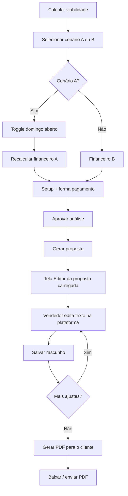

# Plano — Textos de viabilidade e proposta (simplificação operacional)

**Data:** 2026-06-04 (rev. 4)  
**Contexto:** Lead tipo Farmaxima (~200 entregas/mês, delivery 08:00–22:00 seg–sáb, domingo 08:00–20:00 aberto).

> **Atualização (proposta PDF):** O fluxo de **editor HTML + Mammoth** foi substituído pelo pipeline **template DOCX versionado → Gotenberg → preview PDF**. Ver **[COMMERCIAL_PROPOSAL_DOCX_PDF_PLAN.md](./COMMERCIAL_PROPOSAL_DOCX_PDF_PLAN.md)** para APIs, UX e fases de implementação. Este documento permanece válido para **viabilidade**, cenários A/B, setup e textos operacionais.

**Objetivo:** Viabilidade simplificada (entregadores + horários + diárias) e **proposta ao cliente** no modelo `Proposta_Royal_Farma`, com **preview PDF fiel** na plataforma (observações em texto; layout alterado apenas via nova versão de template).

---

## 1. Regras de negócio

| Tema | Regra |
|------|--------|
| **Escala detalhada** | Não exibir turnos (Entregador 1/2) na viabilidade nem na proposta. |
| **Domingo — fixos** | Entregadores fixos **nunca** trabalham domingo. |
| **Domingo — cobertura** | Delivery aberto → **folguista/diarista** (diária cobrada). |
| **Cenário A (base)** | Domingo **fechado** → **0 diárias** no financeiro. |
| **Cenário A — toggle domingo** | **Implementar** na UI: “Domingo aberto com folguista” → recalcula A com **+1 diária**, `DOM` e custos atualizados **antes** de aprovar. |
| **Cenário B** | Horário integral do lead; **2 fixos + 2 diárias**; domingo só folguistas. |
| **Documento ao cliente** | Conteúdo gerado a partir do template Royal Farma → **editado na tela** → **salvo** → **PDF final** para envio (WhatsApp/e-mail). |
| **Setup** | Valor em R$ (máscara BR) + **forma de pagamento** (à vista / parcelado); se parcelado, **quantidade de parcelas**. |
| **Horários e datas (UI)** | Padrão do projeto: armazenamento `HH:mm`; exibição pt-BR; valores monetários via `BrCentsInput` / `formatBRL`. |

---

## 2. Fluxo do documento (vendedor → cliente)



| Etapa | Onde | Ação do vendedor |
|--------|------|------------------|
| Pré-requisitos | Aba **Viabilidade** na ficha do lead | Cenário, toggle domingo (A), setup, aprovar análise |
| Gerar proposta | Ficha ou modal | Cria registro `commercial_proposals` + abre **editor** |
| **Editor in-app** | `/commercial/proposals/[id]` (área principal) | Lê o documento já preenchido, ajusta parágrafos/tabelas visíveis, **Salvar** |
| PDF oficial | Mesma tela, botão primário | **Gerar PDF para envio** — só habilitado após pelo menos um save (ou geração inicial) |
| Envio | WhatsApp / download | PDF anexo (fluxo existente ou futuro `send`) |

**Regra:** o vendedor **não depende** de abrir Word no desktop para o fluxo padrão. Download do `.docx` original pode existir como **ação secundária** (backup), mas a edição oficial é **na tela carregada**.

---

## 2.1 Editor de proposta na plataforma (obrigatório)

### Tela

- Rota: **`/commercial/proposals/[id]`** — layout em duas zonas:
  - **Cabeçalho:** cliente, versão, status (Rascunho / PDF gerado / Enviada), ações.
  - **Corpo:** visualização + edição do documento (scroll, largura ~A4).
- Botões (ordem de uso):
  1. **Salvar alterações** — persiste o conteúdo editado (`draft`).
  2. **Gerar PDF para o cliente** — usa o **último conteúdo salvo**; desabilitado se houver alterações não salvas.
  3. *(secundário)* Baixar DOCX / Baixar PDF — após PDF gerado.

### Abordagem técnica recomendada

O `.docx` do modelo não é editável byte-a-byte no browser de forma confiável. Pipeline:

1. **Geração (backend):** `Proposta_Royal_Farma.template.docx` + tags → preencher com snapshot → converter corpo para **HTML** (`mammoth` ou geração HTML direta por seções).
2. **Persistência:** gravar em `commercial_proposals`:
   - `document_html` — conteúdo exibido/editado (HTML sanitizado);
   - `document_source` — opcional: JSON das variáveis usadas na geração (para “regenerar do zero”);
   - `document_saved_at`, `document_saved_by`;
   - `pdf_generated_at`, `pdf_storage_path` (ou blob) após export.
3. **Editor (frontend):** componente rich text (**TipTap** ou equivalente já alinhado ao design system), `locale` pt-BR, toolbar simples (negrito, lista, parágrafo — sem mudar layout crítico do template).
4. **Salvar:** `PUT /api/commercial/proposals/:id/document` com `{ document_html }`.
5. **PDF:** `POST /api/commercial/proposals/:id/pdf` — renderiza o **HTML salvo** para PDF (ex.: Puppeteer/Playwright no api-service, ou `@react-pdf` se o layout for reimplementado). CSS de impressão espelha tipografia do modelo Royal Farma.

**Regenerar do template:** botão “Restaurar texto gerado pelo sistema” (confirmação) — sobrescreve `document_html` a partir do snapshot atual; útil se o vendedor quiser desfazer edições manuais.

### Estados da proposta

| Status | Significado |
|--------|-------------|
| `draft` | Proposta criada; editor com HTML; PDF ainda não gerado ou desatualizado |
| `pdf_ready` | PDF gerado a partir do último save |
| `sent` | PDF enviado ao cliente (integração WA futura) |

Se o vendedor **Salvar** após um PDF existente, status volta a `draft` e exibir aviso: *“PDF desatualizado — gere novamente antes de enviar.”*

### UX — indicadores

- Badge **“Alterações não salvas”** ao editar.
- Timestamp: *Salvo em 04/06/2026 às 14:32* (formato `dd/MM/yyyy 'às' HH:mm`, `ptBR`).
- Preview opcional em painel lateral: PDF anterior (iframe) vs. editor.

### O que o vendedor pode editar na tela

- Parágrafos de recomendação (`TEXTO_FOLGUISTA`, `TEXTO_ESCALA_RESUMIDA`, blocos comerciais).
- Valores já inseridos pelo sistema (setup, horários, nomes) — **editáveis** para casos negociados (ex.: observação de setup, ajuste de frase).
- **Não** exigir edição de MERGEFIELD cru; tudo vira texto legível no HTML carregado.

Campos estruturados (setup R$, parcelas, toggle domingo) permanecem na **aba Viabilidade** — ao mudar, avisar que é preciso **regenerar** o documento ou atualizar variáveis antes do próximo save.

---

## 3. Toggle domingo aberto — Cenário A (obrigatório)

### 3.1 UI (`CommercialDimensioningPreview`)

Quando o cenário **A** estiver selecionado (ou na coluna A antes da seleção):

- **Switch:** `Domingo aberto com folguista (Cenário A)`
- **Desligado (padrão):** `quantidade_diarias_semana = 0`, `DOM` = “Fechado ao delivery”, horários enxutos sem domingo.
- **Ligado:** `quantidade_diarias_semana = 1`, `DOM` = horário do lead (`horario_domingo_inicio`–`fim` do `CommercialLeadDeliveryHoursEditor`) + sufixo “(folguista)”; recálculo de MG+diárias, margem e valor lead.

### 3.2 Persistência

Novo em `PropostaComercialSnapshot` / flags do cenário enxuto:

```ts
cenario_a_domingo_aberto?: boolean; // default false
```

Ao alternar o toggle:

1. `PATCH` proposta comercial ou `POST .../dimensioning/select` com payload `{ cenarioId: 'enxuto', domingo_aberto: true }`.
2. Backend reaplica financeiro do cenário A com `diarias = domingo_aberto ? 1 : 0` e `delivery_funciona_domingo` coerente.
3. `confirmed_at` limpo (exige reaprovar se já estava confirmado).

### 3.3 Motor

- `buildDualOperationalScenarios`: cenário A base sempre **0 diárias** + domingo fechado no input enxuto.
- Função `applyEnxutoDomingoAberto(resultado, input, cfg)` quando toggle ativo: sobrescreve `quantidade_diarias_semana`, `custo_diarias_semana`, `horario_delivery_considerado`, tags `DOM`, `TEXTO_FOLGUISTA`.

### 3.4 Textos quando toggle ligado

- Bullets A: domingo aberto com **1 folguista** (não mais “opcional em texto”).
- `TEXTO_FOLGUISTA` (A + toggle): folguista no domingo; fixo folga.
- Tabela comparativa: linha A atualiza diárias de 0 → 1 em tempo real.

---

## 4. Setup e forma de pagamento

### 4.1 Campos na seção “Proposta comercial” (viabilidade)

| Campo | Tipo UI | Armazenamento |
|--------|---------|----------------|
| Valor setup (R$) | `BrCentsInput` (máscara `R$ 0,00`) | `proposta_comercial.setup_cents` |
| Sem setup / isento | checkbox | `sem_setup` |
| O que inclui o setup | textarea | `setup_observacao` |
| **Forma de pagamento** | radio: **À vista** / **Parcelado** | `setup_pagamento: 'a_vista' \| 'parcelado'` |
| **Quantidade de parcelas** | `input` numérico (min 2), visível só se parcelado | `setup_parcelas?: number` |

**Validação:** se `parcelado`, `setup_parcelas` obrigatório (≥ 2). Exibir hint: valor por parcela = `setup_cents / setup_parcelas` formatado em pt-BR.

### 4.2 Texto na proposta (Word / PDF)

Novas tags no template:

| Tag | Exemplo |
|-----|---------|
| `{SETUP}` | `2.000,00` |
| `{SETUP_PAGAMENTO}` | `À vista` ou `Parcelado em 3x de R$ 666,67` |

Gerado no backend:

```ts
function formatSetupPagamento(pc: PropostaComercialSnapshot): string {
  if (pc.sem_setup) return 'Isento';
  const total = formatBrlCents(pc.setup_cents);
  if (pc.setup_pagamento !== 'parcelado') return `À vista — ${total}`;
  const n = pc.setup_parcelas ?? 2;
  const parcela = Math.round(pc.setup_cents / n);
  return `Parcelado em ${n}x de ${formatBrlCents(parcela)} (total ${total})`;
}
```

### 4.3 API / schema

Estender `PropostaComercialSnapshot` em `commercialSnapshotFinance.ts`, `leadSchemas.ts` (PATCH proposta), tipos web `types.ts`.

---

## 5. Padrão brasileiro — horários, datas e valores

Alinhado ao que já existe no projeto:

| Dado | Armazenamento (API/lead) | UI | Exibição proposta |
|------|---------------------------|-----|-------------------|
| Horário delivery | `HH:mm` (24h) em `custom_fields` | `CommercialLeadDeliveryHoursEditor`: `input type="time"` + `clampTime` | `08:00 às 22:00` (texto “às”, vírgula decimal em valores) |
| Valores monetários | centavos `number` | `BrCentsInput` / `formatBRLInputMask` | `1.000,00` sem símbolo ou `R$ 1.000,00` |
| Data da proposta | ISO | — | `dd/MM/yyyy` (`date-fns` + `locale: ptBR`, como `InboxAttendanceSlaStages`) |
| CNPJ | 14 dígitos | `BrCnpjInput` | `00.000.000/0000-00` |

**Toggle domingo (Cenário A):** reutilizar horários já informados no lead (`horario_domingo_*`); não abrir segundo editor — só switch que **usa** os horários do cadastro do lead. Se lead não tem domingo informado e toggle ligado, exibir aviso “Informe horário de domingo na ficha do lead”.

**Proibição:** inputs de setup como `type="number"` cru ou formato US (`2,000.00`); usar componentes BR do `apps/web/src/components/form/`.

---

## 6. Modelo `Proposta_Royal_Farma.docx` (fonte do layout)

O `.docx` na raiz do repositório é a **referência de layout** e base de MERGEFIELD. Na geração, o backend produz **`document_html`** para o editor; o PDF final sai do HTML **salvo**, não de um DOCX editado externamente.

MERGEFIELD identificados (rev. 2) + novos:

| Tag | Origem |
|-----|--------|
| `NOME_FANTASIA`, `RAZAO_SOCIAL`, `CNPJ`, `CONTATO` | Lead |
| `TAXA_1`, `MINIMO_GARANTIDO`, `QT_ENTREGAS`, `QT_ENTREGADORES`, `QT_DIARIAS_SEMANA` | Snapshot aprovado |
| `SETUP`, `SETUP_PAGAMENTO` | `proposta_comercial` |
| `SEG_A_SEX`, `SAB`, `DOM`, `FER` | Cenário selecionado (+ toggle A) |
| `VALOR_DIARIA`, `TEXTO_FOLGUISTA`, `TEXTO_ESCALA_RESUMIDA` | Textos gerados |
| `DATA_PROPOSTA` | `dd/MM/yyyy` na geração |

Template runtime: `apps/api-service/assets/Proposta_Royal_Farma.template.docx` (tags `{...}`).

---

## 7. Mapeamento `DOM` / diárias

| Situação | `QT_DIARIAS` | `DOM` |
|----------|--------------|-------|
| Cenário A, toggle **off** | 0 | Fechado ao delivery |
| Cenário A, toggle **on** | 1 | `{ini} às {fim} (folguista)` |
| Cenário B | 2 | `{ini} às {fim} (folguista)` — fixos folgam |

---

## 8. Textos — Viabilidade (resumo)

### Cenário A (toggle off)

- 1 entregador · 0 diárias · domingo fechado · horário enxuto.

### Cenário A (toggle on)

- 1 entregador · **1 diária** · domingo aberto (horário lead) · folguista no domingo.

### Cenário B

- 2 entregadores · 2 diárias · domingo folguista · fixos folgam.

Sem blocos de escala/turnos na UI.

---

## 9. Implementação — arquivos

### 9.1 Backend

| Arquivo | Alteração |
|---------|-----------|
| `commercialSnapshotFinance.ts` | `setup_pagamento`, `setup_parcelas`, `cenario_a_domingo_aberto` |
| `operationalDimensioning.ts` | Toggle A, 0/1 diárias, textos, escala vazia |
| `proposalDocument.ts` *(novo)* | Preencher template → `document_html` + variáveis; regenerar |
| `proposalPdf.ts` | PDF a partir de **`document_html` salvo** (não só snapshot cru) |
| `proposalService.ts` | `createProposal` gera HTML; `saveProposalDocument`; `generateProposalPdf` |
| `routes/commercial.ts` | `PUT /proposals/:id/document`, `POST /proposals/:id/pdf`, `GET /proposals/:id/document` |
| `leadSchemas.ts` | Validar parcelas se parcelado |
| Migration | Colunas `document_html`, `document_saved_at`, `document_saved_by`, `pdf_storage_path` em `commercial_proposals` |

### 9.2 Frontend

| Arquivo | Alteração |
|---------|-----------|
| `CommercialDimensioningPreview.tsx` | Toggle domingo A; setup BR + pagamento; bullets sem escala |
| `CommercialProposalPage.tsx` | Refatorar: **editor** como área principal + ações Salvar / Gerar PDF |
| `CommercialProposalEditor.tsx` *(novo)* | TipTap (ou similar), dirty state, toolbar pt-BR |
| `CommercialLeadDeliveryHoursEditor.tsx` | *(já BR)* — horário domingo para toggle A |
| `types.ts` / `commercialApi.ts` | `saveProposalDocument`, `generateProposalPdf` |
| `CommercialLeadDetailPanel.tsx` | Após “Gerar proposta”, navegar para editor da proposta |

### 9.3 Fora de escopo

- Motor de turnos (`operationalScalePlanning`) — só estudos internos.
- OnlyOffice / Collabora embutido (edição `.docx` nativa no browser).
- Download Word como **caminho principal** de edição (apenas atalho opcional).

---

## 10. Ordem de implementação

1. Migration + schema: proposta (`document_html`, pagamento setup, toggle domingo).  
2. UI viabilidade: toggle A, setup BR + pagamento, aprovação.  
3. Motor: financeiro e textos; geração HTML do template Royal Farma.  
4. **Editor in-app:** `CommercialProposalEditor` + save document API.  
5. **PDF:** render do HTML salvo; botão “Gerar PDF para o cliente”.  
6. Integração ficha do lead → gerar proposta → abrir editor.  
7. Testes E2E: editar parágrafo → salvar → PDF reflete alteração.

---

## 11. Validação manual

1. Lead com horários `HH:mm` → calcular viabilidade → aprovar.  
2. Gerar proposta → **editor abre com texto preenchido** (nomes, valores, horários).  
3. Alterar um parágrafo → **Salvar** → recarregar página → texto persiste.  
4. Tentar “Gerar PDF” com alterações não salvas → bloqueado ou aviso.  
5. **Gerar PDF** → download abre documento com edição salva + setup parcelado correto.  
6. Cenário A toggle on / B: textos de domingo e diárias corretos no editor e no PDF.  
7. “Restaurar texto do sistema” → HTML volta ao gerado pelo motor.

---

## 12. API — contratos (resumo)

| Método | Rota | Body | Resposta |
|--------|------|------|----------|
| `POST` | `/proposals` | lead_id, package_name, … | `{ id, status: 'draft', document_html }` |
| `GET` | `/proposals/:id` | — | proposta + `document_html` |
| `PUT` | `/proposals/:id/document` | `{ document_html }` | `{ saved_at }` |
| `POST` | `/proposals/:id/pdf` | — | `{ pdf_url, pdf_generated_at }` |
| `POST` | `/proposals/:id/regenerate-document` | — | novo `document_html` do snapshot (confirmação UI) |

---

*Rev. 4 — editor de proposta in-app (salvar HTML) → PDF para cliente; toggle domingo; setup à vista/parcelado; padrão BR.*
