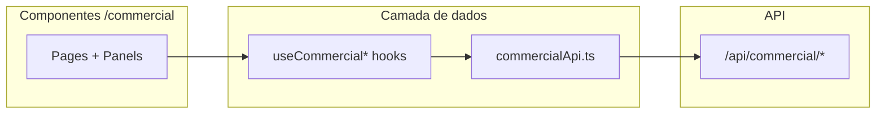

# Plano: Integração Frontend — CRM Comercial

**Status backend:** migration `047_commercial_crm.sql` aplicada em produção (Supabase `omhlb`). API `/api/commercial/*` no `flux-farma-api` (deploy recente).

**Referências:** [CRM_FRONTEND_BRIEF.md](./CRM_FRONTEND_BRIEF.md) (UX e rotas), tipos em `apps/web/src/lib/commercial/types.ts`, contrato API em `apps/api-service/src/routes/commercial.ts`.

---

## 1. Pré-requisitos (antes de ligar a UI)

| Item | Ação |
|------|------|
| Migration 047 | Concluída (`node scripts/apply-migration-047.mjs --execute`) |
| Feature flag | `PUT /api/settings` com `{ "key": "commercial_crm_enabled", "value": true }` (admin) |
| Canal WhatsApp comercial | Em Configurações → Canais: WhatsApp ativo com `config.purpose = "commercial"` |
| Papéis | Usuários com `sales` ou `commercial` (ou admin/supervisor) em `workspace_memberships` |
| Smoke Flux prod | `npm run smoke:flux-delivery-prod -w api-service` (requer `.secrets/flux-delivery-prod.env`) |

---

## 2. Arquitetura alvo



### 2.1 Novos arquivos

| Arquivo | Responsabilidade |
|---------|------------------|
| `apps/web/src/lib/commercial/commercialApi.ts` | Funções HTTP espelhando o store (axios via `@/lib/api`) |
| `apps/web/src/lib/commercial/useCommercialQueries.ts` | React Query: cache, invalidação, loading/error |
| `apps/web/src/lib/commercial/commercialKeys.ts` | Query keys estáveis (`['commercial','leads', filters]`) |
| `apps/web/src/lib/commercial/leadInput.ts` | `LeadInput` + `toApiLeadBody()` com `normalizeBrazilPhone` / `onlyDigits` de `@/lib/brFormat` |

### 2.2 Deprecar (após migração)

| Arquivo | Destino |
|---------|---------|
| `commercialPrototypeStore.ts` | Remover ou manter só em Storybook/dev com `NEXT_PUBLIC_COMMERCIAL_MOCK=1` |
| `mockData.ts` | Fixtures de teste apenas |
| `viabilityMock.ts` | Substituído por `POST /api/commercial/viability/check` |
| `CommercialPrototypeBanner.tsx` | Remover quando API estável |

### 2.3 Padrão de chamada (igual `opsAnalyticsApi.ts`)

```ts
// commercialApi.ts (esboço)
import api from '@/lib/api';
import type { CommercialLead, CommercialStage } from './types';

export async function fetchPipelineStages(): Promise<CommercialStage[]> {
  const { data } = await api.get<CommercialStage[]>('/api/commercial/pipeline-stages');
  return data;
}

export async function fetchLeads(params: { q?: string; stage_id?: string; owner_id?: string; source?: string; temperature?: string; page?: number }) {
  const { data } = await api.get<{ data: CommercialLead[]; total: number }>('/api/commercial/leads', { params });
  return data;
}
```

**Normalização no submit:** sempre enviar CNPJ e telefone só com dígitos (`BrCnpjInput` / `BrPhoneInput` já ajudam na UX; no `onSubmit` aplicar `onlyDigits` + validação CNPJ 14 chars).

---

## 3. Mapeamento componente → API

| Componente / página | Store hoje | Substituir por |
|---------------------|------------|----------------|
| `CommercialPipelinePage` | `stages`, `leads`, `moveLeadToStage` | `usePipelineStages`, `useLeads`, `usePatchLead` (`stage_id`) |
| `CommercialLeadsPage` | `stages`, `leads` | `useLeads({ q, filters })` |
| `CommercialLeadNewPage` | `addLead`, `fieldDefinitions` | `useCreateLead`, `useFieldDefinitions` |
| `CommercialLeadEditPage` | `updateLead` | `useLead(id)`, `usePatchLead` |
| `CommercialLeadDetailPanel` | todas as ações | hooks por domínio (abaixo) |
| `CommercialSettingsPage` | stages/fields/loss CRUD | `usePutPipelineStages`, `usePutFieldDefinitions`, `usePutLossReasons` |
| `CommercialDashboardPage` | métricas locais | `useCommercialDashboard` → `GET /dashboard` |
| `CommercialChatDrawer` | `messagesByLead`, `startConversation` | `useLeadConversation`, `useStartLeadConversation` |
| `CommercialCopilotDrawer` | mock | `POST /api/copilot/chat` com `commercial_lead_id` |
| `CommercialProposalPage` | proposals mock | `useProposal(id)`, `useSendProposal` |
| `CommercialConvertWizard` | `convertLead` + localStorage prefill | `useConvertLead` → redirect `/pharmacies/[id]` com `prefill` do response |
| `CommercialLossModal` | `markLeadLost` | `useLoseLead` |
| `commercialAccess.ts` | `localStorage` flag | `useSetting('commercial_crm_enabled')` ou campo em `/api/settings` |

### 3.1 Detalhe ficha (`CommercialLeadDetailPanel`)

| Tab / ação | Endpoint |
|------------|----------|
| Resumo | `GET /leads/:id` |
| Atividades | `GET /leads/:id/activities` |
| Conversa | `GET /leads/:id/conversation` (messages[]) ou link `/inbox-unificado?conversation=…` |
| Iniciar WA | `POST /leads/:id/conversation/start` |
| Viabilidade | `POST /viability/check` |
| Scoring / temperatura | `GET /leads/:id/scoring` |
| Proposta | `POST /proposals` + navegação `/commercial/proposals/:id` |
| Perdido | `POST /leads/:id/lose` |
| Ganho | `POST /leads/:id/convert` |

---

## 4. Ajustes de produto (alinhar com backend)

| Tema | Protótipo hoje | Alvo API |
|------|----------------|----------|
| CNPJ | Opcional no form | **Obrigatório** — validar 14 dígitos antes do submit; atualizar brief §11 checklist |
| Owners | `MOCK_OWNERS` | `GET /api/users?role=sales` ou lista de membros do workspace (definir endpoint existente) |
| `probability` vs `probability_pct` | `probability` no tipo | Mapear: API devolve ambos; UI continua com `probability` |
| `commercial_conversation_id` | campo no tipo | Vem de `primary_conversation_id` na API (já serializado) |
| Mensagens chat | array mock | `messages` da conversa real; reutilizar `MessageBubble` do inbox |
| Flag módulo | `localStorage` | Setting `commercial_crm_enabled`; 403 → `CommercialForbidden` |

---

## 5. Fases de implementação

### Fase F0 — Fundação (1 PR)

- [ ] Criar `commercialApi.ts` + `commercialKeys.ts` + hooks mínimos
- [ ] `commercialAccess`: ler flag da API (`useQuery` em settings)
- [ ] `CommercialLayoutGate`: loading até flag + role
- [ ] Remover banner protótipo em build de produção

### Fase F1 — Config + lista (P0)

- [ ] `CommercialSettingsPage` → PUT pipeline / fields / loss
- [ ] `CommercialLeadsPage` + filtros `q`, `stage_id`, `owner_id`, `source`
- [ ] `CommercialLeadForm`: CNPJ obrigatório + envio normalizado
- [ ] `CommercialLeadNewPage` / `EditPage` → POST / PATCH

**Aceite:** criar lead com CNPJ mascarado persiste; lista busca por CNPJ formatado.

### Fase F2 — Pipeline + ficha (P1)

- [ ] `CommercialPipelinePage`: DnD → `PATCH` com validação de erro (ganho/perdido)
- [ ] `CommercialLeadDetailPanel`: atividades da API
- [ ] Estados loading/empty/error em kanban e ficha

### Fase F3 — Operação comercial (P2)

- [ ] `CommercialLossModal` → POST lose
- [ ] `CommercialConvertWizard` → POST convert + redirect farmácia
- [ ] `CommercialChatDrawer` → conversation start + mensagens API
- [ ] Propostas: criar, preview, send

### Fase F4 — Analytics + scoring (P3 + P2b)

- [ ] `CommercialDashboardPage` → `GET /dashboard`
- [ ] Viabilidade tab → `POST /viability/check`
- [ ] `CommercialTemperatureBadge` + estagnados via `GET /scoring`
- [ ] `CommercialCopilotDrawer` → copilot com `commercial_lead_id`

### Fase F5 — Inbox bridge (P4b)

- [ ] Inbox: PATCH conversa com `context_commercial_lead_id`
- [ ] `NewConversationModal` ou menu contexto: `contact_type: commercial_lead`
- [ ] Criar lead a partir da thread (POST leads com telefone da conversa)
- [ ] Deep link `/commercial/leads/[id]` a partir do inbox

---

## 6. React Query — invalidação sugerida

| Mutação | Invalidar |
|---------|-----------|
| `createLead` | `leads`, `dashboard` |
| `patchLead` (stage) | `leads`, `lead(id)`, `activities(id)`, `dashboard` |
| `loseLead` / `convertLead` | idem |
| `putPipelineStages` | `pipeline-stages`, `leads` |
| `startConversation` | `lead(id)`, `conversation(id)` |

---

## 7. Tratamento de erros

- Usar `apiErrorMessage` existente (padrão cadastros)
- **403** módulo desligado → redirect `/inbox` ou `CommercialForbidden`
- **400** CNPJ duplicado / estágio ganho sem convert → toast com mensagem da API
- **400** canal comercial ausente → link para Configurações → Canais

---

## 8. Deploy

| Ordem | Serviço | Quando |
|-------|---------|--------|
| 1 | Supabase migration | Feito |
| 2 | `flux-farma-api` | Feito (CRM routes) |
| 3 | `flux-farma-web` | Após F1+ (integração real); pode shippar F0+F1 em um deploy |

Script web: mesmo padrão `scripts/deploy-production-*.mjs` (substitutions em `reports/web-build-substitutions.json`).

---

## 9. Checklist de aceite (integração completa)

- [ ] Flag `commercial_crm_enabled` controla menu via API
- [ ] Pipeline: drag persiste; bloqueio ao arrastar para “Ganho”
- [ ] Novo lead: CNPJ + telefone obrigatórios; dígitos no payload
- [ ] Ficha: WA usa canal `purpose=commercial`
- [ ] Ganho: farmácia criada; link `/pharmacies/[id]`
- [ ] Perdido: motivo obrigatório da lista configurável
- [ ] Settings: estágios/campos/motivos persistem
- [ ] Dashboard e viabilidade batem com API
- [ ] Copiloto envia `commercial_lead_id`
- [ ] Sem dependência de `localStorage` do protótipo (exceto auth token)

---

## 10. Estimativa de esforço

| Fase | Escopo | Esforço indicativo |
|------|--------|-------------------|
| F0 | Api + hooks + flag | 0,5–1 dia |
| F1 | Settings + lista + form | 1–1,5 dias |
| F2 | Kanban + ficha P1 | 1–2 dias |
| F3 | WA + convert + propostas | 1,5–2 dias |
| F4 | Dashboard + copilot + scoring | 1 dia |
| F5 | Inbox bridge | 1–2 dias |

**Total:** ~6–9 dias úteis para substituir o protótipo por produção end-to-end.

---

## 11. Fora de escopo (manter no backlog)

- Inbox único vendas + suporte
- Múltiplos pipelines, rotação de leads, forecast AI
- Lead automático Instagram (webhook P4)
- Envio real de proposta via template Meta (marcar `sent` hoje; integrar `messages` depois)
