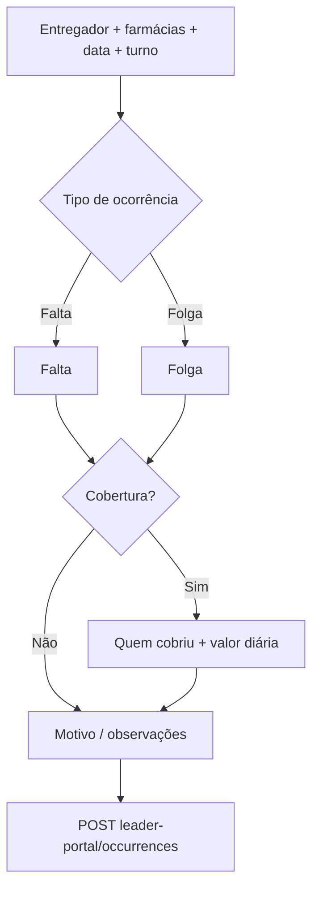
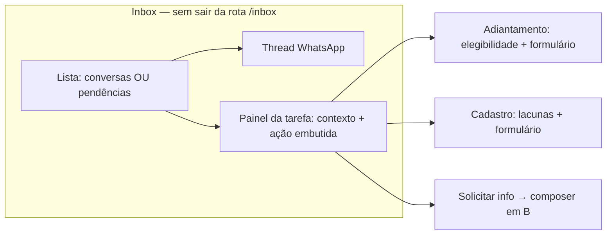
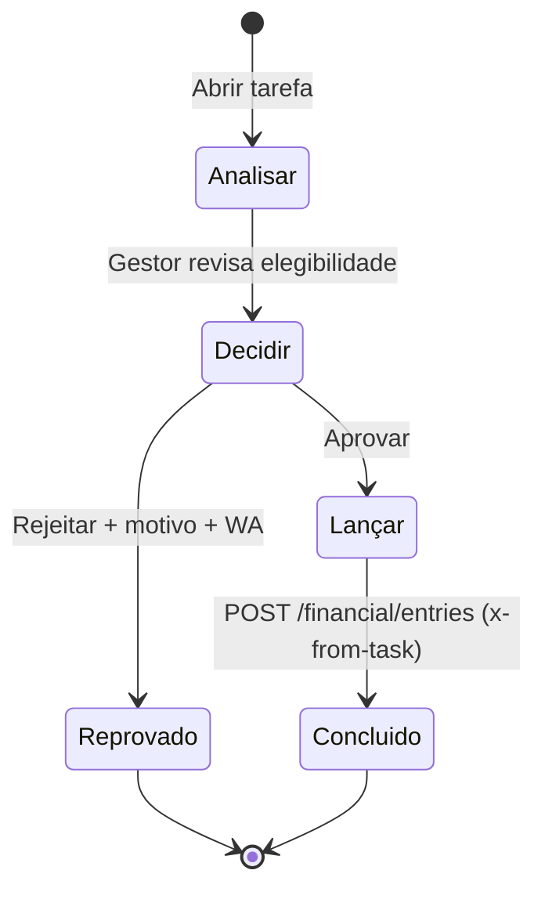

# Plano: Falta / folga / cobertura (líder) + Pendências na Inbox

Documento de produto e implementação. Complementa o portal do líder e o painel unificado de atendimento.

---

## Parte A — Lançamento operacional (líder)

### Objetivo

Na hora do lançamento, o líder deve deixar explícito **o que aconteceu** (falta vs folga) e **se houve cobertura**, sem informar valor de desconto. O financeiro consolida valores no **fechamento do ciclo de apuração** (seg–dom + data de pagamento configurada).

### Tipos de ocorrência (UI)

| Tipo | Código API | Significado | Financeiro (ciclo) |
|------|------------|-------------|----------------------|
| **Falta** | `absence` + `occurrence_kind: unexcused` | Ausência não programada / não compareceu | Desconto sugerido na apuração (sem valor no portal) |
| **Folga** | `absence` + `occurrence_kind: day_off` | Folga programada / dia sem escala | Informativo; desconto só se política exigir |
| **Folga com cobertura** | `day_off` + `has_coverage: true` | Folga, outro entregador trabalhou | Diária do cobridor + vínculo ao faltante |
| **Falta com cobertura** | `absence` + `has_coverage: true` | Faltou, outro cobriu | Diária do cobridor + falta informativa do ausente |

> Implementação sugerida: um único fluxo em `/lider/faltas` (renomear para **“Ocorrências de escala”** ou manter título e subtítulo claro), com ramificação em 2 passos antes do envio.

### Fluxo de UI (wizard curto no formulário)



**Passo 1 — Contexto (já existe, manter)**  
- Entregador, farmácias vinculadas, data do evento, turno (manhã/tarde/noite/dia inteiro).

**Passo 2 — Tipo (novo, obrigatório)**  
- Botões ou cards: **Falta** | **Folga**  
- Texto de ajuda curto em cada card (ex.: falta = não compareceu; folga = dia sem escala combinado).

**Passo 3 — Cobertura (novo)**  
- Pergunta: **“Outro entregador cobriu nesta farmácia/data?”** Sim / Não  
- Se **Não**: apenas registro informativo → segue para motivo e envio.  
- Se **Sim**:  
  - Select **Entregador que cobriu** (lista da rede, excluindo o ausente).  
  - Campo **Valor da diária** (obrigatório, como em `/lider/diarias`).  
  - Opcional: observação “cobertura de falta/folga”.

**Passo 4 — Motivo** (já existe)  
- Textarea; placeholder varia por tipo (ex. folga: “folga combinada com gerente”; falta: “não apareceu no turno da manhã”).

**Resumo antes de enviar (novo)**  
- Bloco de confirmação: tipo, cobertura sim/não, quem cobriu, ciclo de apuração estimado (“desconto/pagamento na apuração de DD/MM a DD/MM — pagamento previsto DD/MM”), **sem campo de valor de desconto da falta**.

### Regras de negócio (API)

**Novo endpoint preferido:** `POST /api/leader-portal/occurrences` (ou estender `/absences` com schema v2).

Body sugerido:

```ts
{
  driver_id: uuid,           // ausente / de folga
  pharmacy_ids: uuid[],
  event_date: 'YYYY-MM-DD',
  shift?: 'full' | 'morning' | 'afternoon' | 'night',
  occurrence_kind: 'unexcused' | 'day_off',
  has_coverage: boolean,
  coverage?: {
    covering_driver_id: uuid,
    amount: number,
    notes?: string
  },
  reason?: string
}
```

**Persistência:**

| Cenário | Registros |
|---------|-----------|
| Sem cobertura | 1× `financial_entries` tipo `absence`, `total_amount: 0`, `status: informed` (novo) ou `pending_approval`, `metadata`: `{ occurrence_kind, shift, leader_id }` |
| Com cobertura | 1× falta/folga informativa (ausente) + 1× `daily` (cobridor), `metadata.covered_absence_id` / `coverage_of_driver_id` entre ambos |

**Validações:**

- `event_date` dentro do ciclo aberto ou até a data de fechamento configurada (bloquear após fechamento).  
- Cobridor ≠ ausente; ambos no escopo do líder.  
- Com cobertura: `amount > 0`; sem campo `total_amount` na falta.  
- Alinhar stats do líder: contar `informed` / `pending_approval`, não só `active`.

**Diárias órfãs (retrocompat):**  
- Job ou tela financeiro: diárias `daily` sem `coverage_of_driver_id` na mesma farmácia/data → sugerir vínculo (fora do escopo do formulário, na Parte B financeiro).

### Ajustes de copy (UI atual)

- Remover “desconto na data do evento”.  
- Usar: “Registro informativo para o financeiro. Valores de desconto e diária de cobertura são conferidos no fechamento do ciclo (seg–dom).”

### Arquivos previstos (Parte A)

| Camada | Arquivo |
|--------|---------|
| API | `lib/leaderOccurrences.ts`, `routes/leader-portal.ts` |
| DB | migration: `financial_entries.occurrence_kind`, `coverage_of_entry_id`, status `informed` |
| Web | `lider/faltas/page.tsx` (wizard), opcional renomear rota |
| Pacote | `financial-cycle` — validar `event_date` vs fechamento |

### Critérios de aceite (Parte A)

- [ ] Líder escolhe **Falta** ou **Folga** em todo lançamento.  
- [ ] Líder indica **cobertura sim/não**; se sim, escolhe cobridor e valor da diária.  
- [ ] Nenhum campo de **valor de desconto** da falta no portal.  
- [ ] Inbox/financeiro vê vínculo ausente ↔ cobridor na conferência do ciclo.  

---

## Parte B — Pendências na Inbox (sem novo item de menu)

### Problema hoje

- Pendências aparecem num painel lateral (“Atividade → Tarefas”) com título, descrição genérica e botões **Concluir** / **Aprovar**.  
- Muitos tipos (`guided_demand`, `queue_sla_*`, `driver_registration_completion`, tickets SLA, etc.) exigem contexto que não está na lista.  
- SLA de conversa usa `sla_events` (feed separado), não `pending_tasks`.  
- Atendente precisa navegar conversa + painel + às vezes Financeiro / Cadastros.

### Princípio

**Tudo que exige ação humana vira “trabalho” visível na Inbox**, com **gaveta de tarefa** (drawer) ou **coluna dedicada** no layout atual — sem rota `/tarefas` no menu.

### Arquitetura de UX alvo

**Layout “trabalho na Inbox” (3 colunas quando há pendência ativa):**



| Coluna | Conteúdo |
|--------|----------|
| 1 | Pastas (Atribuídas, **Pendências**, Menções…) + busca |
| 2 | Thread da conversa vinculada (`conversation_id`) — **sempre acessível** com botão “Ver conversa” sem fechar a tarefa |
| 3 | `InboxTaskWorkspace`: playbook, contexto, formulário embutido (financeiro/cadastro) |

> Em telas estreitas: abas **Conversa | Tarefa | Ação** no mesmo viewport, sem navegar para `/financial` ou `/drivers/[id]`.

### 1. Pasta **“Pendências”** na sidebar da Inbox

- Nova pasta ao lado de “Menções”, contagem = `mine_open` + urgentes (`overdue`).  
- Lista **cards de tarefa** (não só conversas): prioridade, SLA `due_at`, tipo legível, contato/entregador.  
- Clique abre **modo tarefa** e fixa a coluna 3; se `conversation_id`, coluna 2 carrega a thread **sem** `openAppRouteInNewTab` (hoje adiantamento abre `/financial` em nova aba — remover).

### 2. `InboxTaskWorkspace` (painel de execução)

Componente único: `InboxTaskWorkspace.tsx`.

**Cabeçalho:** tipo traduzido, prioridade, SLA countdown, assignee.

**Bloco Contexto (sempre visível):**

| Fonte | Campos |
|-------|--------|
| `pending_tasks` | title, description, metadata, due_at, task_type |
| `conversations` | setor, demanda, farmácia/entregador/líder, SLA conversa |
| `drivers` / `pharmacies` / `leaders` | ficha resumida (nome, telefone, vínculos) |
| `metadata` | payload específico (desligamento, adiantamento, fila SLA, etc.) |

**Playbook por `task_type` (checklist + CTAs):**

| task_type | Passos guiados | CTAs principais |
|-----------|----------------|-----------------|
| `guided_demand` | 1) Ler demanda 2) Responder no WhatsApp 3) Resolver conversa | Abrir thread, templates por demanda, Concluir quando `resolved` |
| `queue_sla_treatment` | 1) Ver SLA 2) Primeira resposta 3) Tratamento | Thread, nota interna, Concluir / Escalar |
| `queue_sla_treatment_warning` / `_overdue` | Idem pai + urgência | Ir para tarefa pai, Thread |
| `financial_advance_request` | Ver **B.1 Adiantamento** (elegibilidade → decisão → lançamento embutido) | Painel financeiro inline; não redirecionar para `/financial` |
| `advance_sla_*` | Lembrete do adiantamento | Ir para tarefa pai na mesma Inbox |
| `driver_registration_completion` | Ver **B.2 Cadastro** (lacunas → pedir dados → salvar inline) | Formulário embutido + conversa líder/entregador na coluna 2 |
| `driver_termination_request` | 1) Confirmar motivo 2) Aprovar desligamento 3) Aguardar financeiro | Aprovar/Reprovar, ver metadata farmácias |
| `driver_termination_financial_review` | 1) Pendências financeiras 2) Acerto | Painel financeiro filtrado por `driver_id` |
| `internal_note_mention` | 1) Ler nota 2) Responder | Abrir conversa na nota |
| `ticket_sla_notification` | 1) Tratar ticket 2) Atualizar status | Thread + sidecar ticketing (já existe) |
| `ticket_sla_daily_report` | Resumo do dia | Marcar lido / Concluir |
| `operational_pending` | Genérico | Thread + Concluir + nota |

**Bloco “Solicitar informação” (guiado):**

- Selecionar destinatário: **Entregador** | **Líder** | **Farmácia** (com base em `context_*` e telefone WA).  
- Templates por persona (pré-cadastro, falta, adiantamento, documento).  
- Botão **Inserir no composer** / **Enviar** (outbound staff) — reutilizar composer da thread quando houver `conversation_id`; senão modal com escolha de conversa ou criação de thread outbound.

### 3. API de enriquecimento

`GET /api/tasks/:id/context` retorna payload unificado para renderizar coluna 3 sem chamadas extras:

```ts
{
  task: PendingTask,
  playbook: { steps: { id: string; label: string; done?: boolean }[], current_step: string },
  entities: {
    driver?: DriverSummary,
    pharmacy?: PharmacySummary,
    leader?: LeaderSummary,
    conversation?: ConversationSummary,
  },
  related_tasks: PendingTask[],
  suggested_messages: { label: string; body: string; target: 'driver' | 'leader' | 'pharmacy' }[],
  // Somente quando task_type === 'financial_advance_request'
  advance_context?: AdvanceTaskContext,
  // Somente quando task_type === 'driver_registration_completion'
  registration_context?: RegistrationTaskContext,
}
```

Registro central: `lib/taskPlaybooks.ts` (mapeamento `task_type` → passos + permissões por role).

---

## B.1 — Adiantamento na Inbox (gestor financeiro)

### Objetivo

Ao abrir `financial_advance_request`, o sistema **já mostra** se o entregador tem adiantamento em aberto, quanto já recebeu / quanto falta descontar, e — após **aprovar** — o gestor **configura e confirma o lançamento na mesma tela**, sem ir a `/financial`.

### Estado atual (gap)

- `PATCH /api/tasks/:id/decision` com `approved` devolve `next_action.url` → `/financial?fromTask=…` e a Inbox chama `openAppRouteInNewTab` (`inbox/page.tsx`).
- Formulário de adiantamento em modo aprovação já existe em `financial/page.tsx` (`advanceApprovalMode`, header `x-from-task` em `POST /api/financial/entries`).
- **Falta:** snapshot de elegibilidade na abertura da tarefa; formulário embutido na Inbox; decisão em dois passos (aprovar → lançar) na mesma workspace.

### Bloco “Situação do entregador” (antes da decisão)

Carregar em `advance_context` via `GET /api/tasks/:id/context` (ou `GET /api/financial/drivers/:id/advance-eligibility`):

| Informação | Fonte sugerida |
|------------|----------------|
| Adiantamentos **ativos** (tipo `advance`, status `active` / `approved`) | `financial_entries` + parcelas `pending` |
| **Total já adiantado** no ciclo / mês | `buildMonthlyDriverSummary` / `buildWeeklyDriverSummary` (`financialSummaries.ts`) |
| **Descontos pendentes** (parcelas a vencer) | resumo mensal `pending_installments_amount` |
| **Limite sugerido** (política) | `app_settings` ex.: `advance_max_percent_of_cycle_net`, `advance_max_open_count` |
| **Solicitação desta tarefa** | `metadata` (valor pedido, motivo, se bot preencheu) |
| **Alertas** | “Já possui adiantamento em aberto”, “Acima do limite”, “Cadastro incompleto” |

Exemplo de UI:

```
┌─ Situação financeira ─────────────────────────┐
│ Adiantamentos em aberto: 1 (R$ 450,00)        │
│ Parcelas pendentes no mês: R$ 120,00        │
│ Receita ciclo anterior (est.): R$ 2.100,00    │
│ Limite sugerido (80% líquido): R$ 1.580,00   │
│ ⚠ Já existe adiantamento ativo desde 12/05   │
└───────────────────────────────────────────────┘
```

Regras de negócio (configuráveis):

- Bloquear **aprovação** se `open_advance_count >= max` (override só `admin`/`financial` com motivo).
- Exibir **valor máximo recomendado**; formulário pós-aprovação pré-preenche `min(solicitado, recomendado)`.

### Fluxo em 3 passos (playbook na coluna 3)



**Passo 1 — Analisar**  
- Checklist: confirmar identidade do entregador, ler pedido na conversa (coluna 2), revisar `advance_context`.  
- CTA: **Abrir conversa** (foca coluna 2, não navega fora).

**Passo 2 — Decidir**  
- Botões **Reprovar** (motivo obrigatório) / **Aprovar e lançar** (não fecha tarefa ainda).  
- `PATCH /tasks/:id/decision` evoluir para:
  - `decision: approved` + `phase: 'awaiting_entry'` → mantém tarefa `in_progress`, grava `metadata.decided_at`, **não** resolve conversa até lançamento confirmado (ajuste fino ao fluxo atual que resolve conversa no approve).  
  - OU manter approve atual mas **não** redirecionar; abrir passo 3 inline imediatamente.

**Passo 3 — Lançar (somente financeiro/admin)**  
- Componente embutido `InboxAdvanceEntryForm` (extrair de `financial/page.tsx`):
  - Campos editáveis: valor total, nº parcelas, frequência, justificativa (como `approvalMode` hoje).
  - Travados: `driver_id`, `type: advance`, `start_date` = data da aprovação (`metadata.decided_at`).
  - `POST /api/financial/entries` com header `x-from-task: {taskId}` (já validado na API).
- Ao sucesso: marcar tarefa `done`, mensagem WA de confirmação, resolver conversa, nota interna com ID do lançamento.

### API nova / ajustes

| Endpoint | Uso |
|----------|-----|
| `GET /api/financial/drivers/:driverId/advance-eligibility` | Snapshot para card de situação (reutilizável no Copilot) |
| `GET /api/tasks/:id/context` | Inclui `advance_context` |
| `PATCH /api/tasks/:id/decision` | `approved` sem `open_financial_entry` externo; retorna `{ phase: 'launch_entry' }` |
| `POST /api/financial/entries` | Inalterado; `x-from-task` + corpo `advance` |

### Permissões

- **Decidir / lançar:** `financial`, `supervisor`, `admin` (como hoje).  
- **Atendente:** só leitura + pedir documentos na conversa; não aprova.

### Critérios de aceite — adiantamento

- [ ] Ao abrir pendência, vê adiantamentos existentes e valores resumidos.  
- [ ] Alertas impedem ou avisam aprovação indevida (política configurável).  
- [ ] Após aprovar, formulário de lançamento aparece **na Inbox** (coluna 3).  
- [ ] Lançamento criado com `x-from-task` sem abrir `/financial`.  
- [ ] Conversa permanece visível (coluna 2) durante todo o fluxo.

---

## B.2 — Cadastro de entregador na Inbox

### Objetivo

`driver_registration_completion` permite **preencher o cadastro**, **ver lacunas**, **pedir dados** ao entregador ou líder via WhatsApp, e **abrir a conversa** — tudo sem sair de `/inbox`.

### Estado atual (gap)

- Playbook sugere “abrir ficha” → rota `/drivers/[id]`.  
- Copilot já expõe `analyze_driver_registration_gaps` (`copilotTools.ts`, `driverRegistrationCatalog.ts`).  
- Não há formulário embutido nem atalho para conversa do líder na Inbox.

### Bloco “Lacunas de cadastro”

`registration_context` em `GET /api/tasks/:id/context`:

```ts
{
  driver_id: string,
  missing_required: { key: string; label: string }[],
  missing_optional: { key: string; label: string }[],
  completion_percent: number,
  pharmacies: { id; trade_name }[],
  leader?: { id; name; phone; conversation_id? },
  contact?: { conversation_id?; wa_phone? },
}
```

Fonte: extrair lógica de `analyzeDriverRegistrationGaps` para lib compartilhada `driverRegistrationGaps.ts` (API + Copilot).

### Formulário embutido `InboxDriverRegistrationForm`

- Campos agrupados: **Identidade**, **Documentos**, **Operação** (farmácias, veículo, etc.).  
- Só exibe campos em `missing_required` + expansão “ver todos”.  
- `PATCH /api/drivers/:id` por seção; upload de anexos se já existir endpoint.  
- Ao salvar último obrigatório: habilitar **Concluir tarefa**.

### Contato para obter informações (coluna 2)

| Destinatário | Quando | Ação na Inbox |
|--------------|--------|----------------|
| **Entregador** | `contact.conversation_id` ou WA do driver | Botão **Abrir conversa do entregador** → `setActiveId` na coluna 2 |
| **Líder** | farmácia com `leader_id` / `context_leader` | Resolver conversa do líder (`contacts.leader_id`) ou iniciar thread; templates: “Precisamos completar cadastro do entregador X: falta CPF, CNH…” |
| **Farmácia** | dado de loja | Template curto para contato pharmacy se aplicável |

**Templates (bloco “Solicitar informação”):**

- Lista dinâmica a partir de `missing_required` (“Por favor envie foto da CNH e confirme CPF”).  
- **Inserir no composer** / **Enviar** usando composer da coluna 2.  
- Integração opcional com **Copilot** (botão “Gerar mensagem pedindo dados faltantes”) reutilizando `buildClientDraftFromGaps`.

### Playbook cadastro (checklist)

1. Revisar lacunas no painel.  
2. Abrir conversa (entregador ou líder) na coluna 2.  
3. Enviar pedido de documentos (template).  
4. Preencher campos conforme respostas chegam (form embutido).  
5. Concluir tarefa quando `missing_required.length === 0`.

### API nova / ajustes

| Endpoint | Uso |
|----------|-----|
| `GET /api/drivers/:id/registration-gaps` | Lacunas para UI (wrapper público da análise) |
| `GET /api/tasks/:id/context` | Inclui `registration_context` + `leader.conversation_id` se existir |
| `GET /api/leaders/:id/contact-conversation` | Opcional: conversa WA do líder para abrir na Inbox |

### Critérios de aceite — cadastro

- [ ] Lacunas listadas na abertura da pendência.  
- [ ] Formulário salva campos sem navegar para `/drivers/[id]`.  
- [ ] Abrir conversa entregador/líder na coluna 2 sem sair da Inbox.  
- [ ] Templates gerados a partir dos campos faltantes.  
- [ ] Concluir tarefa só quando obrigatórios preenchidos (ou override com motivo para supervisor).

### 4. Unificar alertas SLA na mesma fila (opcional fase 2)

- Conversas em risco (`sla_events` critical) sem tarefa aberta → criar `pending_tasks` tipo `conversation_sla_breach` (dedupe por `conversation_id`) **ou** mesclar no feed da pasta Pendências com badge “SLA” (sem duplicar menu).  
- Preferência: **criar tarefa** para critical/breach; warning permanece só no feed SLA com link “Tratar na conversa”.

### 5. Gestor (supervisor)

- Pasta Pendências mostra escopo do setor (`buildSupervisorPendingTasksOr` — já existe).  
- Filtros: tipo, vencidas, sem conversa, por atendente.  
- Ação **Reatribuir** (`assignee_id`) no drawer.  
- Visão agregada no topo do painel Atividade (já parcial): evoluir para mesmos cards da pasta Pendências.

### 6. O que não mudar no menu

- Sem item “Tarefas” global: tudo em **Inbox → Pendências**.  
- `/financial` e `/drivers/[id]` permanecem para consulta avançada / relatórios, mas **não** são o caminho obrigatório de resolução.

### Fases de implementação (Parte B)

| Fase | Entrega |
|------|---------|
| **B1** | Pasta Pendências + layout 3 colunas + `GET /tasks/:id/context` + remover redirect `openAppRouteInNewTab` no approve |
| **B1a** | **Adiantamento:** `advance-eligibility` + card situação + `InboxAdvanceEntryForm` + ajuste `decision` (lançar inline) |
| **B1b** | **Cadastro:** `registration-gaps` + `InboxDriverRegistrationForm` + abrir conversa líder/entregador na coluna 2 |
| **B2** | “Solicitar informação” + templates dinâmicos + Copilot rascunho; demais `task_type` |
| **B3** | SLA crítico → tarefa deduplicada; supervisor reassign + políticas de limite de adiantamento |

### Critérios de aceite (Parte B)

- [ ] Gestor financeiro: elegibilidade de adiantamento visível antes de aprovar.  
- [ ] Gestor financeiro: lança adiantamento na Inbox após aprovar, sem `/financial`.  
- [ ] Atendente: completa cadastro e pede dados ao líder/entregador sem sair da Inbox.  
- [ ] Conversa aberta na coluna 2 enquanto tarefa ativa na coluna 3.  
- [ ] Toda pendência mostra playbook + contexto.  
- [ ] Gestor vê e reatribui pendências do setor na pasta Pendências.  

---

## Ordem sugerida de desenvolvimento

1. **Parte A** — UI falta/folga/cobertura + API `occurrences` (desbloqueia operação correta).  
2. **Parte B1** — Inbox Pendências + drawer + playbooks principais.  
3. **Parte B2/B3** — Mensagens guiadas + SLA unificado.

---

## Referências no código atual

- Lançamento líder: `apps/web/src/app/(app)/lider/faltas/page.tsx`, `POST /api/leader-portal/absences`  
- Diária: `apps/web/src/app/(app)/lider/diarias/page.tsx`  
- Motor ciclo falta: `packages/financial-cycle/src/absence.ts`  
- Pendências inbox: `apps/web/src/app/(app)/inbox/page.tsx` (~1338 `decideTask`, ~3030 tarefas)  
- API tarefas: `apps/api-service/src/routes/tasks.ts` (`next_action.open_financial_entry` → substituir por fluxo inline)  
- Adiantamento UI legado: `apps/web/src/app/(app)/financial/page.tsx` (`advanceApprovalMode`, `x-from-task`)  
- Resumos financeiros: `apps/api-service/src/lib/financialSummaries.ts`  
- Lacunas cadastro: `apps/api-service/src/lib/copilotTools.ts` (`analyze_driver_registration_gaps`), `driverRegistrationCatalog.ts`  
- Ficha entregador (referência campos): `apps/web/src/app/(app)/drivers/[id]/page.tsx`
