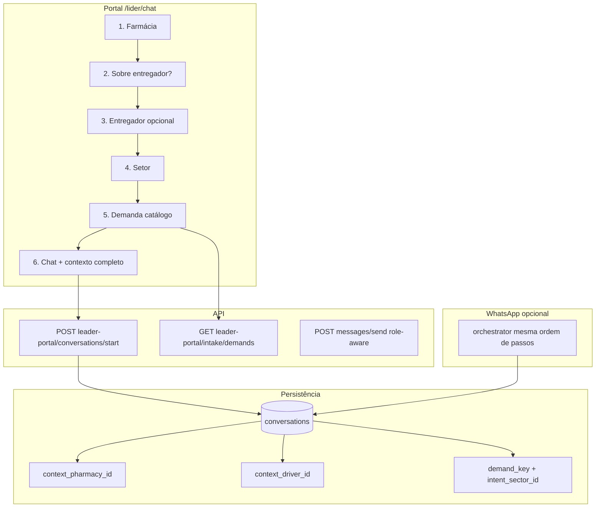

# Plano: Portal do líder alinhado ao WhatsApp + UI de chat + demandas do catálogo

Objetivo: o fluxo **Nova conversa** no portal (`/lider/chat`) deve espelhar a triagem do **orchestrator** (farmácia → entregador opcional → setor → **demanda**), persistir o mesmo contexto que o inbox/copiloto usam, e corrigir bolhas de mensagem no portal do líder e no inbox.

Referências atuais:
- Triagem WhatsApp: [LEADER_WHATSAPP_INTAKE.md](./LEADER_WHATSAPP_INTAKE.md), `apps/orchestrator-service/src/leaderIntake.ts`, `index.ts` (`stepIdentify` → `ask_leader_*` → `ask_intent`).
- Catálogo / webhook: `workspace_channels.config.demands`, `workspace_sector_demands`, `workspaceCatalogRuntime.ts`, preview em `POST /api/workspace-catalogs/preview-handoff`.
- Portal hoje: `POST /api/conversations/start` (legado) só com `sector_id` — **pula** farmácia, entregador e demanda.
- UI: `MessageBubble.tsx` (visão atendente); inbox usa `from: outbound ? 'me' : 'them'`.

---

## Diagnóstico (estado atual)

| Área | Comportamento atual | Problema |
|------|---------------------|----------|
| Portal Nova conversa | Escolhe só setor → cria conversa | Sem `context_pharmacy_id` / `context_driver_id` / `demand_key` |
| Orchestrator (líder) | Após setor chama `completeLeaderSectorRouting` | **Não** lista demandas (`ask_demand` só para driver/pharmacy) |
| Demandas “do webhook” | `workspace_channels.config.demands[]` + fallback `workspace_sector_demands` | Líder não consome no portal; catálogo default só tem `ldr-setor` em SLA, sem linhas `profile_code: leader` em demands |
| Bolhas portal líder | `MessageBubble` sem perspectiva | Mensagens do atendimento e do líder podem aparecer no mesmo lado/cor |
| Bolhas inbox | `outbound` → `me` (direita) | Se tudo for gravado `outbound`, tudo fica à direita (como nos prints) |
| `messages/send` | Sempre `direction: outbound` | Mensagem do **líder** no portal sai como “time”, igual resposta do atendente |

---

## Arquitetura alvo



**Regra de demandas para líder (recomendada):**
- Com `context_driver_id` → listar demandas do perfil **`driver`** para o setor (ex.: MEI → `drv-ag-mei`), via mesmo resolver do orchestrator (`runtimeListDemandsForSector`).
- Sem entregador → listar demandas do perfil **`pharmacy`** para o setor, ou catálogo **`leader`** quando existir em `workspace_sector_demands` / `config.demands`.
- Prioridade de fonte (igual orchestrator): **canal WhatsApp `config.demands`** → tabela **`workspace_sector_demands`** → mapa estático em `guidedIntake.ts`.

---

## Fase 1 — Modelo de mensagens (API) — base para UI

**Escopo:** corrigir `direction` na origem; inbox e portal passam a refletir dados certos.

| Origem | `direction` correto | Quem envia |
|--------|---------------------|------------|
| Webhook → orchestrator | `inbound` | Contato (líder / driver / farmácia) |
| Inbox atendente `messages/send` | `outbound` | Time / plataforma |
| Portal líder `messages/send` | `inbound` | Líder (é o contato da conversa) |

**Tarefas:**
1. Em `apps/api-service/src/routes/messages.ts`, se `user.role === 'leader'`: persistir `inbound`; não aplicar lógica de “primeira resposta do atendente” (`markConversationFirstResponseIfNeeded` só em `outbound` de staff).
2. Opcional (mais claro): `POST /api/leader-portal/messages` delegando ao mesmo persist, evitando envio Meta duplicado se a mensagem já veio do web (definir se portal replica no WhatsApp do líder ou só thread interna).
3. Auditar mensagens de teste “Robert Platform: …” — se forem notas internas, não misturar com `messages` ou marcar tipo/note.

**Critério de aceite:** na inbox, mensagem do líder à esquerda (`them`); resposta do atendente à direita (`me`). No portal, o oposto via perspectiva (Fase 2).

---

## Fase 2 — `MessageBubble` com perspectiva (web)

**Arquivo:** `apps/web/src/components/ui/MessageBubble.tsx`

| `viewerRole` | `inbound` | `outbound` |
|--------------|-----------|------------|
| `staff` (inbox, padrão) | Esquerda, superfície neutra, “Contato” | Direita, primária, “Time” |
| `leader` | Direita, verde/WhatsApp, “Você” | Esquerda, neutra, “Atendimento” |

**Tarefas:**
1. Prop `viewerRole?: 'staff' | 'leader'` (default `staff`).
2. `/lider/chat`: `<MessageBubble viewerRole="leader" />`.
3. Inbox: manter `staff` ou extrair de `MessageBubble` em um subcomponente `ChatThread` compartilhado (evitar duplicar estilos de `inbox/page.tsx` ~2450).
4. Cores: aumentar contraste (ex. líder `bg-channel-whatsapp/15 border-channel-whatsapp/30`; atendimento `bg-surface-elevated`).

**Critério de aceite:** prints reproduzidos — três mensagens com lados/cores distintos conforme quem enviou.

---

## Fase 3 — API de intake do líder (paridade de dados)

### 3.1 Listar demandas (catálogo / webhook)

**Novo:** `GET /api/leader-portal/intake/demands`

Query: `sector_id` (uuid, obrigatório), `driver_id?`, `pharmacy_id?`.

Implementação sugerida: extrair função compartilhada (ex. `apps/api-service/src/lib/intakeDemands.ts`) espelhando `workspaceCatalogRuntime` + `loadWorkspaceWhatsAppChannel`:
- Resolver `sector_key` / nome do setor a partir de `sectors.id`.
- `demand_profile = driver_id ? 'driver' : 'pharmacy'` (ou `leader` quando houver linhas no catálogo).
- Retornar `{ demands: [{ demand_key, title }], source: 'channel_config' | 'workspace_catalog' | 'static' }`.

### 3.2 Iniciar conversa com contexto completo

**Estender** `leaderPortalStartSchema` / novo endpoint dedicado:

`POST /api/leader-portal/conversations/start`

```ts
{
  pharmacy_id: uuid,          // obrigatório se N farmácias; auto se 1
  driver_id?: uuid | null,    // null = não é sobre entregador
  sector_id: uuid,
  demand_key: string,
  initial_message?: string    // opcional — primeira mensagem do líder (inbound)
}
```

**Persistir:**
- `context_pharmacy_id`, `context_driver_id`, `context_leader_id`
- `sector_id`, `intent_sector_id`, `demand_key`
- `summary` rico: farmácia, entregador, setor, título da demanda
- `tags`: `portal-lider`, `guided-intake`
- Nota interna espelhando orchestrator (`completeLeaderSectorRouting` + `stepAskDemand`)
- SLA: `runtimeSlaPresetForDemand` / regra do catálogo para `demand_key` (não só `ldr-setor`)
- `ensureGuidedDemandTaskForConversation` (já existe no GET conversa)

**Validações:** reutilizar `leaderPortalScope` (`assertPharmaciesInLeaderScope`, `isDriverInLeaderScope`).

### 3.3 Listagens auxiliares (já existem)

- `GET /api/leader-portal/pharmacies`
- `GET /api/leader-portal/drivers` — filtrar por `pharmacy_id` no wizard (query param ou filtro client)

**Critério de aceite:** conversa criada no portal com os mesmos campos que uma triagem WhatsApp completa + `demand_key` preenchido.

---

## Fase 4 — Wizard no `/lider/chat` (UI)

Substituir modal/coluna “só setor” por fluxo em passos (mobile: modal fullscreen; desktop: coluna esquerda ou stepper).

| Passo | UI | API |
|-------|-----|-----|
| 1 | Farmácia (lista; pular se 1) | `GET /leader-portal/pharmacies` |
| 2 | “É sobre entregador?” Sim/Não | local |
| 3 | Lista entregadores da farmácia + “Não está na lista” | `GET /leader-portal/drivers?pharmacy_id=` |
| 4 | Setor macro | `GET /api/sectors` |
| 5 | **Demandas** (cards/lista) | `GET /leader-portal/intake/demands` |
| 6 | Abrir chat | `POST /leader-portal/conversations/start` |

**Painel “Contexto do atendimento”** (thread): exibir **Farmácia · Entregador · Setor · Demanda** (não só setor + contadores genéricos).

**Critério de aceite:** fluxo E2E do doc [LEADER_WHATSAPP_INTAKE.md](./LEADER_WHATSAPP_INTAKE.md) reproduzido no portal, com passo extra de demanda após setor.

---

## Fase 5 — Paridade orchestrator (WhatsApp)

Hoje em `stepAskIntent`, `profileType === 'leader'` chama `completeLeaderSectorRouting` sem `ask_demand`.

**Alteração:**
1. Após setor (e farmácia/entregador já resolvidos), ir para `ask_demand` com `demand_profile` derivado (`driver` se `context_driver_id`, senão `pharmacy`).
2. Novo handler ou ramo em `stepAskDemand` para `leader_flow === true` → gravar `demand_key`, SLA da demanda, `completeGuidedIntakeSession` com `path: leader_pharmacy_driver_sector_demand`.
3. Mensagens: `leader_ask_demand` em `channelMessages` / catálogo.

**Catálogo (dados):** adicionar em `workspaceCatalogDefaults` (e seed) demandas `profile_code: leader` por setor, **ou** documentar que líder herda listas driver/pharmacy conforme Fase 3.

**Critério de aceite:** `npm run smoke:leader-intake-flow` + checklist WhatsApp com passo de demanda; portal e WhatsApp geram `demand_key` equivalente.

---

## Fase 6 — Inbox e copiloto

1. Header inbox: badge **Demanda** (`demand_key` / título do catálogo) — copiloto já referencia `demand_key` em `copilot.ts`.
2. Garantir `GET /api/conversations/:id` inclui `demand_key` na lista do líder (select enxuto no GET lista se necessário).
3. Contexto completo: link “Contexto completo” mostra farmácia/entregador/demanda (já parcialmente no embed).

---

## Fase 7 — Deploy e QA

| Ordem | Artefato |
|-------|----------|
| 1 | API (`flux-farma-api`) — Fases 1 + 3 |
| 2 | Web (`flux-farma-web`) — Fases 2 + 4 |
| 3 | Orchestrator — Fase 5 |
| 4 | Seed catálogo / `workspace_sector_demands` se novas demandas `leader` |

**Checklist manual:**
- [ ] Portal: 1 farmácia → entregador sim → MEI → inbox com contexto
- [ ] Portal: sem entregador → demanda financeira farmácia
- [ ] Inbox: bolhas esquerda/direita corretas com líder Robert
- [ ] WhatsApp: mesma ordem de perguntas + lista de demandas após setor
- [ ] Copiloto: sugere demanda coerente com `demand_key`

---

## Estimativa de esforço (ordem de grandeza)

| Fase | Esforço |
|------|---------|
| 1 API mensagens | 0,5–1 d |
| 2 MessageBubble + inbox thread | 1 d |
| 3 API intake/start/demands | 1,5–2 d |
| 4 Wizard portal | 2 d |
| 5 Orchestrator + catálogo | 1,5 d |
| 6 Inbox/copiloto polish | 0,5 d |
| 7 QA + deploy | 0,5 d |

**Total:** ~7–8 dias úteis (1 dev), ou 3–4 d com foco só portal + bolhas (Fases 1–4) deixando orchestrator para sprint seguinte.

---

## Decisões a confirmar com negócio

1. **Portal envia cópia no WhatsApp do líder** ao digitar no web, ou só thread interna visível ao atendente?
2. **Demandas do líder:** herdar sempre lista **driver** quando há entregador selecionado (recomendado para MEI) ou cadastro dedicado `profile_code: leader` no catálogo?
3. **Conversa existente** aberta só com setor: permitir “Completar contexto” (wizard retroativo) ou forçar nova conversa?

---

## Ordem de implementação recomendada

1. **Fase 1 + 2** — corrige os prints imediatamente (dados + perspectiva).
2. **Fase 3 + 4** — valor principal (wizard + demandas pós-setor).
3. **Fase 5** — paridade WhatsApp.
4. **Fase 6–7** — polish e go-live.
