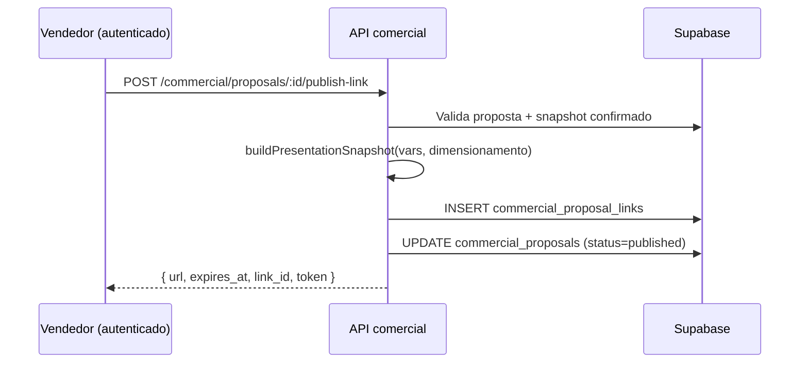
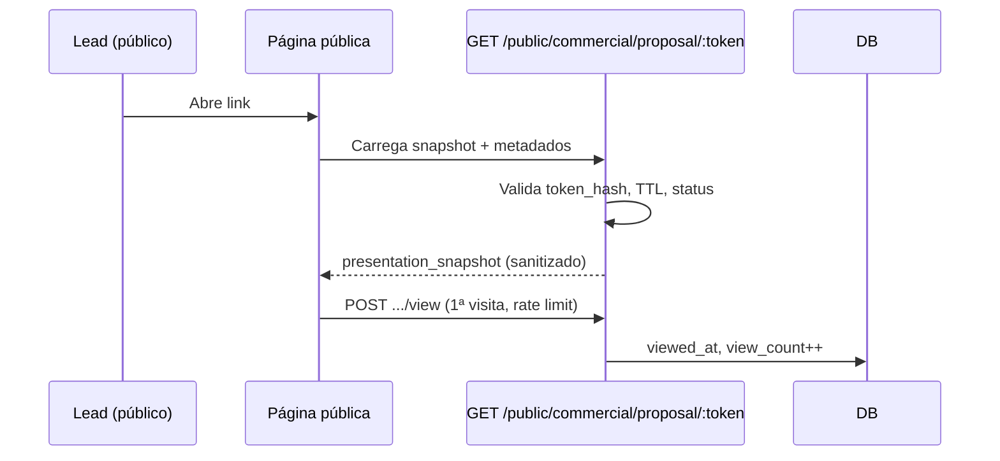
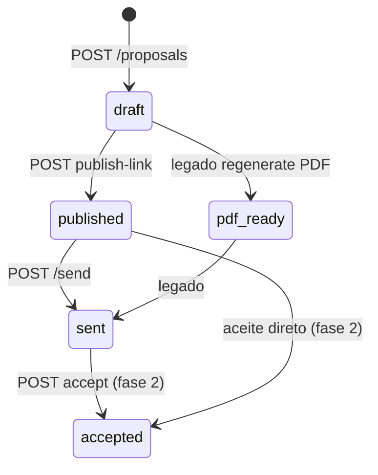
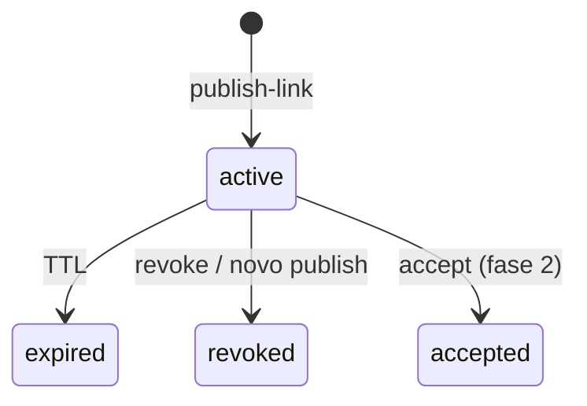

# Plano de Backend — Proposta Comercial Interativa

> **Status:** documento de aprovação — **sem implementação** até validação de produto e UX.  
> **Referências atuais:** `dataRequest.ts`, `publicCommercial.ts`, `proposalService.ts`, `buildProposalDocumentVars`, `CommercialProposalPage`.

---

## 1. Objetivos e não-objetivos

### Objetivos

- Substituir o **PDF/DOCX como caminho crítico** da apresentação comercial por um **link público interativo** (deck de slides), no mesmo padrão do formulário de dados (`commercial_data_requests`).
- Permitir ao **vendedor**:
  1. Gerar/publicar link a partir de uma proposta já dimensionada;
  2. **Apresentar** em reunião (screen share / fullscreen);
  3. **Enviar o mesmo link** ao lead depois (WhatsApp, e-mail).
- Expor ao lead **somente dados customer-facing** derivados do motor + `ProposalDocumentVars`, **sem margens internas Flux** (30%, valor do lead anual, etc.).
- Congelar conteúdo no momento da publicação via **`presentation_snapshot`** imutável (republicar = novo link ou nova versão).
- Registrar **analytics mínimos**: primeira visualização, visualizações, aceite (fase posterior).

### Não-objetivos (nesta fase)

- Implementar UI interna definitiva (apenas protótipo estático em `docs/prototypes/`).
- Remover imediatamente Gotenberg/DOCX/PDF do repositório (ver plano de depreciação faseado).
- Assinatura eletrônica ou pagamento inline.
- Edição colaborativa do deck pelo lead.
- Autenticação do lead (acesso exclusivamente por token opaco na URL).

---

## 2. Fluxos de usuário

### 2.1 Vendedor — publicar link



**Pré-condições (reutilizar regras atuais de `createProposalFromConfirmedSnapshot`):**

- Lead com `operational_snapshot.confirmed_at` preenchido;
- Proposta existente (`commercial_proposals`) vinculada ao lead;
- Permissão comercial (`requireCommercialProposals`).

**Pós-condições:**

- Link público `{WEB_APP_URL}/public/commercial/proposta/{token}`;
- Snapshot congelado em `commercial_proposal_links.presentation_snapshot`;
- Atividade `proposal_link_published` no lead;
- Status da proposta: `published` (substitui dependência de `pdf_ready` no fluxo principal).

### 2.2 Vendedor — apresentar (screen share)

1. Vendedor abre o link no navegador (modo apresentação / F11).
2. Navega slides (setas, dots, swipe mobile).
3. **Opcional fase 2:** modo “apresentador” autenticado com notas internas (fora do escopo inicial).

Nenhuma chamada extra à API durante a apresentação — dados já no snapshot.

### 2.3 Vendedor — enviar ao lead

1. Copia URL retornada em `publish-link` (ou botão “Copiar link” na UI interna futura).
2. Envia por WhatsApp/e-mail.
3. **Opcional:** `POST /proposals/:id/mark-sent` (equivalente ao `send` atual) registra `sent_at` sem exigir PDF.

O **mesmo token** serve para apresentação ao vivo e revisão assíncrona pelo lead.

### 2.4 Lead — visualizar proposta



Lead vê deck fullscreen, responsivo, sem login.  
**Não** vê: margem Flux, valor do lead, notas internas, paths de storage, IDs de workspace.

### 2.5 Lead — aceitar (fase 2, opcional na v1)

- `POST /public/commercial/proposal/:token/accept` com confirmação explícita.
- Atualiza link → `accepted`, proposta → `accepted`, notifica owner.
- Pode ser adiado: v1 só leitura + analytics.

---

## 3. Modelo de dados

### 3.1 Nova tabela: `commercial_proposal_links`

Espelha o padrão de `commercial_data_requests` (`049_commercial_lead_legal_and_data_requests.sql`).

| Coluna | Tipo | Descrição |
|--------|------|-----------|
| `id` | `uuid` PK | Identificador interno |
| `workspace_id` | `uuid` FK → `workspaces` | Tenant |
| `proposal_id` | `uuid` FK → `commercial_proposals` | Proposta congelada |
| `lead_id` | `uuid` FK → `commercial_leads` | Denormalizado para queries/RLS |
| `token_hash` | `text` UNIQUE NOT NULL | SHA-256 do token (nunca persistir token puro) |
| `status` | `text` | Ver máquina de estados abaixo |
| `presentation_snapshot` | `jsonb` NOT NULL | Payload público congelado (schema §5) |
| `snapshot_version` | `integer` NOT NULL DEFAULT `1` | Versão do schema JSON |
| `expires_at` | `timestamptz` NOT NULL | TTL configurável |
| `published_at` | `timestamptz` NOT NULL | Momento da publicação |
| `sent_at` | `timestamptz` | Quando vendedor marcou envio (opcional) |
| `viewed_at` | `timestamptz` | Primeira visualização pelo lead |
| `view_count` | `integer` NOT NULL DEFAULT `0` | Total de visualizações registradas |
| `last_viewed_at` | `timestamptz` | Última visualização |
| `accepted_at` | `timestamptz` | Aceite do lead (fase 2) |
| `revoked_at` | `timestamptz` | Revogação manual |
| `created_by` | `uuid` FK → `users` | Vendedor que publicou |
| `created_at` | `timestamptz` | |
| `updated_at` | `timestamptz` | |

**Índices:**

- `(proposal_id, created_at DESC)`
- `(lead_id, created_at DESC)`
- `(token_hash)` — lookup público
- `(workspace_id, status)` — dashboard

**Status do link:**

| Status | Significado |
|--------|-------------|
| `active` | Link válido, snapshot servido |
| `expired` | TTL esgotado (lazy update na leitura) |
| `revoked` | Cancelado pelo vendedor (novo link necessário) |
| `accepted` | Lead aceitou (fase 2) |

**Constraint sugerida:**

```sql
CHECK (status IN ('active', 'expired', 'revoked', 'accepted'))
```

**RLS:** igual `commercial_data_requests` — service role only; acesso público só via API com hash.

### 3.2 Alterações em `commercial_proposals`

Migration `0XX_commercial_interactive_proposal.sql`:

| Coluna | Alteração |
|--------|-----------|
| `status` | Expandir CHECK: `'draft' \| 'published' \| 'sent' \| 'accepted'` (+ manter `'pdf_ready'` temporariamente para compat) |
| `published_at` | `timestamptz` — quando entrou em `published` |
| `active_link_id` | `uuid` FK → `commercial_proposal_links` — link vigente (nullable) |
| `presentation_snapshot` | `jsonb` — cópia denormalizada do link ativo (opcional, acelera GET autenticado) |

**Colunas legadas (mantidas até fase 3):**

- `docx_storage_path`, `pdf_storage_path`, `pdf_generated_at`, `document_html`, `document_source`, `template_version`

**Transição de status:**

| Antes | Depois (fluxo novo) |
|-------|---------------------|
| `draft` (PDF pendente) | `draft` (proposta criada, link não publicado) |
| `pdf_ready` | **`published`** (link ativo; PDF opcional) |
| `sent` | `sent` |
| `accepted` | `accepted` |

### 3.3 Atividades (`commercial_lead_activities`)

Estender `activity_type` CHECK:

- `proposal_link_published`
- `proposal_link_viewed` (metadata: `link_id`, `view_count`)
- `proposal_link_revoked`
- `proposal_accepted` (fase 2)

### 3.4 Migration SQL (rascunho)

```sql
-- 0XX_commercial_interactive_proposal.sql

CREATE TABLE IF NOT EXISTS public.commercial_proposal_links (
  id uuid PRIMARY KEY DEFAULT uuid_generate_v4(),
  workspace_id uuid NOT NULL REFERENCES public.workspaces(id) ON DELETE CASCADE,
  proposal_id uuid NOT NULL REFERENCES public.commercial_proposals(id) ON DELETE CASCADE,
  lead_id uuid NOT NULL REFERENCES public.commercial_leads(id) ON DELETE CASCADE,
  token_hash text NOT NULL UNIQUE,
  status text NOT NULL DEFAULT 'active'
    CHECK (status IN ('active', 'expired', 'revoked', 'accepted')),
  presentation_snapshot jsonb NOT NULL,
  snapshot_version integer NOT NULL DEFAULT 1,
  expires_at timestamptz NOT NULL,
  published_at timestamptz NOT NULL DEFAULT now(),
  sent_at timestamptz,
  viewed_at timestamptz,
  view_count integer NOT NULL DEFAULT 0,
  last_viewed_at timestamptz,
  accepted_at timestamptz,
  revoked_at timestamptz,
  created_by uuid REFERENCES public.users(id) ON DELETE SET NULL,
  created_at timestamptz NOT NULL DEFAULT now(),
  updated_at timestamptz NOT NULL DEFAULT now()
);

CREATE INDEX IF NOT EXISTS idx_proposal_links_proposal
  ON public.commercial_proposal_links(proposal_id, created_at DESC);
CREATE INDEX IF NOT EXISTS idx_proposal_links_lead
  ON public.commercial_proposal_links(lead_id, created_at DESC);
CREATE INDEX IF NOT EXISTS idx_proposal_links_token
  ON public.commercial_proposal_links(token_hash);

ALTER TABLE public.commercial_proposals
  ADD COLUMN IF NOT EXISTS published_at timestamptz,
  ADD COLUMN IF NOT EXISTS active_link_id uuid
    REFERENCES public.commercial_proposal_links(id) ON DELETE SET NULL,
  ADD COLUMN IF NOT EXISTS presentation_snapshot jsonb;

ALTER TABLE public.commercial_proposals DROP CONSTRAINT IF EXISTS commercial_proposals_status_check;
ALTER TABLE public.commercial_proposals
  ADD CONSTRAINT commercial_proposals_status_check
  CHECK (status IN ('draft', 'pdf_ready', 'published', 'sent', 'accepted'));
```

---

## 4. API — endpoints

Prefixos existentes:

- Autenticado: `/api/commercial/...` (via `registerCommercialProposalRoutes`)
- Público: `/api/public/commercial/...` (via `publicCommercialRoutes`)

### 4.1 Autenticados (vendedor)

#### `POST /commercial/proposals/:id/publish-link`

Publica link interativo. Revoga link `active` anterior do mesmo `proposal_id` (status → `revoked`).

**Request body (opcional):**

```json
{
  "ttl_days": 30,
  "revoke_previous": true
}
```

**Response 201:**

```json
{
  "link_id": "uuid",
  "proposal_id": "uuid",
  "url": "https://app.fluxfarma.com.br/public/commercial/proposta/{token}",
  "token": "base64url-opaco",
  "expires_at": "2026-07-15T12:00:00.000Z",
  "published_at": "2026-06-15T12:00:00.000Z",
  "snapshot_version": 1
}
```

**Erros:**

| HTTP | Condição |
|------|----------|
| 400 | Dimensionamento não confirmado (`DimensionamentoNotConfirmedError`) |
| 404 | Proposta inexistente |
| 409 | Proposta em status terminal (`accepted`) |

#### `GET /commercial/proposals/:id/links`

Lista links da proposta (histórico). **Não** retorna token — só metadados.

```json
{
  "links": [
    {
      "id": "uuid",
      "status": "active",
      "published_at": "...",
      "expires_at": "...",
      "viewed_at": "...",
      "view_count": 3,
      "url_hint": ".../proposta/[token]"
    }
  ]
}
```

#### `POST /commercial/proposals/:id/links/:linkId/revoke`

Revoga link ativo.

**Response 200:** `{ "ok": true, "status": "revoked" }`

#### `POST /commercial/proposals/:id/send` (evolução)

Manter rota existente; **remover** pré-requisito de PDF.  
Opcional body: `{ "link_id": "uuid" }` para associar envio ao link.

#### `POST /commercial/proposals` (evolução)

Manter criação; **não** bloquear por falha Gotenberg.  
Status inicial: `draft` ou `published` se flag `publish_immediately: true`.

#### `GET /commercial/proposals/:id` (evolução)

Incluir campos:

```json
{
  "id": "...",
  "status": "published",
  "active_link": {
    "id": "...",
    "url": "...",
    "expires_at": "...",
    "view_count": 0,
    "viewed_at": null
  },
  "has_pdf": false,
  "document_source": { "vars": { "...": "ProposalDocumentVars" } }
}
```

### 4.2 Públicos (lead / apresentação)

Registrados em `publicCommercial.ts`, mesmo padrão de rate limit do `PUT /data-request/:token`.

#### `GET /public/commercial/proposal/:token`

Retorna snapshot + metadados mínimos para renderizar deck.

**Response 200:**

```json
{
  "status": "active",
  "expires_at": "2026-07-15T12:00:00.000Z",
  "proposal": {
    "version": 2,
    "package_name": "Operação enxuta",
    "data_proposta": "15/06/2026"
  },
  "lead": {
    "trade_name": "Farmácia Exemplo",
    "city": "Belo Horizonte",
    "state": "MG",
    "contact_name": "Maria Silva"
  },
  "presentation_snapshot": { "...": "ver §5" },
  "slides": [
    { "id": "capa", "title": "Proposta Comercial" },
    { "id": "diagnostico", "title": "Diagnóstico" }
  ]
}
```

**Erros:** 404 (token inválido), 410 (`expired` / `revoked`).

#### `POST /public/commercial/proposal/:token/view`

Registra visualização (idempotente com debounce por sessão/IP — ver §6).

**Response 200:**

```json
{
  "ok": true,
  "view_count": 1,
  "first_view": true
}
```

#### `POST /public/commercial/proposal/:token/accept` (fase 2)

**Request:**

```json
{
  "accepted_by_name": "Maria Silva",
  "accepted_by_role": "Sócia"
}
```

**Response 200:** `{ "ok": true, "accepted_at": "..." }`

---

## 5. Schema `presentation_snapshot`

Versão `snapshot_version: 1`.  
Gerado por **`buildPresentationSnapshot()`** — wrapper sobre `buildProposalDocumentVars` + campos estruturados para slides, **filtrando dados internos**.

### 5.1 Função de construção (backend)

```typescript
// Novo: apps/api-service/src/lib/commercial/presentationSnapshot.ts (futuro)

buildPresentationSnapshot({
  lead: Record<string, unknown>,
  dimensionamento: DimensionamentoResultado,
  propostaComercial: PropostaComercialSnapshot,
  proposalMeta: { version, package_name },
  generatedAt?: Date,
}): PresentationSnapshotV1
```

**Reutiliza:**

- `buildProposalDocumentVars` — fonte única de strings formatadas (taxa, setup, horários, textos folguista/escala);
- `rehydrateOperationalSnapshot` — garantir financeiro coerente antes de extrair campos públicos;
- **Não** incluir `proposalVarsToMergeTags` (uso interno DOCX).

### 5.2 Estrutura JSON (v1)

```json
{
  "schema_version": 1,
  "generated_at": "2026-06-15T15:30:00.000Z",
  "locale": "pt-BR",
  "branding": {
    "product_name": "Flux Farma",
    "tagline": "Delivery profissional para farmácias"
  },
  "meta": {
    "proposal_version": 2,
    "package_name": "Operação enxuta",
    "cenario_id": "enxuto",
    "cenario_label": "Cenário A — Enxuto",
    "modelo_cobranca": "minimo_garantido",
    "classificacao_viabilidade": "viavel",
    "classificacao_label": "Viável"
  },
  "cliente": {
    "nome_fantasia": "Farmácia Exemplo",
    "razao_social": "Farmácia Exemplo Ltda",
    "cnpj": "12.345.678/0001-90",
    "contato": "Maria Silva",
    "cidade": "Belo Horizonte",
    "estado": "MG"
  },
  "document_vars": {
    "nome_fantasia": "...",
    "razao_social": "...",
    "cnpj": "...",
    "contato": "...",
    "taxa_1": "8,50",
    "qt_entregas": "12",
    "minimo_garantido": "850,00",
    "setup": "2.500,00",
    "setup_pagamento": "À vista — 2.500,00",
    "qt_entregadores": "1",
    "qt_diarias_semana": "1",
    "valor_diaria": "250,00",
    "seg_a_sex": "08:00 às 18:00",
    "sabado": "08:00 às 14:00",
    "domingo": "Fechado ao delivery",
    "feriados": "Fechado",
    "texto_folguista": "...",
    "texto_escala_resumida": "...",
    "data_proposta": "15/06/2026",
    "sugestao_comercial": "..."
  },
  "diagnostico": {
    "entregas_media_mes": 480,
    "entregas_media_dia": 18,
    "perfil_operacao": "intermediaria",
    "perfil_operacao_label": "Operação intermediária",
    "horarios_resumo": {
      "seg_sex": "08:00 às 18:00",
      "sabado": "08:00 às 14:00",
      "domingo": "Fechado ao delivery"
    }
  },
  "viabilidade": {
    "status": "viavel",
    "headline": "Operação viável com modelo enxuto",
    "sugestao_comercial": "...",
    "ponto_equilibrio_entregas_semana": 12
  },
  "operacao": {
    "quantidade_entregadores": 1,
    "quantidade_diarias_semana": 1,
    "texto_folguista": "...",
    "texto_escala_resumida": "...",
    "horarios": {
      "seg_a_sex": "...",
      "sabado": "...",
      "domingo": "...",
      "feriados": "..."
    }
  },
  "economia": {
    "taxa_entrega": "8,50",
    "minimo_garantido_entregador_semana": "850,00",
    "entregas_minimas_semana": "12",
    "modelo_cobranca": "minimo_garantido",
    "modelo_cobranca_label": "Mínimo garantido + diárias",
    "custo_farmacia_semana": "1.100,00",
    "custo_farmacia_mes": "4.766,67",
    "valor_diaria_folguista": "250,00"
  },
  "setup": {
    "valor": "2.500,00",
    "pagamento": "À vista — 2.500,00",
    "sem_setup": false
  },
  "fechamento": {
    "pacote": "Operação enxuta",
    "resumo_bullets": [
      "1 entregador fixo + 1 diária/semana",
      "Taxa de R$ 8,50 por entrega",
      "Mínimo garantido R$ 850,00/semana"
    ]
  },
  "proximos_passos": {
    "cta_label": "Falar com consultor",
    "cta_whatsapp_hint": true,
    "observacoes_publicas": null
  },
  "slides_order": [
    "capa",
    "diagnostico",
    "viabilidade",
    "operacao",
    "economia",
    "setup",
    "fechamento",
    "proximos_passos"
  ]
}
```

### 5.3 Campos explicitamente **excluídos** (internos)

Nunca entrar no snapshot público:

| Campo / conceito | Motivo |
|------------------|--------|
| `valor_lead_anual_cents`, `deal_value_cents` | Margem Flux 30% — interno |
| `margem_flux_semana`, `margem_flux_mensal` | Margem interna |
| `config_hash`, `config_version`, `motor_config` | Configuração interna |
| `ajustes_manuais`, `override_motivo` | Auditoria comercial |
| `operational_snapshot` completo | Contém financeiro interno |
| `notes` da proposta | Observações internas |
| `owner_id`, `workspace_id`, IDs de storage | Segurança |
| `receita_semanal_estimada` bruta | Pode expor premissas internas (avaliar product) |

**Incluídos** (customer-facing, já usados no DOCX):

- `custo_farmacia_semana/mes`, `faturamento_mensal_farmacia` → renomeados como **custo para a farmácia**;
- `sugestao_comercial`, textos de folguista/escala;
- todos os campos de `ProposalDocumentVars`.

---

## 6. Segurança

### 6.1 Token

Reutilizar utilitários de `dataRequest.ts`:

```typescript
generateDataRequestToken() // → { token, tokenHash }
hashDataRequestToken(token)
```

- Token: 32 bytes `base64url` (~43 caracteres);
- Persistir **apenas** `token_hash`;
- Token retornado **uma vez** em `publish-link` (igual data-request).

### 6.2 TTL

Nova env: `COMMERCIAL_PROPOSAL_LINK_TTL_DAYS` (default **30**; data-request usa 7).

Expiração lazy na leitura (padrão `loadDataRequestByToken`):

```typescript
if (status === 'active' && expires_at < now) → status = 'expired'
```

### 6.3 Rate limiting (público)

| Rota | Limite sugerido |
|------|-----------------|
| `GET .../proposal/:token` | 60/min por IP |
| `POST .../view` | 10/min por IP; debounce 1 registro/5min por `(token_hash, ip)` |
| `POST .../accept` | 5/min por IP |

Implementação: mesmo mapa in-memory de `publicCommercial.ts` (fase 1); Redis/Cloud Armor (fase 2 produção).

### 6.4 Dados públicos vs internos

| Contexto | Dados |
|----------|-------|
| **Público** (`GET /proposal/:token`) | `presentation_snapshot` sanitizado + metadados lead mínimos |
| **Autenticado** (`GET /proposals/:id`) | Snapshot + link stats + `document_source.vars` + flags PDF legado |
| **Nunca expor** | Token de outros links, hash, margens, motor config |

### 6.5 Revogação

- Novo `publish-link` com `revoke_previous: true` → links `active` anteriores → `revoked`;
- Revogação manual via API;
- Link revogado → HTTP 410.

### 6.6 Audit

- `writeAuditLog` em: publish, revoke, accept;
- Atividades no lead (§3.3);
- Snapshot imutável — alterações na viabilidade exigem **nova proposta** ou **republicar** (novo link).

---

## 7. Integração com código existente

| Componente atual | Papel na proposta interativa |
|------------------|------------------------------|
| `proposalService.createProposalFromConfirmedSnapshot` | Continua criando registro; **deixa de exigir** PDF para status útil; chama `buildPresentationSnapshot` opcionalmente |
| `buildProposalDocumentVars` | **Fonte única** de strings do deck e do DOCX legado |
| `commercialMotorRuntime` / `operational_snapshot` | Pré-condição: snapshot confirmado |
| `dataRequest.ts` | Padrão de token, hash, TTL |
| `publicCommercial.ts` | Novas rotas públicas no mesmo router |
| `webAppUrl.ts` | Novo helper `resolveCommercialProposalPublicUrl(token)` → `/public/commercial/proposta/{token}` |
| `CommercialProposalPage` | Futuro: substituir iframe PDF por preview do link + botões publicar/copiar (fora deste plano) |
| `appendLeadActivity` / `createCommercialNotification` | Eventos publish/view/accept |
| `mapProposalRow` | Mapear novos campos (`published_at`, `active_link_id`) |

### 7.1 Fluxo de criação proposto

```
Lead confirmado → POST /proposals → draft
                → POST /proposals/:id/publish-link → published + link
                → (apresentação / envio)
                → POST /proposals/:id/send → sent
                → (opcional) accept público → accepted
```

PDF/DOCX: rotas `/pdf`, `/docx`, `/regenerate` permanecem como **export opcional** até depreciação.

---

## 8. Máquina de estados

### 8.1 Proposta (`commercial_proposals.status`)



### 8.2 Link (`commercial_proposal_links.status`)



---

## 9. Depreciação PDF / Gotenberg / DOCX

| Fase | Escopo | Critério de saída |
|------|--------|-------------------|
| **0 — Atual** | PDF crítico; Gotenberg obrigatório para `pdf_ready` | — |
| **1 — Paralelo** | Link interativo no caminho principal; PDF botão secundário “Exportar PDF” | 80% propostas com link publicado |
| **2 — Opt-in PDF** | `regenerate` sob feature flag; warning na UI | Zero incidentes por 30 dias |
| **3 — Remoção** | Remover Gotenberg do deploy, `proposalDocxToPdf`, templates DOCX do caminho quente | Aprovação ops + product |
| **4 — Cleanup** | Drop colunas storage ou arquivar bucket; remover `pdf_ready` do CHECK | Migration final |

**Arquivos candidatos à remoção (fase 3+):**

- `proposalDocxToPdf.ts`, dependência Gotenberg no Dockerfile
- `fillProposalDocx` do fluxo automático (manter arquivo para arquivo morto se necessário)
- Smoke scripts `smoke-proposal-pdf.mjs`

---

## 10. Erros, edge cases e analytics

### 10.1 Erros

| Cenário | Comportamento |
|---------|---------------|
| Viabilidade alterada após publish | Snapshot **não** muda; UI interna alerta “viabilidade desatualizada” |
| Token vazado | Revogar link; publicar novo |
| Múltiplos links | Histórico em `GET /links`; só um `active` por proposta (configurável) |
| Proposta `accepted` | Bloquear novo publish (409) |
| Lead perdido/arquivado | Link continua válido até TTL (decisão product) |

### 10.2 Analytics

| Evento | Campo | Uso |
|--------|-------|-----|
| Primeira view | `viewed_at` | Notificar vendedor (`proposal_link_viewed`) |
| Views totais | `view_count` | Dashboard comercial |
| Última view | `last_viewed_at` | Follow-up |
| Aceite | `accepted_at` | Pipeline / estágio ganho |

**Notificação sugerida:** espelhar `contract_form_submitted` — notificar `owner_id` na primeira view.

---

## 11. Estimativa de esforço por fase

| Fase | Entregas | Esforço |
|------|----------|---------|
| **A — Backend core** | Migration, `buildPresentationSnapshot`, `publish-link`, GET público, token/TTL | **3–4 dias** |
| **B — Web público** | Página `/public/commercial/proposta/[token]`, deck React, analytics view | **3–4 dias** |
| **C — UI vendedor** | `CommercialProposalPage`: publicar, copiar link, stats, remover bloqueio PDF | **2–3 dias** |
| **D — Aceite + notificações** | POST accept, notificações, auditoria | **1–2 dias** |
| **E — Depreciação PDF** | Feature flags, docs ops, remover Gotenberg | **2–3 dias** |
| **Total** | | **~11–16 dias** dev |

QA + product review: +3–5 dias.

---

## 12. Perguntas abertas (aprovação de produto)

1. **TTL padrão:** 30 dias é suficiente ou alinhar com data-request (7)?
2. **Aceite na v1:** lead confirma na última slide ou só visualização na v1?
3. **Republicação:** alterar viabilidade exige nova versão de proposta (`version++`) ou republish sob mesma versão?
4. **WhatsApp CTA:** número fixo Flux ou telefone do `owner_id` / canal comercial?
5. **Observações públicas:** vendedor pode incluir texto visível ao lead no snapshot?
6. **Comparativo cenários A/B:** deck mostra só cenário selecionado ou tab comparativa (impacto UX + snapshot)?
7. **PDF export:** manter botão “Baixar PDF” gerado do snapshot HTML (sem Gotenberg) ou eliminar totalmente?
8. **Privacidade:** exibir CNPJ completo ao lead ou mascarar parcialmente?
9. **SEO / indexação:** `noindex` na rota pública (recomendado) — confirmar?
10. **Multi-workspace branding:** deck sempre Flux Farma ou white-label futuro?

---

## 13. Protótipo UI (referência visual)

Arquivo estático para aprovação de layout (sem API):

- [`docs/prototypes/commercial-proposal-presentation.html`](../prototypes/commercial-proposal-presentation.html)

Slides (9): capa, diagnóstico, viabilidade, **escolha do pacote**, operação, economia, setup, fechamento, próximos passos.

### Modelo Comercial 2026 — pacotes (referência `preview.html`)

O protótipo adota o **Modelo Comercial 2026** (pacote fixo semanal + excedente escalonado), alinhado ao material interno de gestão. Três pacotes regionais mapeiam ao motor comercial via `motorKey` / `cenario_id`:

| Pacote | Valor/sem | Franquia | Região | Motor (futuro) |
|--------|-----------|----------|--------|----------------|
| Básico | R$ 1.000 | 80 entregas | Interior / cidade pequena | `pacote_basico_interior` |
| Médio | R$ 1.200 | 100 entregas | Cidade média | `pacote_medio_cidade_media` |
| Capital | R$ 1.400 | 120 entregas | Capital / grande cidade | `pacote_capital_grande_cidade` |

No snapshot público, `meta.modelo_cobranca` evolui de `minimo_garantido` para `pacote_fixo_semanal`; `meta.package_name` e `economia.pacote_valor_semana` / `economia.franquia_entregas` derivam do pacote selecionado no dimensionamento. Excedentes (faixas 1–3: R$ 8,00 / R$ 9,50 / R$ 11,00) e diária de cobertura (R$ 250) permanecem customer-facing. Dados internos (pool 70%, margem Flux 12%, fundo de equalização) **não** entram no deck.

---

## 14. Checklist de implementação (pós-aprovação)

- [ ] Migration `commercial_proposal_links` + alterações `commercial_proposals`
- [ ] `presentationSnapshot.ts` + testes unitários (sanitização de campos internos)
- [ ] `proposalLinkService.ts` (publish, revoke, loadByToken)
- [ ] Rotas autenticadas em `proposals.ts`
- [ ] Rotas públicas em `publicCommercial.ts`
- [ ] `resolveCommercialProposalPublicUrl` em `webAppUrl.ts`
- [ ] Página Next.js pública + componente deck
- [ ] Atualizar `CommercialProposalPage` (remover dependência Gotenberg do fluxo principal)
- [ ] Tipos em `apps/web/src/lib/commercial/types.ts`
- [ ] Documentar env `COMMERCIAL_PROPOSAL_LINK_TTL_DAYS`
- [ ] Testes smoke script `smoke-proposal-link.mjs`

---

*Documento gerado para revisão. Nenhuma alteração em `apps/api-service` ou `apps/web` de produção foi feita além desta pasta `docs/`.*
